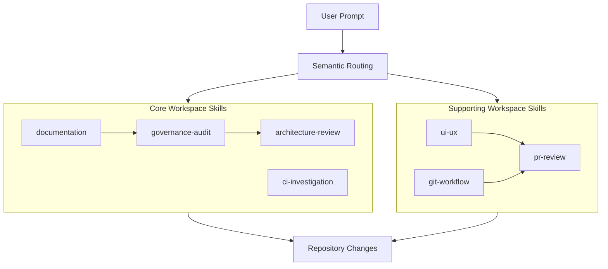

# MAD AI Skills Index & Discovery Guide

This document is the Single Source of Truth (SSOT) for all AI workspace skills within the MAD Entertrainment repository. It defines triggering keywords, responsibilities, boundaries, and collaboration paths for human developers and automated agents.

---

## Document Metadata & Changelog

- **Document Version**: 1.0
- **Last Updated**: 2026-07-03
- **Owner**: Principal Software Architect
- **Scope**: Workspace Customizations Root

### Change History
| Version | Date | Author | Summary of Changes |
| :--- | :--- | :--- | :--- |
| 1.0 | 2026-07-03 | Technical Architect | Initial release of consolidated AI Skills Index. |

---

## 1. Overview
The MAD AI Skills Architecture consists of modular, specialized custom skills designed to assist during development, diagnostics, auditing, and review.

- **Core Skills**: Essential technical and logic drivers (`governance-audit`, `architecture-review`, `ci-investigation`, `documentation`). These define architecture, enforce compliance, debug, and document.
- **Supporting Skills**: Target delivery, lifecycle management, and visual audits (`git-workflow`, `pr-review`, `ui-ux`).
- **Semantic Routing**: Prompt inputs are mapped to specific skills based on semantic trigger keywords and prerequisites.
- **AGENTS.MD vs. Skills**:
  - `AGENTS.MD` defines **always-on repository-wide rules** (coding guidelines, visual spacing constants, file size ratchets).
  - Each `SKILL.md` defines a **procedural execution workflow** for specific, non-contiguous tasks.

---

## 2. Architecture & Dependency Diagram



---

## 3. Skill Discovery Decision Tree

Use this decision tree to identify the correct skill for your task:

```
Start
 │
 ├─► Need to run/extend the repository compliance check, validator rules, or fixers?
 │    └─► governance-audit
 │
 ├─► Proposing changes to monorepo package boundaries, DTO schemas, or drafting ADRs?
 │    └─► architecture-review
 │
 ├─► Debugging tests, compile crashes, race conditions, memory leaks, or profiling?
 │    └─► ci-investigation
 │
 ├─► Editing manuals, READMEs, changelogs, runbooks, or drafting PR summaries?
 │    └─► documentation
 │
 ├─► Auditing visual layouts, contrast ratios, responsiveness, or loading/empty states?
 │    └─► ui-ux
 │
 ├─► Staging commits, managing branch checkouts, or cleaning up remote branches?
 │    └─► git-workflow
 │
 └─► Performing final quality-check reviews, checking file limits, or merge readiness?
      └─► pr-review
```

---

## 4. Skills Table

| Skill Name | Version | Owner | Scope | Purpose | Supersedes | Depends On | Collaborates With | Does Not Replace |
| :--- | :--- | :--- | :--- | :--- | :--- | :--- | :--- | :--- |
| **`governance-audit`** | 1.1 | Principal Software Architect | Governance | Enforce compliance gates and guide governance engine edits. | None | None | `pr-review`, `architecture-review` | `ci-investigation`, `documentation`, `ui-ux` |
| **`architecture-review`** | 1.1 | Technical Architect | Architecture | Maintain package boundaries, client-server contracts, and ADRs. | GStack | None | `governance-audit`, `pr-review`, `ci-investigation` | `ci-investigation`, `documentation`, `ui-ux` |
| **`ci-investigation`** | 1.1 | Lead Diagnostic Engineer | Investigation | Isolate, reproduce, and debug test, build, or compile failures. | Caveman | None | `governance-audit`, `architecture-review`, `pr-review` | `governance-audit`, `architecture-review`, `ui-ux` |
| **`documentation`** | 1.1 | Technical Writer | Documentation | Maintain READMEs, runbooks, changelogs, and copy tone. | Humanizer | None | `governance-audit`, `architecture-review`, `pr-review` | `architecture-review`, `governance-audit`, `ui-ux` |
| **`git-workflow`** | 1.0 | Release Manager | Git Lifecycle | Enforce branch prefixes, commit structure, and history cleanup. | None | None | `pr-review` | `pr-review`, `governance-audit`, `architecture-review` |
| **`pr-review`** | 1.0 | QA Lead | Gating | Run the final 11-question quality checklist and check file limits. | None | None | All Skills | None |
| **`ui-ux`** | 1.0 | UI/UX Designer | UI-UX | Audit layout responsiveness, contrast, and component compliance. | None | None | `pr-review`, `architecture-review`, `documentation` | `governance-audit`, `architecture-review`, `ci-investigation` |

---

## 5. Skill Priority (Routing Precedence)

If a user prompt matches trigger keywords for multiple skills, the routing engine resolves conflicts according to the following precedence order:

1. **`governance-audit`** (Enforces core repository safety)
2. **`architecture-review`** (Enforces monorepo boundaries)
3. **`ci-investigation`** (Diagnoses failures)
4. **`documentation`** (Governs writing quality)
5. **`ui-ux`** (Audits visual layout)
6. **`git-workflow`** (Manages branch lifecycle)
7. **`pr-review`** (Performs final gate checklist)

---

## 6. Repository Ownership Mapping

Skills map directly to specific directories to prevent routing ambiguity:

| Target Directory / Scope | Primary Skill | Secondary Skill (Collab) |
| :--- | :--- | :--- |
| `scripts/governance/` | **`governance-audit`** | `pr-review` |
| `packages/` | **`architecture-review`** | `governance-audit` |
| `docs/` | **`documentation`** | `architecture-review` |
| `.github/` | **`documentation`** | `git-workflow` |
| `apps/web/` / `apps/admin/` (UI layouts) | **`ui-ux`** | `pr-review` |
| vitest configurations & error logs | **`ci-investigation`** | `governance-audit` |
| git index & staging | **`git-workflow`** | `pr-review` |

---

## 7. Trigger & Keyword Matrix

| User Request | Routed Skill | Purpose |
| :--- | :--- | :--- |
| *"Create a new lint checker"* | **`governance-audit`** | Enforces engine development guidelines. |
| *"Check component sizes before merge"* | **`governance-audit`** | Evaluates warning thresholds. |
| *"Add a package for payment utilities"* | **`architecture-review`** | Verifies monorepo package boundaries. |
| *"Verify types match controller schemas"* | **`architecture-review`** | Verifies API contracts. |
| *"Debug vitest connection timeouts in CI"* | **`ci-investigation`** | Enforces the GOV-INV-001 evidence workflow. |
| *"Locate introducing commit for database error"* | **`ci-investigation`** | Triggers git archaeology. |
| *"Draft installation guidelines"* | **`documentation`** | Employs technical writing standards. |
| *"Rewrite this README paragraph for clarity"* | **`documentation`** | Integrates Humanizer tone rules. |
| *"Audit accessibility of checkout screen"* | **`ui-ux`** | Runs accessibility checklists. |
| *"Check checkout drawer responsiveness"* | **`ui-ux`** | Performs mobile reviews. |
| *"Stage these changes and commit"* | **`git-workflow`** | Enforces commit staging rules. |
| *"Check if this PR is ready to merge"* | **`pr-review`** | Enforces the 11-question gate. |

---

## 8. Trigger Keywords details

### 1. `governance-audit`
- **Primary**: governance, validator, fixer, warnings ratchet, findings, audit engine.
- **Secondary**: rollback, persistence, session manager, analytics store.
- **Negative Triggers**: *Do NOT trigger for visual visual sizing or Next.js app routing.*

### 2. `architecture-review`
- **Primary**: monorepo boundary, package dependencies, API contract, circular dependency, ADR.
- **Secondary**: shared packages, backend-frontend alignment, GStack, package coupling.
- **Negative Triggers**: *Do NOT trigger for debugging vitest crashes or formatting markdown files.*

### 3. `ci-investigation`
- **Primary**: debugging, root-cause analysis, profiling, stack trace, race condition, Caveman.
- **Secondary**: CI failure, build crash, vitest error, memory leak, flaky test, deadlock.
- **Negative Triggers**: *Do NOT trigger for creating new features or editing PR templates.*

### 4. `documentation`
- **Primary**: README, CONTRIBUTING, CHANGELOG, RUNBOOK, DEPLOYMENT.
- **Secondary**: developer guide, technical writing, Humanizer, tone, PR description.
- **Negative Triggers**: *Do NOT trigger for styling UI components or writing Zod validators.*

### 5. `git-workflow`
- **Primary**: git checkout, git branch, commit staging, rebase, release.
- **Secondary**: task branch, branch pruning, commit structure.
- **Negative Triggers**: *Do NOT trigger for verifying PR gating compliance.*

### 6. `pr-review`
- **Primary**: pr review, pull request check, merge readiness, quality gate.
- **Secondary**: component file size, checklist validation.
- **Negative Triggers**: *Do NOT trigger for initial system design or profiling.*

### 7. `ui-ux`
- **Primary**: UI audit, UX audit, accessibility audit, responsive audit, mobile review.
- **Secondary**: WCAG contrast, keyboard navigation review, loading state review, Radix, shadcn.
- **Negative Triggers**: *Do NOT trigger for backend database migration or REST schemas.*

---

## 9. Collaboration & Multi-Skill Workflows

When performing multi-package or cross-cutting changes, execute skills in sequence to ensure clean handoffs:

### Execution sequence templates
- **New Governance Validator**:
  `architecture-review` (Design) ➔ `governance-audit` (Implement Validator) ➔ `documentation` (Record in guide) ➔ `pr-review` (Merge checklist)
- **CI Build Failure**:
  `ci-investigation` (Isolate/Caveman) ➔ `governance-audit` (Refine ratchet if caused by warnings) ➔ `pr-review` (Verify pass)
- **Client-Server API Redesign**:
  `architecture-review` (Align DTO types & schemas) ➔ `documentation` (Update runbook/API contracts) ➔ `pr-review` (Check size limits)
- **UI Visual Audit**:
  `ui-ux` (Run accessibility & contrast audits) ➔ `documentation` (Note modifications in release doc) ➔ `pr-review` (Final gate)

---

## 10. Anti-Patterns
- **No Architecture in Docs**: Do not use `documentation` to determine or design software architecture.
- **No Component Code in UI-UX**: Do not use `ui-ux` to write production React components or styling scripts (it is for auditing only).
- **No Debugging in Governance**: Do not use `governance-audit` to diagnose active compiler, test suite, or runtime failures.
- **No Redesigns in Debugging**: Do not use `ci-investigation` to redesign APIs or create package boundaries.

---

## 11. Best Practices
1. **One Skill Per Task**: Never active multiple skills for a single implementation task.
2. **Reuse First**: Always search the repository for existing utilities, shared types, or validators before writing new modules.
3. **Follow the boundaries**: If a task spans boundaries (e.g. debugging a validation failure), use `ci-investigation` to isolate the bug first, then use `governance-audit` to modify the validation rule.
4. **Clean Diagnostics**: Remove any troubleshooting files (like scratch scripts) before staging commits.

---

## 12. Index Maintenance Rules

Whenever a custom skill file is modified:
1. Update that specific `.agents/skills/<name>/SKILL.md` file.
2. Update this `.agents/SKILLS_INDEX.md` document to synchronize metadata, versions, and keywords.
3. Verify metadata consistency across both files.
4. Run `pnpm governance:docs --update-history` to commit snapshot changes.

---

## 13. Future Skills (Reserved)
The following directories are reserved for future custom workspace skills:
- **`security-review`**: Automated dependency audits, SQL injection reviews, and token/encryption validations.
- **`performance-review`**: Database query optimizations, API caching models, and bundling efficiency reports.
- **`database-review`**: Schema migration strategies, indexing audits, and ORM query optimizations.
- **`deployment-review`**: Container configs, CI/CD actions, environment variables mapping, and Render/Vercel deploys.
- **`testing-review`**: Unit test coverage models, integration mocks, and end-to-end Cypress/Playwright configurations.
