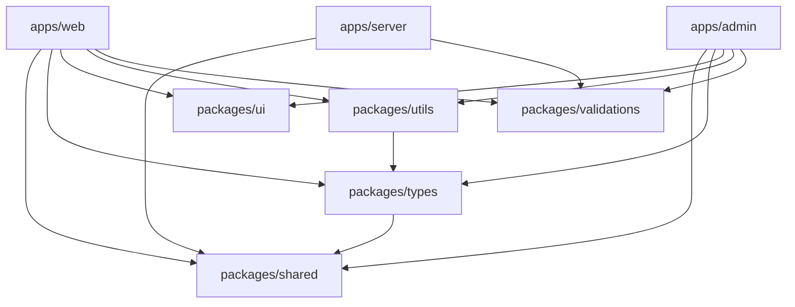

# Package Boundaries

This document defines the import rules, allowed dependencies flow, and circular reference checks enforced across the monorepo workspace.

---

## 1. Allowed Dependency Graph Flow

To maintain strict modularity, dependencies must flow unidirectionally. Upward imports or forbidden library references are blocked by TypeScript compilation checks.

---

## 2. Directory & Import Rules

1. **Relative Cross-Package Imports**: Workspaces must never resolve cross-package imports using relative directory links (e.g. `import * from "../../../packages/types"`). They must resolve strictly using the package name alias (e.g. `@mad/types`).
2. **Library Nesting Policies**:
   - **`@mad/shared`**: Is the leaf node. It must not import from any other workspace.
   - **`@mad/types`**: May only import from `@mad/shared`.
   - **`@mad/utils`**: May only import from `@mad/types` (and `@mad/shared` transitively). It is prohibited from importing from validations or ui.
   - **`@mad/validations`**: Must not depend on any other workspace library to remain easily consumable by server and client nodes.
   - **`@mad/ui`**: Must not import from other workspace libraries. It is limited strictly to visual UI primitive styling.
3. **Circular Import Prevention**: Next.js workspaces run Madge checks (`pnpm circular-check`) to detect circular reference chains during type check tasks.
