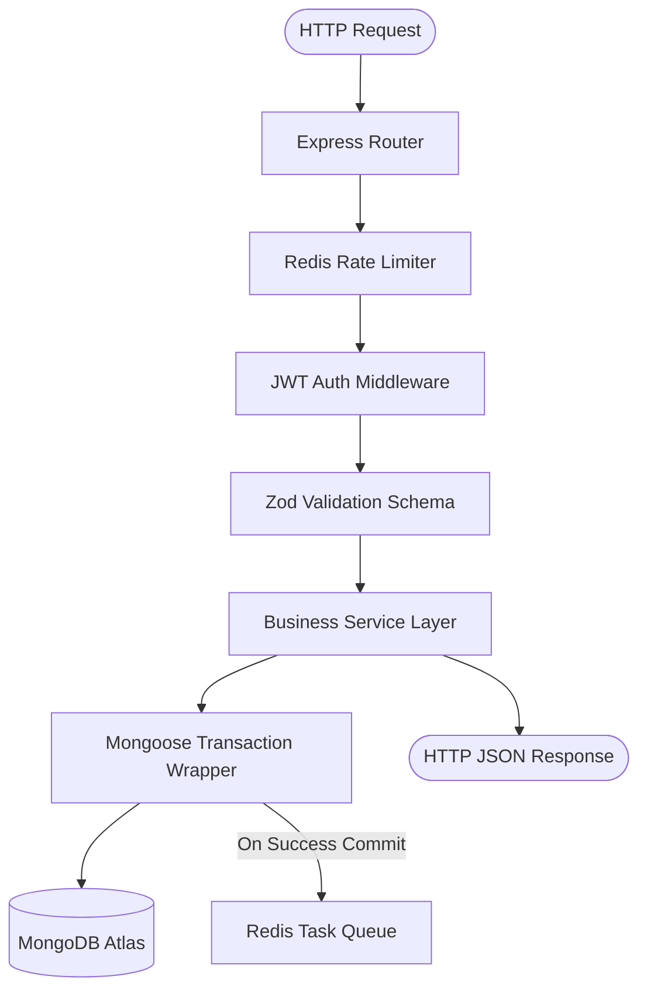

# Request Lifecycle Pipelines

This document maps the end-to-end processing pipeline of API requests throughout the platform architecture.

---

## 1. Request Pipeline Flow

Each incoming request is routed through a series of validation, authorization, and persistence gates before returning standard payloads.

---

## 2. Pipeline Execution Steps

### 1. Routing & Throttling
* **Action**: Request hits the Express router. The rate limiter (`express-rate-limit` using `rate-limit-redis`) checks request thresholds against the Redis IP tracking buffer.

### 2. Authentication Verification
* **Action**: The authentication middleware extracts authorization headers or cookie credentials (`cookie-parser`). Verifies JWT cryptographic signatures using token utilities. Rejects requests lacking correct credentials.

### 3. Schema Payload Validation
* **Action**: Zod schema validation checks (`@mad/validations`) evaluate request payloads (query, body, params). Rejects validation mismatches with a 400 Bad Request receipt.

### 4. Service Execution
* **Action**: The verified payload routes to the target public or admin service handler.

### 5. Transactions & Persistence
* **Action**: Multi-document data updates are wrapped inside Mongoose transaction blocks (`runInTransaction`) to guarantee atomic consistency.

### 6. Event Dispatching
* **Action**: Downstream tasks (such as sending emails or rendering PDFs) are pushed to the Redis-backed BullMQ queues.

### 7. Response Generation
* **Action**: Returns a standardized JSON payload. Standardized swagger structures match definitions from `zod-to-openapi`.
