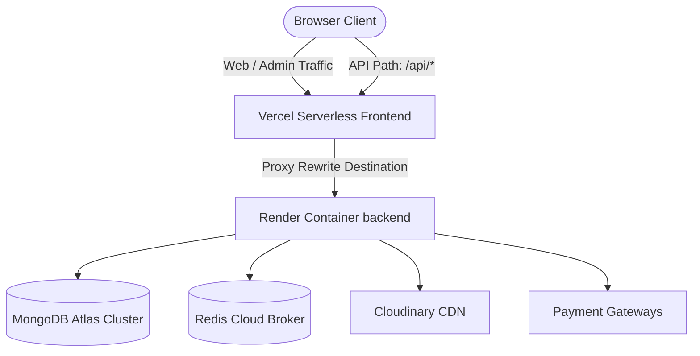

# System Overview

This document describes the high-level platform topology and component relationships of the MAD Entertrainment platform.

---

## 1. High-Level Infrastructure Topology

The platform decouples client interfaces from core transaction engines to ensure high availability and prevent CORS preflight latency.

---

## 2. Platform Core Architecture Boundaries
* **Vercel Serverless Layer**: Serves `@mad/web` (customer ticket interface) and `@mad/admin` (operator dashboard). All HTTP request routes targeting `/api/*` are rewritten at the proxy edge directly to Render to bypass CORS preflight overhead.
* **Render Container Layer**: Runs the `@mad/server` Express server. This stateful container hosts all business controller layers, service entities, Mongoose models, and local BullMQ background workers (email dispatcher, ticket PDF rendering, and lock managers).
* **Datastore Layer**:
  - **MongoDB Atlas**: Primary persistent document datastore. Enforces transactional consistency across booking states using multi-document sessions.
  - **Redis Cloud**: backing rate limiting buffers and task queues.
* **Integrations CDN**: Cloudinary serves all media assets and DJ performer avatars.
* **Payment Gateways**: Stripe and Razorpay process transactions. Gateways return status notifications to Render webhook endpoints.

*Repository Evidence*: Root `vercel.json` rewrites configurations, `apps/server/src/server.ts` connection setups.
