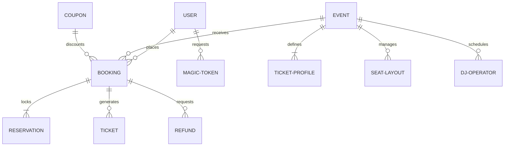

# Business Entities

This document defines the core business entities and their relationships within the MAD Entertrainment platform.

---

## 1. Entity Index

* **User**: Represents any human actor (Customer or Admin) in the system.
* **MagicToken**: A temporary secure verification record tracking active OTP login requests.
* **Event**: A scheduled entertainment show containing details, scheduling, and ticket allocations.
* **TicketProfile**: A sub-entity of Event defining price tiers, capabilities, and initial capacity limits.
* **SeatLayout**: The spatial matrix of seats (specifying rows and numbers) and their current block states.
* **Booking**: An order receipt summarizing purchased ticket counts, applied discounts, and billing details.
* **Reservation**: A transient ticket-allocation lock securing inventory for a booking.
* **Ticket**: A validated entry pass carrying a unique barcode/QR code for access.
* **Coupon**: A promotional record offering flat or percentage-based booking discounts.
* **Refund**: A financial reconciliation record tracking booking reversals.
* **DJOperator**: A performer/artist profile linked to events.

---

## 2. Entity Relationship Map (Business Topology)

* **Core Constraint**: A `Booking` cannot exist without being linked to an `Event` and a `User` (either a registered account or a guest profile record). A `Ticket` can only be generated after a `Booking` enters a confirmed state.
