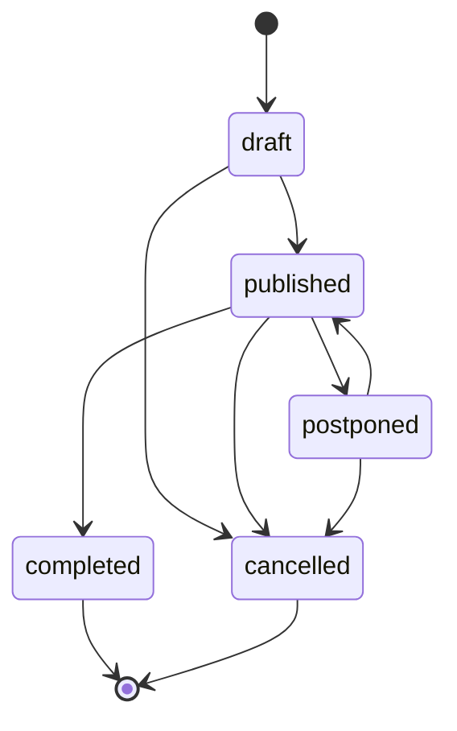
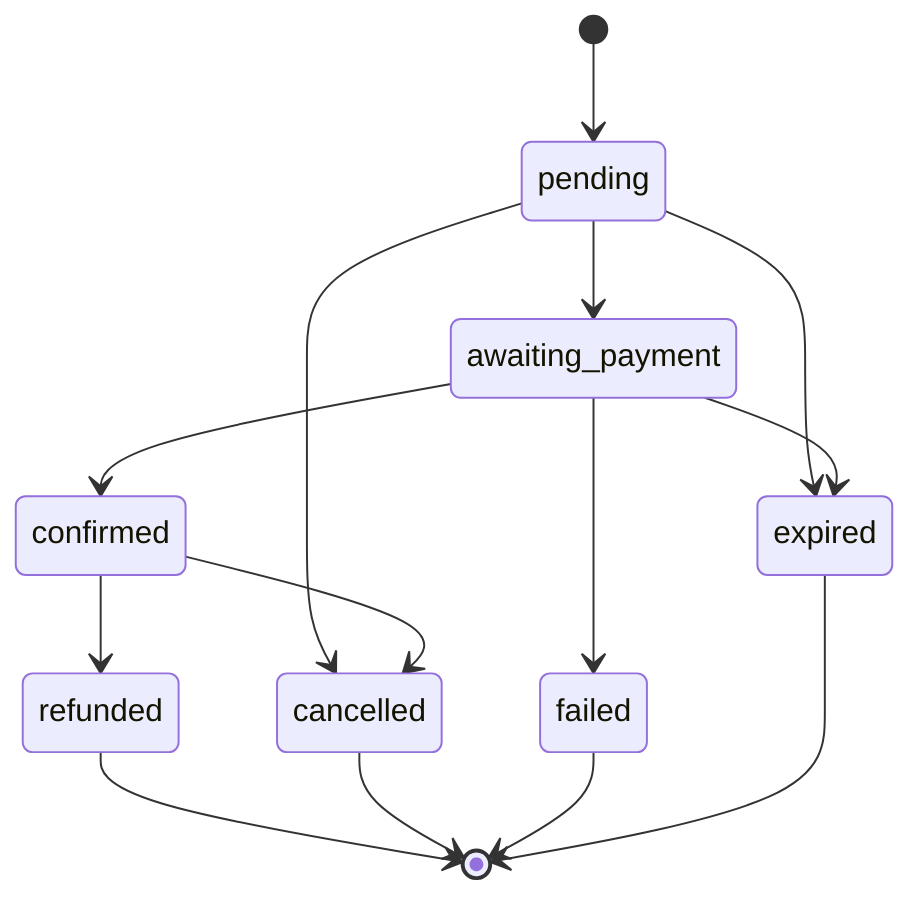
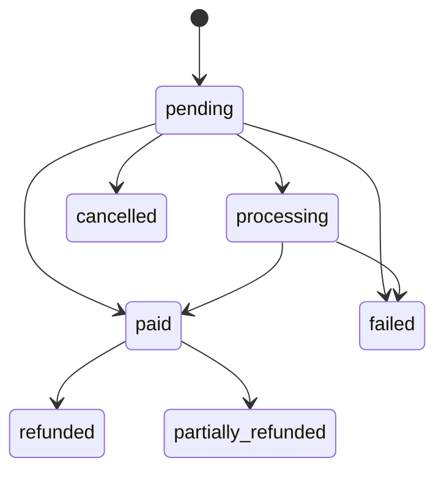
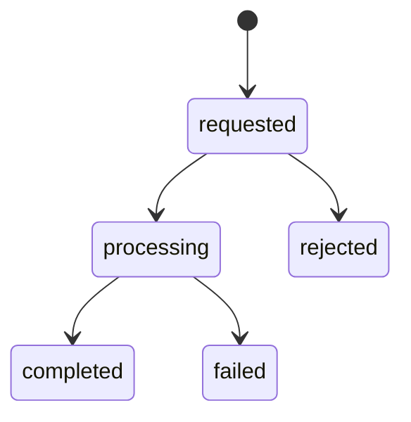

# Domain State Machines

This document records the business lifecycle states and transition constraints for core platform entities.

---

## 1. Event States
* **Allowed States**: `draft`, `published`, `cancelled`, `postponed`, `completed`.
* **State Machine Diagram**:

* **Terminal States**: `completed`, `cancelled`. No transitions are permitted from these states.

---

## 2. Booking States
* **Allowed States**: `pending`, `awaiting_payment`, `confirmed`, `failed`, `cancelled`, `refunded`, `expired`, `expiring`.
* **State Machine Diagram**:

* **Entry Conditions**:
  - `pending`: Triggered when seat or ticket count locks are successfully acquired.
  - `confirmed`: Only permitted after a validated payment gateway confirmation matches the booking fingerprint.
* **Exit Conditions**:
  - `pending` / `awaiting_payment` must exit to `expired` after the 10-minute timeout limit if unpaid.

---

## 3. Payment States
* **Allowed States**: `pending`, `processing`, `paid`, `failed`, `refunded`, `cancelled`, `partially_refunded`.
* **State Machine Diagram**:

---

## 4. Seat Statuses
* **Allowed States**: `available`, `locked`, `booked`, `blocked`, `wheelchair`.
* **Transition Constraints**:
  - `available` -> `locked`: Triggered for 10 minutes when booking is initiated.
  - `locked` -> `booked`: Triggered when booking becomes `confirmed`.
  - `locked` -> `available`: Triggered automatically on booking lock timeout (`expired`).
  - `booked` -> `available`: Triggered upon booking refund or cancellation.

---

## 5. Refund States
* **Allowed States**: `requested`, `processing`, `completed`, `rejected`, `failed`.
* **State Machine Diagram**:

