# Lifecycle & Versioning Governance

* **Governance ID**: GOV-LIF-001
* **Purpose**: Registers document state changes, versioning policies, and cross-layer dependency mappings.
* **Scope**: All AI OS artifacts.
* **Owner**: Repository Governance Owner
* **Versioning Policy**:
  - Increments must follow Semantic Versioning (SemVer) rules.
  - Updates altering structural workflows require MAJOR increments.
  - Patch updates mapping current configurations require PATCH increments.
* **Governance Dependency Map (Technical Matrix)**:
  Every layer in the AI Operating System is governed by the operational processes defined in the Governance Layer.

```mermaid
graph TD
    Governance[Layer 2: Governance]
    Foundation[Layer 1: Foundation]
    Repository[Layer 2: Repository]
    Domain[Layer 4: Domain]
    Architecture[Layer 3: Architecture]
    Standards[Layer 6: Standards]
    Patterns[Layer 7: Patterns]
    AntiPatterns[Layer 7: Anti-Patterns]
    Validation[Layer 5: Validation - Future]
    Skills[Layer 8: Skills - Future]
    Prompts[Layer 8: Prompts - Future]

    Governance -->|Governs amendment rules| Foundation
    Governance -->|Enforces branch/commit naming| Repository
    Governance -->|Restricts business SSOT| Domain
    Governance -->|Controls ADR freeze policy| Architecture
    Governance -->|Defines ESLint & CI check gates| Standards
    Governance -->|Validates code review checks| Patterns
    Governance -->|Registers code smells rules| AntiPatterns
    Governance -->|Monitors automated test audits| Validation
    Governance -->|Enforces 7-state lifecycle rules| Skills
    Governance -->|Monitors prompt changes| Prompts
```

* **Governance Mappings**:
  - **Foundation**: Changes to the core constitution require formal governance review.
  - **Repository**: Workspace and package structures are aligned via ownership rules.
  - **Domain**: Business rules are protected by backend SSOT rules.
  - **Architecture**: Design decisions are frozen via the ADR amendment workflow.
  - **Standards**: Linter configurations and formatter outputs are enforced by PR checks.
  - **Patterns / Anti-Patterns**: Blueprints and code smells are verified during code reviews.
  - **Skills / Prompts**: Future execution modules are constrained by lifecycle states.
