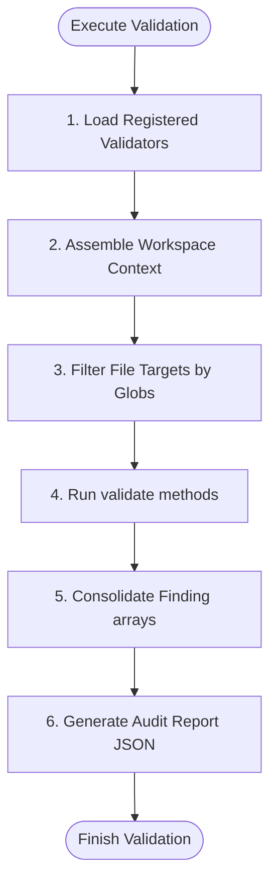

# Validation Engine Architecture

This document defines the abstract validator interfaces, lifecycle execution steps, and pipeline schema contracts.

---

## 1. Abstract Validator Interface (Contract)

Every validator specifications document must define its behavior matching the following interface parameters:

```ts
interface Validator {
  readonly id: string;               // Unique ID, e.g. VAL-NAM-001
  readonly name: string;             // Human readable title
  readonly targets: string[];        // Glob patterns targeting files to scan
  readonly requiredLayers: string[]; // OS layers needed as knowledge SSOT (e.g. ['Standards', 'Patterns'])
  
  /**
   * Evaluates targets and collects findings.
   * Does not modify codebase files.
   */
  validate(context: ValidationContext): Promise<Finding[]>;
}
```

---

## 2. Validator Execution Lifecycle

The execution pipeline processes validators sequentially to prevent thread locks:



1. **Load**: The engine parses target directories and instantiates registered validators.
2. **Context Assembly**: Gathers workspace context (branch names, git status, changed file lists).
3. **Filter**: Matches file targets using defined glob properties.
4. **Execution**: Invokes validation routines, passing context.
5. **Collection**: Merges arrays of findings.
6. **Reporting**: Outputs the final JSON report.
