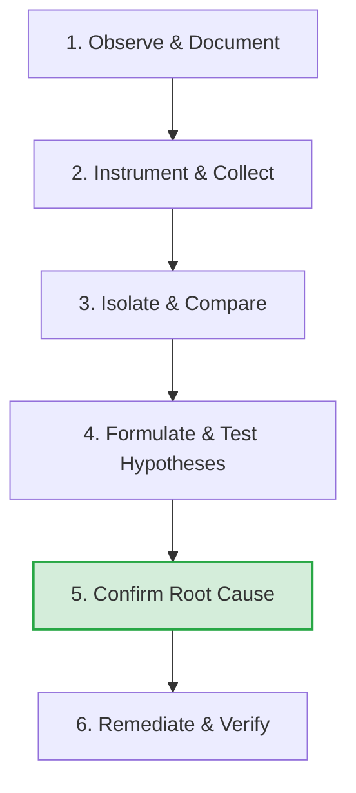

# CI & Build Investigation Skill

This skill governs the systematic, evidence-driven investigation of build, compilation, lint, test, and deployment failures occurring in Continuous Integration (CI) or pipeline environments.

## Purpose
To prevent speculative fixes by enforcing a disciplined, diagnostic-first workflow that isolates whether a failure is caused by:
1. Application source code defects
2. Tooling/dependency configuration mismatch
3. Pipeline environment state/cache discrepancy

---

## When to Use
- **Build/Transpilation Failures**: TypeScript compilation, Webpack/esbuild bundling, Next.js build errors, or other compiler/transpiler crashes.
- **Lint/Formatting Gating Failures**: ESLint, Prettier, or governance validator gating errors.
- **Test Failures**: Unit, integration, or E2E test failures occurring in CI but passing locally (or vice versa).
- **Dependency Resolution Failures**: Package installation crashes, package manager lockfile conflicts, or missing peer dependency resolutions.
- **Deployment Failures**: Build or target orchestration failures occurring on platforms like Vercel, Render, AWS, or Docker.
- **Performance/Regression Gating**: Gating metrics violations (e.g., bundle size limits, lighthouse/performance metrics regressions).

## When NOT to Use
- **General Feature Implementation**: Do not use this skill when executing planned, verified feature development.
- **Standard Local Refactoring**: Local code quality updates that do not involve pipeline discrepancies.

---

## Core Principles
1. **Evidence First**: A plausible explanation is never a verified root cause. No hypothesis may be promoted to a root cause until it survives independent verification and repeated attempts at falsification.
2. **Observe Before Altering**: Never modify application code, project dependencies, or pipeline configurations without proving the location and nature of the defect.
3. **Environments Are Variables**: Treat local development and CI runners as distinct environments with separate states (caches, Node versions, package managers, filesystem case-sensitivity, OS architectures).
4. **Clean Exit**: Always clean up temporary instrumentation steps, diagnostic scripts, and modified debug configurations before merging the final fix.

---

## Investigation Workflow

The investigation must follow a systematic 6-step lifecycle (see [CHECKLIST.md](CHECKLIST.md) for terminal CLI tasks):

### 1. Observe & Document
- Record the exact symptoms, error logs, and call stacks.
- Document the environment context (runner OS, Node version, package manager version).
- Identify the earliest reporting component in the logs.

### 2. Instrument & Collect
- Temporarily add diagnostic and logging steps to the CI configuration or checkout flow.
- Print tool versions, environment variables, git status, file hashes, and line endings.
- Export diagnostic outputs as build artifacts.

### 3. Isolate & Compare
- Construct a comparison matrix between the failing CI environment and the working local environment (use the standard template in [evidence-matrix.md](templates/evidence-matrix.md)).
- Verify workspace integrity (check for hidden edits, partial merge conflicts, or untracked file mutations).
- Run compilers or tools in isolation to isolate whether the failure lies in the wrapper runner (e.g., `tsx`) or the compiler itself (e.g., `esbuild`).

### 4. Formulate & Test Hypotheses
- Propose multiple independent hypotheses for the discrepancy.
- Focus on falsifying hypotheses rather than proving them.
- Recreate minimal reproductions outside of the main application code where possible.

### 5. Confirm Root Cause
- Promote a hypothesis to a confirmed root cause only when supported by two independent evidence categories (e.g., reproducible local failure AND upstream issue documentation).
- State any remaining unknowns or limits of the evidence.

### 6. Remediate & Verify
- Implement the narrowest, most reversible fix.
- Verify the fix passes in both local and CI environments.
- **Mandatory**: Remove all temporary diagnostic instrumentation before submitting the Pull Request.

---

## Deliverables
Every investigation conducted using this skill must produce a **Governance Incident Report** structured according to the [evidence-matrix.md](templates/evidence-matrix.md) template.
- **Incident Status**: Active status, root cause status, and local reproduction status.
- **Evidence Summary Table**: Checklists of collected vs. missing evidence.
- **Build/Failure Classification**: Classification of failure type (e.g., Environment Drift, Code Defect).
- **Environment Comparison Matrix**: Side-by-side comparison of local vs. CI environments.
- **Evaluation of Hypotheses**: Clear validation or rejection of each candidate hypothesis.
- **Next Verification Steps**: Diagnostic steps if the status is still open.
- **Decision Log**: Record of engineering decisions made during the investigation.
