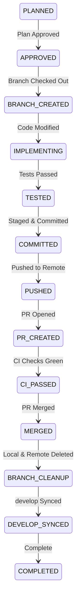

# AGENTS.md

- **Owner**: Repository Governance Owner
- **Status**: Mandatory
- **Version**: 2.0
- **Review Cycle**: Quarterly
- **Last Updated**: 2026-08-17
- **Related Documents:**
  - [REPOSITORY_GOVERNANCE.md](REPOSITORY_GOVERNANCE.md)
  - [ARCHITECTURE.md](ARCHITECTURE.md)
  - [API_CONTRACTS.md](API_CONTRACTS.md)
  - [DEPLOYMENT_MAP.md](DEPLOYMENT_MAP.md)
  - [RUNBOOK.md](RUNBOOK.md)
  - [TESTING.md](TESTING.md)
  - [CHANGELOG.md](CHANGELOG.md)
  - [Architecture Decisions Index](docs/decisions/README.md)

---

# MAD Entertrainment Engineering Governance & AI Agent Operating System

Applies To:
* Human Developers
* AI Coding Agents
* Code Review Agents
* Audit Agents
* Refactoring Agents
* PR Review Agents

---

## Relationship to Repository Governance Policy
The repository governance policies (roles, matrices, branch and PR policies) are canonically defined in [REPOSITORY_GOVERNANCE.md](REPOSITORY_GOVERNANCE.md). This file (`AGENTS.md`) serves as the operational Single Source of Truth (SSOT) and instructions for human and AI agents implementing those policies in the codebase.

---

# 1. PURPOSE & CORE PRINCIPLES

## Purpose
This document defines how all engineering work must be performed in the MAD Entertrainment repository.

The goals are:
* Maintain a Single Source of Truth (SSOT)
* Prevent duplicate logic and UI
* Prevent dead, zombie, and orphan code
* Prevent legacy code accumulation
* Prevent orphan APIs and routes
* Maintain strict repository hygiene
* Maintain frontend/backend alignment
* Protect production systems
* Guarantee long-term maintainability

Failure to follow these rules is considered a governance violation.

## Core Principles
Every change must satisfy:
1. **Correctness**
2. **Security**
3. **Maintainability**
4. **Scalability**
5. **Simplicity**
6. **Traceability**
7. **Reversibility**

## One Task Rule
Only one active implementation task may exist at a time.
A task is not complete until:
* Implementation Complete
* Verification Complete
* PR Approved & Merged
* Branch Cleanup Complete
* Develop Sync Complete

Do not begin a second implementation stream until the first is fully completed. New findings must be added to the backlog. Never interrupt active implementation.

## Hard Safety Rule
Audit-only means **NO**: editing, refactoring, deleting, installing packages, staging, committing, pushing, merging, rebasing, or deleting branches without explicit user approval. Never modify code first; always audit first.

---

# 2. SINGLE SOURCE OF TRUTH (SSOT) & OWNERSHIP

Every business rule must have exactly one owner.

### Ownership Matrix

| Domain | Canonical Owner | Rule |
|---|---|---|
| **Auth** | Server | Session, token verification, permission checks |
| **Payments** | Server | Payment intents, webhooks, verification |
| **Bookings** | Server | Booking lifecycle, expiry, reservations |
| **Ticket Status** | Server | Issuance, transfers, invalidations |
| **Pricing** | Server | Tier calculations, discounts, taxes |
| **Availability** | Server | Capacity, inventory calculations |
| **Seat Locking** | Server | Redis locks, distributed mutexes |
| **RBAC** | Server | Role permissions, access gates |
| **Notifications** | Server | Email, SMS, push delivery |
| **UI State** | Frontend | Form inputs, modal visibility, client selections |
| **UI Presentation**| Frontend | Rendering, responsiveness, layout, styling |

*Frontend must never own business rules or duplicate backend validation decisions.*

### Shared Ownership Rule
Reusable cross-cutting logic must live in shared packages:
* `packages/shared` — Shared schemas, constants, business contracts
* `packages/ui` — Reusable presentation components and design primitives
* `packages/types` — TypeScript type definitions
* `packages/utils` — Domain-agnostic utilities and helpers
* `packages/validations` — Zod and validation schemas

Before creating any utility, type, schema, constant, or validation, search the repository first. Reuse existing implementations. Do not create duplicates.

### Frontend-Backend Contract Governance
Every UI feature must trace:
$$\text{Page} \longrightarrow \text{API} \longrightarrow \text{Service} \longrightarrow \text{Database}$$

Before implementation, identify: Endpoint, Request Schema, Response Schema, Error Schema, Auth Rules, and Ownership. Frontend assumptions must match backend responses exactly. Shared schemas are mandatory.

---

# 3. GLOBAL IMPLEMENTATION DECISION GATE

No implementation or file modification may begin until the Implementation Readiness Audit has concluded with one of the approved outcomes.

```text
Request
   ↓
Issue Created
   ↓
Implementation Readiness Audit
   ↓
Repository Search
   ↓
Implementation Decision Gate
   ↓
Approved?
   ├── Already Implemented → Close/Document
   ├── Partially Implemented → Extend Existing
   ├── Rejected → Close Request
   └── Not Implemented → Create Branch → Implement
```

Every request must end with exactly one decision:
* [ ] **Outcome A — Already Implemented**: Feature exists, behavior matches requirements, and tests pass. STOP. Do NOT implement. Reject any implementation PR. Create documentation updates only if required. Close or convert the issue.
* [ ] **Outcome B — Partially Implemented**: Feature exists but is incomplete. Extend the existing implementation. Reuse existing architecture. Do not duplicate logic.
* [ ] **Outcome C — Not Implemented**: Feature does not exist. Proceed with implementation following the approved 13-phase workflow on a dedicated task branch.
* [ ] **Outcome D — Rejected**: Duplicate issue, duplicate feature, invalid request, architecture conflict, superseded by another issue, or out of scope. Close the request immediately.

---

# 4. 13-PHASE EXECUTION PROTOCOL

Before modifying any code, documentation, scripts, or configurations, execute and document the following 13 phases:

1. **Phase 1 — Task Classification**: State category (Bug Fix, Feature, Refactor, etc.), primary objective, scope (apps/packages), and risk level (Low/Medium/High).
2. **Phase 2 — Skill Selection**: Select primary and supporting skills under `.agents/skills/` with justification.
3. **Phase 3 — Repository Discovery**: Search the workspace for existing components, helpers, utilities, or hooks.
4. **Phase 4 — Existing Solution Search**: Align naming, structure, and design tokens with existing repository patterns.
5. **Phase 5 — Dependency Impact Analysis**: Map downstream consumers and evaluate regression risk.
6. **Phase 6 — Git Status & Branch Analysis**: Ensure working tree is clean and branch name matches naming rules.
7. **Phase 7 — Root Cause Analysis**: For bugs, isolate root causes using verified facts and evidence before writing code.
8. **Phase 8 — Implementation Plan**: Document planned changes file-by-file with trade-off analysis.
9. **Phase 9 — Validation Plan**: Define automated tests, build commands, and manual verification steps.
10. **Phase 10 — Execution**: Implement changes incrementally in logical commits.
11. **Phase 11 — Post-Implementation Verification**: Run `pnpm run build`, `pnpm run lint`, `pnpm run type-check`, and test suites.
12. **Phase 12 — Repository Cleanup**: Remove temporary scratch files, debug logs, unused imports, or trailing whitespaces.
13. **Phase 13 — PR Readiness Review**: Clear the 11-question quality gate and UI merge gate.

---

# 5. INVESTIGATION WORKFLOW (GOV-INV)

## GOV-INV-001 — Root Cause Investigation Standard
> **Core Principle: A plausible explanation is never a verified root cause.**
> No hypothesis may be promoted to a root cause until it survives independent verification and repeated attempts at falsification.

### Mandatory Workflow:
1. **Observe**: Collect facts only (symptoms, logs, stack traces, screenshots, versions). Do not jump to conclusions.
2. **Generate Multiple Hypotheses**: Formulate at least three independent hypotheses.
3. **Search Upstream First**: Check framework release notes, changelogs, and known limitations before runtime instrumentation.
4. **Create Minimal Reproduction**: Reproduce in isolation whenever possible.
5. **Perform Falsification**: Design experiments to prove hypotheses wrong, not just confirm them.
6. **Evidence Classification**: Explicitly classify findings per GOV-INV-002.
7. **Assign Confidence**: Mark confidence as High, Medium, or Low.
8. **Stop Conditions**: Exit per GOV-INV-003 once root cause is established with high confidence.

## GOV-INV-002 — Claims Must Match Evidence
Every major conclusion must be explicitly labeled as:
* **Verified Fact** — Supported by at least two independent evidence categories.
* **Experimental Result** — Output of an isolated test or benchmark.
* **Inference** — Logical deduction derived from verified facts.
* **Hypothesis** — Proposed explanation awaiting falsification.
* **Unknown** — Unverified or unmeasured state.

## GOV-INV-003 — Investigation Exit Criteria
Stop investigation when:
1. Root cause has High confidence.
2. Remaining uncertainties do not change the engineering decision.
3. Additional steps produce confirmation rather than new evidence.
4. Practical remediation is identified.

---

# 6. UI/UX GOVERNANCE & STANDARDS

Canonical reference: [UI_UX_GOVERNANCE.md](UI_UX_GOVERNANCE.md) (UI-001).

## Authority Order
1. Repository Source Code
2. `UI_UX_GOVERNANCE.md`
3. `.agents/skills/ui-ux/SKILL.md`
4. `AGENTS.md`
5. External Best Practices

## UI Design & Accessibility Principles
* **Mobile-First & Responsive**: Zero horizontal scroll on viewports `320px`, `375px`, `768px`, `1024px`, `1440px`.
* **Touch Targets**: Minimum `44px` (e.g. `min-h-[44px]` / `w-11 h-11`) for all interactive elements.
* **WCAG AA Conformance**: High contrast, semantic HTML (`<main>`, `<section>`, `<button>`), descriptive `aria-label`s, logical keyboard tab order, and Escape-key dismiss on modals.
* **Required Boundary States**: Data containers must implement Loading (skeletons), Empty, Error, Offline, and Success states.
* **Modals & Drawers**: Use responsive drawers for mobile viewports and dialog modals for desktop viewports.

## 15-Point Standardized UI/UX Audit Structure
1. Executive Summary | 2. UX Health Score | 3. Repository Context | 4. Component Inventory | 5. User Journey Audit | 6. Feature-Specific Audit | 7. Accessibility Audit | 8. Mobile Audit | 9. Performance Audit | 10. Cognitive Load Assessment | 11. Verified Findings | 12. Do Not Change | 13. Implementation Roadmap | 14. Regression Checklist | 15. Final Readiness.

## UI PR Merge Gate Checklist
Every UI PR description must include:
```markdown
UI-001 Pull Request Checklist

[ ] Mobile-first layout implemented
[ ] Responsive at all required breakpoints (320px, 375px, 768px, 1024px, 1440px)
[ ] Tabs used instead of deep menus where appropriate
[ ] Buttons aligned consistently
[ ] Consistent spacing applied
[ ] No horizontal scrolling
[ ] Loading state implemented
[ ] Empty state implemented
[ ] Error state implemented
[ ] Accessibility verified (WCAG AA)
[ ] Shared components reused (packages/ui searched first)
[ ] Desktop screenshot attached
[ ] Tablet screenshot attached
[ ] Mobile screenshot attached
[ ] All UI-001 merge gate conditions cleared
```

---

# 7. TASK COMPLETION EVIDENCE GATE & GIT PROTOCOL

Marking a task as **Complete** is strictly forbidden unless verified repository evidence is provided for each state transition:



## Branch Safety & Naming
Protected branches: `develop`, `live`. Never commit directly.
Allowed branch prefixes: `feat/*`, `fix/*`, `refactor/*`, `audit/*`, `docs/*`, `test/*`, `chore/*`, `seo/*`.

## RULE-GIT-001 — Branch Cleanup Protocol
1. Verify working tree clean (`git status`).
2. Synchronize develop: `git checkout develop && git pull origin develop`.
3. Confirm PR merged on GitHub.
4. Verify reachability: `git merge-base --is-ancestor feature-branch develop`.
5. Safe delete local branch: `git branch -d feature-branch` (or `-D` if merge commit verified).
6. Delete remote branch: `git push origin --delete feature-branch`.
7. Prune references: `git fetch --prune`.
8. Final verification: `git status` shows clean tree on `develop`.

## RULE-GIT-002 — No Branch Cleanup with Local Changes
Never delete or switch away from a feature branch with unstaged or uncommitted changes.

## Manual Verification Gate
Before editing, present:
* Current Branch
* Git Status
* Files To Change
* Reason For Change
* Risk Level
* Patch Summary
* Verification Plan
* Rollback Plan
* **Wait for explicit user approval before modifying code.**

---

# 8. REPOSITORY HYGIENE, FILE SIZES & SECURITY RULES

## File Size Governance
* **Component**: 0–300 lines (301–500: Review Required, 701+: Refactor Required, 1000+: PR Blocked)
* **Hook**: 0–250 lines
* **Schema**: 0–300 lines
* **Controller**: 0–200 lines
* **Service**: 0–500 lines (501–700: Review Required, 701+: Refactor Required)

## Code Cleanliness (Zero Tolerance)
The repository must remain clean after every implementation. The following are strictly forbidden:
* Unused variables, imports, exports, functions, types, hooks, or React state
* Dead, commented-out, or unreachable code
* Tracked build artifacts (`dist/`, `.next/`, `*.d.ts` in `src/`, `*.js.map` in `src/`)
* Tracked bytecode (`*.pyc`, `__pycache__/`)
* Disallowed folder names (`temp`, `tmp`, `misc`, `old`, `backup`, `new-folder`, `final`)
* Temporary logging (`console.log`, `console.debug`, `console.trace`) in production code

## Secrets & Security
**NEVER** hardcode or commit API keys, passwords, JWT secrets, database connection strings, Cloudinary credentials, Stripe/Razorpay keys, or access tokens. All secrets must come from validated environment variables.

---

# 9. SKILL SELECTION & PROMPT INTELLIGENCE

Before executing any request:
1. **Analyze Objective**: Identify business context, technical context, affected domain, risk level, and expected outcome.
2. **Select Skills**: Identify relevant skills under `.agents/skills/` (Core, Domain, Infrastructure).
3. **Justify Skills**: State why each skill applies, risks evaluated, and evidence collected.
4. **Identify Applicable Rules**: Note specific governance rules (`VAL-UI-*`, `VAL-HYG-*`, `VAL-DOC-*`, `VAL-SEC-*`).
5. **Isolate Root Causes**: Determine what, why, where, and how with repository evidence before providing solutions.

---

# 10. RELEASE GOVERNANCE & FINAL QUALITY GATE

## PR Quality Gate (11 Questions)
Before merging any PR, confirm:
1. Is there a single source of truth?
2. Did we avoid adding duplicate logic?
3. Did we avoid adding duplicate validation?
4. Did we avoid adding duplicate UI?
5. Did we avoid creating dead code?
6. Did we avoid creating legacy code?
7. Did we avoid creating orphan UI?
8. Did we avoid creating orphan APIs?
9. Are frontend and backend aligned?
10. Are file size limits respected?
11. Can a new developer understand this in ten minutes?

## Release Governance
Before merging `develop` $\longrightarrow$ `live`:
* Build Passes (`pnpm run build`)
* Tests Pass (`pnpm run test`)
* Lint Passes (`pnpm run lint`)
* Governance Gating Passes (`pnpm run governance:docs`)
* Deployment Parity Verified (Render backend + Vercel frontend)
* Rollback Plan Documented

---

# FINAL MAD GOLDEN RULE

> **Do not optimize for speed. Optimize for:**
>
> **Correctness • Maintainability • Safety • Consistency • Traceability • Long-Term Health**
>
> *The cleanest code is the code that never needs to be rewritten.*
