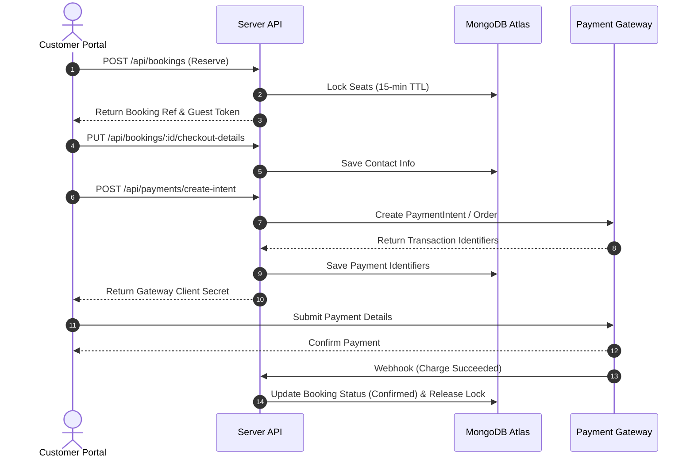

# MAD Entertrainment — API Contracts

Status: Active  
Version: 1.0  
Owner: Repository Architecture & API Governance  
Review Cycle: Quarterly  
Last Updated: 2026-06-25  
API Version: v1 (Active)  

Supersedes:
- None (First version establishing the API Contract SSOT)

Related Documents:
- [README.md](file:///Users/admin/Desktop/MAD%20Entertrainment/README.md)
- [REPOSITORY_GOVERNANCE.md](file:///Users/admin/Desktop/MAD%20Entertrainment/REPOSITORY_GOVERNANCE.md)
- [ARCHITECTURE.md](file:///Users/admin/Desktop/MAD%20Entertrainment/ARCHITECTURE.md)
- [DEPLOYMENT_MAP.md](file:///Users/admin/Desktop/MAD%20Entertrainment/DEPLOYMENT_MAP.md)
- [RUNBOOK.md](file:///Users/admin/Desktop/MAD%20Entertrainment/RUNBOOK.md)
- [decisions/README.md](file:///Users/admin/Desktop/MAD%20Entertrainment/docs/decisions/README.md)
- [CHANGELOG.md](file:///Users/admin/Desktop/MAD%20Entertrainment/CHANGELOG.md)

---

## Repository Documentation Hierarchy

Below is the core documentation structure and relationships for MAD Entertrainment:

```text
README.md
│
├── REPOSITORY_GOVERNANCE.md     ← Governance SSOT
├── ARCHITECTURE.md              ← System architecture SSOT
├── DEPLOYMENT_MAP.md            ← Infrastructure & deployment SSOT
├── API_CONTRACTS.md             ← API contract SSOT
├── docs/decisions/README.md     ← Architecture Decision Records (ADRs)
└── RUNBOOK.md                   ← Operational procedures
```

---

## Document Governance

### API Change Policy

API_CONTRACTS.md must be updated whenever any of the following change:
- New endpoint added
- Endpoint removed
- Request schema changes
- Response schema changes
- Authentication requirements change
- Authorization rules change
- Validation rules change
- Error response changes
- Rate limiting changes
- Webhook contracts change
- API version changes

Changes affecting API contracts must not be merged without updating this document and logging the release in [CHANGELOG.md](file:///Users/admin/Desktop/MAD%20Entertrainment/CHANGELOG.md).

### API Stability Classification
The table below classifies the maturity and stability of the system's API contracts:

| Area | Stability |
| :--- | :--- |
| Public API Endpoints | Stable |
| Admin CRUD Endpoints | Stable |
| Webhook Receivers | Stable |
| Developer Diagnostics | Internal |
| Future API Enhancements | Experimental |

*Definitions*:
- **Stable**: Under continuous integration, verified by tests, and requires formal review to change schema.
- **Internal**: Exposed strictly inside local development networks or dev environments.
- **Experimental**: Unapproved proposal or future suggestion.

---

## 1. Executive Overview

### API Philosophy
MAD Entertrainment operates a decoupled, contract-governed API layer. The backend API server (`apps/server`) exposes a stateless JSON API surface. Frontends (`apps/web` and `apps/admin`) act strictly as presentation and state-rendering consumers.

### Contract-First Validation
Every request payload submitted to backend controllers is statically and runtime-validated at the Express routing layer. We utilize Zod schemas declared in packages (`@mad/validations`) and server schemas (`apps/server/src/validations/`) to block malformed requests before they touch database schemas or business services.

### API Ownership Matrix
API domains are governed by specific engineering groups to maintain accountability:

| API Domain | Middleware Boundaries | Primary Owner |
| :--- | :--- | :--- |
| **Authentication & Profile** | `/api/auth/*`, `/api/admin/auth/*` | Auth Domain Team |
| **Bookings & Tickets** | `/api/bookings/*`, `/api/public/tickets/*` | Booking Domain Team |
| **Payments & Refunds** | `/api/payments/*`, `/api/admin/refunds/*` | Financial Domain Team |
| **Events & Content** | `/api/events/*`, `/api/dj-operators/*`, `/api/categories/*`, `/api/popups/*` | Content Domain Team |
| **Team & User Admin** | `/api/admin/team/*`, `/api/admin/users/*` | Admin Platform Team |
| **Diagnostics & Queues** | `/api/admin/diagnostics/*` | SRE & Infrastructure Team |

### API Lifecycle State
Each active route namespace is classified according to its operational state:

| Route Namespace | Lifecycle Status | Default Consumer |
| :--- | :--- | :--- |
| `/api/auth` | Stable | Public Client (`apps/web`) |
| `/api/events` | Stable | Public Client & Scanner Admin |
| `/api/bookings` | Stable | Public Client & Admin Dashboard |
| `/api/payments` | Stable | Public Client & Webhook Providers |
| `/api/dj-operators` | Stable | Public Client & Admin Dashboard |
| `/api/categories` | Stable | Public Client & Admin Dashboard |
| `/api/popups` | Stable | Public Client & Admin Dashboard |
| `/api/public/tickets` | Stable | Public Client & User Accounts |
| `/api/admin/auth` | Stable | Admin Dashboard (`apps/admin`) |
| `/api/admin/uploads` | Stable | Admin Dashboard (`apps/admin`) |
| `/api/admin/events` | Stable | Admin Dashboard (`apps/admin`) |
| `/api/admin/dj-operators` | Stable | Admin Dashboard (`apps/admin`) |
| `/api/admin/bookings` | Stable | Admin Dashboard (`apps/admin`) |
| `/api/admin/refunds` | Stable | Admin Dashboard (`apps/admin`) |
| `/api/admin/coupons` | Stable | Admin Dashboard (`apps/admin`) |
| `/api/admin/analytics` | Stable | Admin Dashboard (`apps/admin`) |
| `/api/admin/diagnostics` | Internal | Admin Dashboard (Super Admin only) |
| `/api/admin/webhooks` | Stable | Admin Dashboard (Admin logs audit) |
| `/api/admin/categories` | Stable | Admin Dashboard (`apps/admin`) |
| `/api/admin/tiers` | Stable | Admin Dashboard (`apps/admin`) |
| `/api/admin/ticket-profiles` | Stable | Admin Dashboard (`apps/admin`) |
| `/api/admin/popups` | Stable | Admin Dashboard (`apps/admin`) |
| `/api/admin/notifications` | Stable | Admin Dashboard (`apps/admin`) |
| `/api/admin/team` | Stable | Admin Dashboard (Super Admin only) |
| `/api/admin/scanner` | Stable | Scanner Mobile App / Admin |
| `/api/admin/users` | Stable | Admin Dashboard (`apps/admin`) |
| `/api/admin/marketing` | Stable | Admin Dashboard (`apps/admin`) |
| `/api/dev` | Internal | Developer Scripts (Non-prod environments) |
| `/api/health` | Stable | Render Monitor / Uptime Pingers |

---

## 2. API Inventory & Routes

### Current Implementation
The table below logs all active endpoints compiled from Express router maps and verified against `audit_data.json` and server source code:

| Method | Path | Visibility | Lifecycle | Auth Required | Role Constraint | Purpose |
| :--- | :--- | :--- | :--- | :--- | :--- | :--- |
| **GET** | `/api/health` | Public | Stable | None | Public | Health status check of DB, Redis, and Email transporter. |
| **GET** | `/api/dev/email-health` | Internal (Debug Only) | Experimental | Yes (Admin) | `super_admin`, `admin`, `manager`, `support`, `scanner` | Development SMTP diagnostic configurations. |
| **POST** | `/api/auth/google` | Public | Stable | None (Rate Limited) | Public | Sign in/sign up using Google ID Token. |
| **POST** | `/api/auth/check-email` | Public | Stable | None (Rate Limited) | Public | Check if email is associated with a registered user. |
| **POST** | `/api/auth/magic-link` | Public | Stable | None (Rate Limited) | Public | Request transactional login OTP or Magic Link email. |
| **POST** | `/api/auth/verify` | Public | Stable | None (Rate Limited) | Public | Validate OTP or token; returns JWT access/refresh tokens. |
| **POST** | `/api/auth/refresh` | Public | Stable | None (Rate Limited) | Public | Reissue JWT access token using a valid refresh token. |
| **POST** | `/api/auth/logout` | Public | Stable | None | Public | Invalidate refresh token and clear cookies. |
| **GET** | `/api/auth/me` | Public | Stable | Yes (User) | Registered User | Fetch the authenticated customer profile. |
| **PATCH** | `/api/auth/profile` | Public | Stable | Yes (User) | Registered User | Update customer profile details. |
| **GET** | `/api/events` | Public | Stable | None | Public | List published events (filters: category, search, page). |
| **GET** | `/api/events/:slug` | Public | Stable | None | Public | Get single event details by URL slug. |
| **GET** | `/api/events/:eventId/seats` | Public | Stable | None | Public | Get current locked/reserved seating map. |
| **GET** | `/api/bookings/session` | Public | Stable | None | Public | Issue a stateless Guest Session Token for booking. |
| **POST** | `/api/bookings` | Public | Stable | Optional | Registered/Guest | Initiate a booking, lock seats, create pending transaction. |
| **PUT** | `/api/bookings/:bookingId/checkout-details` | Public | Stable | Optional | Registered/Guest | Save firstName, lastName, email, phone on pending booking. |
| **GET** | `/api/bookings/me` | Public | Stable | Yes (User) | Registered User | List ticket purchase history of the logged-in customer. |
| **GET** | `/api/bookings/:bookingId` | Public | Stable | Optional | Registered/Guest | Retrieve single booking confirmation by booking reference. |
| **POST** | `/api/bookings/:bookingId/download-token` | Public | Stable | Optional | Registered/Guest | Request a short-lived ticket PDF download access token. |
| **GET** | `/api/bookings/:bookingId/download` | Public | Stable | Optional | Registered/Guest | Download tickets PDF using download token. |
| **POST** | `/api/bookings/:bookingId/resend` | Public | Stable | Optional (Limited) | Registered/Guest | Resend tickets confirmation email. |
| **POST** | `/api/bookings/recover` | Public | Stable | None (Rate Limited) | Public | Initiate booking recovery for a guest transaction ID. |
| **POST** | `/api/bookings/recover/verify` | Public | Stable | None (Rate Limited) | Public | Verify recovery OTP and return booking search link. |
| **POST** | `/api/payments/create-intent` | Public | Stable | Optional | Registered/Guest | Create Stripe PaymentIntent or Razorpay Order for booking. |
| **POST** | `/api/payments/verify` | Public | Stable | Optional | Registered/Guest | Verify Razorpay signatures or check Stripe intent completion. |
| **POST** | `/api/payments/webhook/stripe` | Public (Webhook) | Stable | None | Public | Stripe payment status event webhook. |
| **POST** | `/api/payments/webhook/razorpay` | Public (Webhook) | Stable | None | Public | Razorpay payment status event webhook. |
| **GET** | `/api/dj-operators` | Public | Stable | None | Public | Fetch active DJ Operator profiles (cached). |
| **GET** | `/api/dj-operators/:slug` | Public | Stable | None | Public | Fetch detailed DJ Operator profile by slug (cached). |
| **GET** | `/api/categories` | Public | Stable | None | Public | Retrieve active event categories. |
| **GET** | `/api/popups/active` | Public | Stable | None | Public | Fetch active promotion cards (cached). |
| **GET** | `/api/public/tickets/my-tickets` | Public | Stable | Yes (User) | Registered User | Retrieve all tickets owned by the user. |
| **GET** | `/api/public/tickets/:ticketId/qr` | Public | Stable | Optional | Registered/Guest | Fetch ticket QR code payload (base64 image payload). |
| **POST** | `/api/public/tickets/:ticketId/assign` | Public | Stable | Yes (User) | Registered User | Assign ticket ownership to a target email address. |
| **POST** | `/api/public/tickets/:ticketId/claim` | Public | Stable | Yes (User) | Registered User | Claim a ticket assigned to the user's email. |
| **POST** | `/api/public/tickets/:ticketId/revoke` | Public | Stable | Yes (User) | Registered User | Revoke ticket assignment and reclaim ownership. |
| **GET** | `/api/marketing/unsubscribe` | Public | Stable | None | Public | Unsubscribe customer from newsletter campaigns. |
| **POST** | `/api/admin/auth/login` | Public | Stable | None | Public | Credentials admin login (returns admin JWT). |
| **GET** | `/api/admin/auth/me` | Internal (Admin) | Stable | Yes (Admin) | `super_admin` up to `scanner` | Retrieve current admin payload. |
| **POST** | `/api/admin/auth/logout` | Internal (Admin) | Stable | Yes (Admin) | `super_admin` up to `scanner` | Clear administrative sessions. |
| **POST** | `/api/admin/uploads/image` | Internal (Admin) | Stable | Yes (Admin) | `super_admin`, `admin`, `manager` | Upload image file to Cloudinary. |
| **DELETE** | `/api/admin/uploads` | Internal (Admin) | Stable | Yes (Admin) | `super_admin`, `admin`, `manager` | Delete image asset from Cloudinary. |
| **POST** | `/api/admin/events` | Internal (Admin) | Stable | Yes (Admin) | `super_admin`, `admin`, `manager` | Create a new event. |
| **GET** | `/api/admin/events` | Internal (Admin) | Stable | Yes (Admin) | `super_admin` up to `scanner` | List all events (including drafted, active, past). |
| **GET** | `/api/admin/events/:id` | Internal (Admin) | Stable | Yes (Admin) | `super_admin` up to `scanner` | Retrieve single event configuration by ID. |
| **PUT** | `/api/admin/events/:id` | Internal (Admin) | Stable | Yes (Admin) | `super_admin`, `admin`, `manager` | Update event details with concurrency safety. |
| **DELETE** | `/api/admin/events/:id` | Internal (Admin) | Stable | Yes (Admin) | `super_admin`, `admin`, `manager` | Delete event profile. |
| **POST** | `/api/admin/dj-operators` | Internal (Admin) | Stable | Yes (Admin) | `super_admin`, `admin`, `manager` | Create DJ Operator. |
| **GET** | `/api/admin/dj-operators` | Internal (Admin) | Stable | Yes (Admin) | `super_admin` up to `scanner` | List DJ Operators. |
| **GET** | `/api/admin/dj-operators/:id` | Internal (Admin) | Stable | Yes (Admin) | `super_admin` up to `scanner` | Retrieve DJ Operator details. |
| **PUT** | `/api/admin/dj-operators/:id` | Internal (Admin) | Stable | Yes (Admin) | `super_admin`, `admin`, `manager` | Update DJ Operator profile. |
| **DELETE** | `/api/admin/dj-operators/:id` | Internal (Admin) | Stable | Yes (Admin) | `super_admin`, `admin`, `manager` | Delete DJ Operator profile. |
| **GET** | `/api/admin/bookings` | Internal (Admin) | Stable | Yes (Admin) | `super_admin`, `admin`, `manager`, `support` | List and search bookings. |
| **GET** | `/api/admin/bookings/summary` | Internal (Admin) | Stable | Yes (Admin) | `super_admin`, `admin`, `manager`, `support` | Fetch aggregated bookings count statistics. |
| **GET** | `/api/admin/bookings/:id` | Internal (Admin) | Stable | Yes (Admin) | `super_admin`, `admin`, `manager`, `support` | Retrieve booking details by ID or reference string. |
| **PATCH** | `/api/admin/bookings/:id/cancel` | Internal (Admin) | Stable | Yes (Admin) | `super_admin`, `admin`, `support` | Cancel booking and release seats. |
| **PATCH** | `/api/admin/bookings/:id/correct-email` | Internal (Admin) | Stable | Yes (Admin) | `super_admin`, `admin`, `support` | Correct customer email on a completed booking. |
| **POST** | `/api/admin/bookings/:id/resend` | Internal (Admin) | Stable | Yes (Admin) | `super_admin`, `admin`, `support` | Force resend of ticket emails. |
| **POST** | `/api/admin/refunds` | Internal (Admin) | Stable | Yes (Admin) | `super_admin`, `admin` | Create a refund request for a booking. |
| **GET** | `/api/admin/refunds` | Internal (Admin) | Stable | Yes (Admin) | `super_admin`, `admin`, `support` | List and search refund requests. |
| **PATCH** | `/api/admin/refunds/:id/process` | Internal (Admin) | Stable | Yes (Admin) | `super_admin`, `admin` | Process (Approve/Reject) refund via gateway. |
| **POST** | `/api/admin/coupons` | Internal (Admin) | Stable | Yes (Admin) | `super_admin`, `admin`, `manager` | Create coupon. |
| **GET** | `/api/admin/coupons` | Internal (Admin) | Stable | Yes (Admin) | `super_admin`, `admin`, `manager`, `support` | List coupons. |
| **GET** | `/api/admin/coupons/:id` | Internal (Admin) | Stable | Yes (Admin) | `super_admin`, `admin`, `manager`, `support` | Retrieve coupon configuration by ID. |
| **PUT** | `/api/admin/coupons/:id` | Internal (Admin) | Stable | Yes (Admin) | `super_admin`, `admin`, `manager` | Update coupon settings. |
| **DELETE** | `/api/admin/coupons/:id` | Internal (Admin) | Stable | Yes (Admin) | `super_admin`, `admin`, `manager` | Delete coupon. |
| **PATCH** | `/api/admin/coupons/:id/toggle` | Internal (Admin) | Stable | Yes (Admin) | `super_admin`, `admin`, `manager` | Toggle coupon active status. |
| **GET** | `/api/admin/analytics/summary` | Internal (Admin) | Stable | Yes (Admin) | `super_admin`, `admin`, `manager` | Get system overview KPI numbers. |
| **GET** | `/api/admin/analytics/revenue` | Internal (Admin) | Stable | Yes (Admin) | `super_admin`, `admin`, `manager` | Get historical booking revenue data. |
| **GET** | `/api/admin/analytics/attendance/summary` | Internal (Admin) | Stable | Yes (Admin) | `super_admin`, `admin`, `manager` | Get ticket scan attendance ratios. |
| **GET** | `/api/admin/analytics/attendance/rankings` | Internal (Admin) | Stable | Yes (Admin) | `super_admin`, `admin`, `manager` | Get event attendance ranks. |
| **GET** | `/api/admin/diagnostics/consistency` | Internal (Diagnostics) | Stable | Yes (Admin) | `super_admin` | Audit database/gateway record consistency. |
| **POST** | `/api/admin/diagnostics/consistency/repair` | Internal (Diagnostics) | Stable | Yes (Admin) | `super_admin` | Fix identified database inconsistencies. |
| **GET** | `/api/admin/diagnostics/reservations` | Internal (Diagnostics) | Stable | Yes (Admin) | `super_admin` | List locked reservation seats. |
| **GET** | `/api/admin/diagnostics/system` | Internal (Diagnostics) | Stable | Yes (Admin) | Standard Admin / Super Admin | Fetch system status details (MongoDB, Redis, CPU). |
| **GET** | `/api/admin/diagnostics/dlq` | Internal (Diagnostics) | Stable | Yes (Admin) | Standard Admin / Super Admin | List dead letter queue jobs. |
| **GET** | `/api/admin/diagnostics/dlq/:id` | Internal (Diagnostics) | Stable | Yes (Admin) | `super_admin` | Retrieve dead letter queue job detail. |
| **POST** | `/api/admin/diagnostics/dlq/:id/retry` | Internal (Diagnostics) | Stable | Yes (Admin) | `super_admin` | Retry processing a dead letter queue job. |
| **POST** | `/api/admin/diagnostics/dlq/retry-all` | Internal (Diagnostics) | Stable | Yes (Admin) | `super_admin` | Retry processing all dead letter queue jobs. |
| **GET** | `/api/admin/diagnostics/queues` | Internal (Diagnostics) | Stable | Yes (Admin) | Standard Admin / Super Admin | Fetch active queues status metrics. |
| **POST** | `/api/admin/diagnostics/queues/:name/pause` | Internal (Diagnostics) | Stable | Yes (Admin) | `super_admin` | Pause specific task queue. |
| **POST** | `/api/admin/diagnostics/queues/:name/resume` | Internal (Diagnostics) | Stable | Yes (Admin) | `super_admin` | Resume specific task queue. |
| **POST** | `/api/admin/diagnostics/queues/:name/drain` | Internal (Diagnostics) | Stable | Yes (Admin) | `super_admin` | Drain specific task queue jobs. |
| **GET** | `/api/admin/webhooks` | Internal (Admin) | Stable | Yes (Admin) | `super_admin`, `admin` | Search and audit processed webhook payloads. |
| **POST** | `/api/admin/categories` | Internal (Admin) | Stable | Yes (Admin) | `super_admin`, `admin`, `manager` | Create category. |
| **GET** | `/api/admin/categories` | Internal (Admin) | Stable | Yes (Admin) | `super_admin` up to `scanner` | List all categories. |
| **PUT** | `/api/admin/categories/:id` | Internal (Admin) | Stable | Yes (Admin) | `super_admin`, `admin`, `manager` | Update category details. |
| **DELETE** | `/api/admin/categories/:id` | Internal (Admin) | Stable | Yes (Admin) | `super_admin`, `admin`, `manager` | Delete category. |
| **POST** | `/api/admin/tiers` | Internal (Admin) | Stable | Yes (Admin) | `super_admin`, `admin`, `manager` | Create ticket tier tag. |
| **GET** | `/api/admin/tiers` | Internal (Admin) | Stable | Yes (Admin) | `super_admin` up to `scanner` | List ticket tier tags. |
| **PATCH** | `/api/admin/tiers/:id` | Internal (Admin) | Stable | Yes (Admin) | `super_admin`, `admin`, `manager` | Update ticket tier tag name. |
| **DELETE** | `/api/admin/tiers/:id` | Internal (Admin) | Stable | Yes (Admin) | `super_admin`, `admin`, `manager` | Delete ticket tier tag. |
| **POST** | `/api/admin/ticket-profiles` | Internal (Admin) | Stable | Yes (Admin) | `super_admin`, `admin`, `manager` | Create ticket configuration profile. |
| **GET** | `/api/admin/ticket-profiles` | Internal (Admin) | Stable | Yes (Admin) | `super_admin` up to `scanner` | List ticket configuration profiles. |
| **GET** | `/api/admin/ticket-profiles/:id` | Internal (Admin) | Stable | Yes (Admin) | `super_admin` up to `scanner` | Retrieve single ticket profile. |
| **PUT** | `/api/admin/ticket-profiles/:id` | Internal (Admin) | Stable | Yes (Admin) | `super_admin`, `admin`, `manager` | Update ticket profile configuration. |
| **DELETE** | `/api/admin/ticket-profiles/:id` | Internal (Admin) | Stable | Yes (Admin) | `super_admin`, `admin`, `manager` | Delete ticket profile. |
| **POST** | `/api/admin/popups` | Internal (Admin) | Stable | Yes (Admin) | `super_admin`, `admin`, `manager` | Create active promotion card. |
| **GET** | `/api/admin/popups` | Internal (Admin) | Stable | Yes (Admin) | `super_admin`, `admin`, `manager`, `support` | List promotion cards. |
| **GET** | `/api/admin/popups/:id` | Internal (Admin) | Stable | Yes (Admin) | `super_admin`, `admin`, `manager`, `support` | Retrieve promotion card details. |
| **PUT** | `/api/admin/popups/:id` | Internal (Admin) | Stable | Yes (Admin) | `super_admin`, `admin`, `manager` | Update promotion card parameters. |
| **DELETE** | `/api/admin/popups/:id` | Internal (Admin) | Stable | Yes (Admin) | `super_admin`, `admin`, `manager` | Delete promotion card. |
| **PATCH** | `/api/admin/popups/:id/toggle` | Internal (Admin) | Stable | Yes (Admin) | `super_admin`, `admin`, `manager` | Toggle active status of promotion card. |
| **GET** | `/api/admin/notifications` | Internal (Admin) | Stable | Yes (Admin) | `super_admin`, `admin`, `manager`, `support` | Retrieve sent notifications list. |
| **POST** | `/api/admin/notifications/:id/retry` | Internal (Admin) | Stable | Yes (Admin) | `super_admin`, `admin`, `support` | Retry sending a failed email/SMS notification. |
| **GET** | `/api/admin/team` | Internal (Admin) | Stable | Yes (Admin) | `super_admin` | Retrieve list of administrator accounts. |
| **POST** | `/api/admin/team` | Internal (Admin) | Stable | Yes (Admin) | `super_admin` | Invite and create new administrative staff account. |
| **PATCH** | `/api/admin/team/:id/toggle` | Internal (Admin) | Stable | Yes (Admin) | `super_admin` | Toggle active status of administrative staff account. |
| **PATCH** | `/api/admin/team/:id` | Internal (Admin) | Stable | Yes (Admin) | `super_admin` | Edit admin name or email address. |
| **PATCH** | `/api/admin/team/:id/role` | Internal (Admin) | Stable | Yes (Admin) | `super_admin` | Update role permissions of administrative staff account. |
| **POST** | `/api/admin/team/:id/reset-password` | Internal (Admin) | Stable | Yes (Admin) | `super_admin` | Force override of admin account password credentials. |
| **GET** | `/api/admin/scanner/lookup/:reference` | Internal (Admin) | Stable | Yes (Admin) | `super_admin` up to `scanner` | Lookup ticket by scanner QR reference. |
| **POST** | `/api/admin/scanner/scan` | Internal (Admin) | Stable | Yes (Admin) | `super_admin` up to `scanner` | Verify scanner reference and mark ticket as checked in. |
| **GET** | `/api/admin/users` | Internal (Admin) | Stable | Yes (Admin) | `super_admin` up to `scanner` | Search registered customers and guest checkout records. |
| **GET** | `/api/admin/users/guest/:email` | Internal (Admin) | Stable | Yes (Admin) | `super_admin` up to `scanner` | Retrieve guest booking history details by email. |
| **GET** | `/api/admin/users/:id` | Internal (Admin) | Stable | Yes (Admin) | `super_admin` up to `scanner` | Retrieve detailed registered customer record & logs. |
| **PATCH** | `/api/admin/users/:id/toggle-active` | Internal (Admin) | Stable | Yes (Admin) | `super_admin` up to `scanner` | Activate or deactivate customer account credentials. |
| **POST** | `/api/admin/marketing/send` | Internal (Admin) | Stable | Yes (Admin) | `super_admin`, `admin` | Trigger a targeted email/SMS campaign. |

### Repository Standard
- No routes may bypass Express routing definitions declared in `apps/server/src/routes/`.
- Endpoint mappings must strictly respect domain boundaries matching their underlying service schema.
- Custom parameter routes (e.g. `:id`) must validate parameter structures (Zod `objectIdSchema`) immediately.

### Future Recommendations
- See *Appendix — Future API Considerations* — Proposal 3: "JSON API Standardized Pagination & Query Envelopes" for proposals on structuring standard response formats.  
  *Status*: Possible Future Enhancement (Not Approved) · Untracked

---

## 3. Authentication & Authorization

### Current Implementation
Authentication is divided into customer authentication and admin authentication, governed by distinct JWT secrets and validation paths:

#### 1. Customer Authentication Flow
- **Magic Link & OTP Verification**: Customers enter their email (`POST /api/auth/magic-link`). The server generates a cryptographically random, 6-digit numeric OTP and stores it in Redis with a 5-minute TTL. The OTP is sent via ZeptoMail.
- **Login Verification**: The user submits the OTP via `/api/auth/verify`. Upon verification, the server issues a JWT Access Token (expires in 15 minutes) and a JWT Refresh Token (expires in 7 days).
- **Session Tokens**: Unauthenticated guest bookings generate a temporary guest session token (`GET /api/bookings/session`) using `JWT_SESSION_SECRET` to trace the seat locks during checkout.

#### 2. Administrative Authentication & Role-Based Access Control (RBAC)
Admins authenticate via credential verification (`POST /api/admin/auth/login`) matching bcrypt-hashed passwords in the database.
Access is authorized via the `requireAdmin` middleware and role checks:
- **Role Hierarchy**: The system uses five distinct administrative roles defined in `AdminRole`:
  - `super_admin`: Full permissions, including database repair and team modification.
  - `admin`: Operations, refund issuance, configuration, and logs audit.
  - `manager`: Event design, pricing rules, ticket profile creations.
  - `support`: Read-only data search, ticket resends, email corrections, notifications retry.
  - `scanner`: Strictly restricted to looking up scanner references and performing ticket scan check-ins.

#### 3. Cryptographic Validation & Session Expiry
- Access tokens contain the actor's ID (`sub`), email, role, and a credential `version`.
- Administrative access tokens are validated in real-time. The `requireAdmin` middleware loads the account profile from MongoDB to verify that `isActive` is `true`. If `passwordVersion` in the database does not match the token's `version`, the session is rejected as expired (revoked on credential change).

### Repository Standard
- Secret scopes must remain strictly isolated: `JWT_SECRET` (customers), `JWT_ADMIN_SECRET` (admin staff), and `JWT_SESSION_SECRET` (guest checkouts) must utilize different cryptographic keys.
- Deactivated admin accounts (`isActive: false`) must have their tokens rejected on the next incoming request by loading the model in auth middleware.

### Future Recommendations
- See *Appendix — Future API Considerations* — Proposal 2: "Centralized JWT Blacklist & Token Revocation Store" for blacklisting strategies.  
  *Status*: Possible Future Enhancement (Not Approved) · Untracked

---

## 4. Request Contracts

### Current Implementation
All request bodies, query strings, and path parameters are validated before reaching controller layers. The types and boundaries are enforced via Zod.

#### 1. Header Contracts
Authenticated requests must supply authorization headers matching E.164-equivalent bearer formatting:
```http
Authorization: Bearer <JWT_Token>
```

#### 2. Body Payload Specifications (Key Schemas)

##### reserveTicketsSchema (`POST /api/bookings`)
Validates structural intent to book tickets. Requires strict object structures matching selected seat layouts:
```json
{
  "eventId": "6a3c97f79f5e4adf16330d2a",
  "tickets": [
    {
      "tier": "vip",
      "quantity": 2,
      "seats": [
        { "seatId": "A1", "row": "A", "number": 1 },
        { "seatId": "A2", "row": "A", "number": 2 }
      ]
    }
  ],
  "couponCode": "SUMMER10"
}
```

##### checkoutDetailsSchema (`PUT /api/bookings/:bookingId/checkout-details`)
Saves guest contact records. Enforces name length and E.164 phone rules:
```json
{
  "firstName": "John",
  "lastName": "Doe",
  "guestEmail": "john.doe@example.com",
  "guestPhone": "+14155552671",
  "keepUpdated": true,
  "sendBestEvents": false
}
```

##### createPaymentIntentSchema (`POST /api/payments/create-intent`)
Maps payment gateway routing triggers:
```json
{
  "bookingId": "MAD-2026-ABCDE",
  "gateway": "stripe"
}
```

##### processRefundSchema (`PATCH /api/admin/refunds/:id/process`)
Enforces audit safety rules. When `manualOverride` is `true`, `overrideReason` must be at least 10 characters:
```json
{
  "action": "approve",
  "adminNotes": "Approved by finance desk.",
  "manualOverride": true,
  "overrideReason": "Manual reconciliation for bank transfer delay"
}
```

### Repository Standard
- All payload Zod schemas must enforce strict validation properties via `.strict()` to reject undeclared JSON parameters.
- Phone numbers must be verified against E.164 formats (`/^\+[1-9]\d{1,14}$/`) to guarantee SMS gateway compliance.

### Future Recommendations
- See *Appendix — Future API Considerations* — Proposal 1: "Centralized Service Contracts (`@mad/contracts`)" for sharing validation logic.  
  *Status*: Possible Future Enhancement (Not Approved) · Untracked

---

## 5. Response Contracts

### Current Implementation
API responses maintain standard structures to simplify client-side integration and error rendering:

#### 1. Success Envelope (HTTP 200/201)
Successful executions return standard envelopes including response states:
```json
{
  "success": true,
  "message": "Operation completed successfully",
  "data": { ... }
}
```

#### 2. Validation Error Envelope (HTTP 400)
Returned when Zod validations fail under `validateBody`, `validateQuery`, or `validateParams` middleware. Errors map exactly to fields:
```json
{
  "success": false,
  "message": "Validation failed",
  "errors": {
    "guestEmail": ["Invalid email address format"],
    "guestPhone": ["Phone number is too long"]
  }
}
```

#### 3. Authentication & Authorization Failure (HTTP 401/403)
Returned when authorization is missing or insufficient:
```json
{
  "success": false,
  "message": "Invalid or expired token"
}
```

#### 4. Business Rule & Conflict Failures (HTTP 409/422)
Used when database constraints or processing rules fail (e.g. duplicate key, mongoose validation error):
```json
{
  "success": false,
  "message": "Validation failed",
  "errors": {
    "email": ["Email address is already registered"]
  }
}
```

### Repository Standard
- Success messages must be clear and descriptive.
- All non-production environments may attach stack trace strings under the `stack` parameter, but this must be explicitly omitted in production builds.

### Future Recommendations
- Standardize all REST payload responses to conform to the JSON:API specifications.  
  *Status*: Possible Future Enhancement (Not Approved) · Untracked

---

## 6. Validation Standards

### Current Implementation
Validations use Zod schemas and normalizers to sanitize and format input data:

- **Regex Constraints**:
  - `objectIdSchema`: Validates Mongoose ObjectId strings (`/^[0-9a-fA-F]{24}$/`).
  - `bookingReferenceSchema`: Enforces the platform standard (`MAD-YYYY-XXXXX`) to match booking files.
  - `otpSchema`: Matches exactly 6 numeric digits (`/^\d{6}$/`).
- **Normalizers**:
  - `normalizeEmail`: Trims whitespace and converts emails to lowercase.
  - `normalizePhone`: Removes whitespace, hyphens, and parentheses.
  - `normalizeName`: Trims whitespace and merges multiple spaces into a single space.
  - `normalizeOtp`: Extracts digits and slices the string to the first 6 characters.

### Repository Standard
- Normalizer operations must run prior to Zod schema parsing.
- Model-level validations (Mongoose hooks) must act as a secondary fallback, not the primary validation layer.

### Future Recommendations
- Implement schema validation checks on API response payloads to prevent data leakage.  
  *Status*: Possible Future Enhancement (Not Approved) · Untracked

---

## 7. Error Handling

### Current Implementation
Exceptions are caught by global Express middlewares (`notFoundHandler`, `errorHandler`) and mapped to HTTP status codes:

| Exception Class | Triggering Event | HTTP Status | Response Structure |
| :--- | :--- | :--- | :--- |
| **AppError.badRequest** | Schema failures, invalid inputs | `400` | `{ success: false, message, errors }` |
| **AppError.unauthorized** | Missing token, signature mismatch | `401` | `{ success: false, message }` |
| **AppError.forbidden** | Insufficient permissions, role fail | `403` | `{ success: false, message }` |
| **AppError.notFound** | Resource not in database | `404` | `{ success: false, message }` |
| **AppError.conflict** | Concurrent seat lock, duplicate ref | `409` | `{ success: false, message }` |
| **AppError.tooManyRequests**| Rate limits exceeded | `429` | `{ success: false, message, code, retryAfter }` |
| **Mongoose ValidationError**| Database schema validation error | `422` | `{ success: false, message: "Validation failed", errors }` |
| **Unhandled Exception** | Runtime crash, connection timeouts | `500` | `{ success: false, message: "An internal server error occurred" }` |

### Repository Standard
- Database errors (e.g. duplicate key errors, Mongoose validations) must be intercepted by the error handling middleware and mapped to appropriate HTTP status codes (e.g., 409 Conflict, 422 Unprocessable Entity) instead of returning a 500 error.
- Standard 500 errors must hide system details from the client in production.

### Future Recommendations
- Implement a structured error classification schema mapping errors to centralized error codes.  
  *Status*: Possible Future Enhancement (Not Approved) · Untracked

---

## 8. API Security

### Current Implementation
The API secures endpoints using several security controls:
- **Rate Limiting**: Integrated via `express-rate-limit` and `rate-limit-redis`. Limit instances are created at app bootstrap to prevent runtime errors.
- **Idempotency Protection**: Admin refund routes utilize unique idempotency keys (`idempotencyKey`) mapped in the database to prevent duplicate payout triggers.
- **Webhook Integrity**: Incoming payment payloads are verified via HMAC SHA-256 signature construction before execution.
- **MongoDB Security Controls**: All user details and auth profiles are queried using projections (e.g. `.select('-password')`) to prevent credential leaks.

### Repository Standard
- Rate limiters must fail-open to memory stores if Redis experiences connection drops to maintain availability.
- All Webhook endpoints must consume raw bodies for HMAC validations instead of parsed JSON strings.

### Future Recommendations
- See *Appendix — Future API Considerations* — Proposal 4: "OpenID Connect & OAuth2 Integration" for delegated authentication.  
  *Status*: Possible Future Enhancement (Not Approved) · Untracked

---

## 9. Payment & Booking Contracts

### Current Implementation
The booking and payment lifecycles enforce transactional integrity:



- **Seat Locking**: Handled using Mongoose sessions. Bookings are created in `reserved` status with a 15-minute expiration window.
- **Verification**: Frontend calls `POST /api/payments/verify` to confirm transactions, but the canonical booking confirmation relies on webhook processing.
- **Refund Policy (RFND-L02)**: Creating refunds requires tracking the original `paymentId`. Approving a refund executes the gateway api call, registers the `gatewayRefundId`, and updates the booking status to `refunded`.
- **Decision Rationale**: See [ADR-001: Booking Ownership](file:///Users/admin/Desktop/MAD%20Entertrainment/docs/decisions/ADR-001-booking-ownership.md) for details on why all booking allocations and validations reside strictly on the backend.

### Repository Standard
- Payments must never rely on frontend success callbacks to update database records. The webhook is the Single Source of Truth for transaction status.
- Seat release logic must run inside a database transaction to prevent double bookings.

### Future Recommendations
- Implement automatic webhook reconcilers to sync missing payment states after prolonged outages.  
  *Status*: Possible Future Enhancement (Not Approved) · Untracked

---

## 10. Webhook Contracts

### Current Implementation
The server exposes two webhook endpoints to handle async payment notifications:

#### 1. Stripe Webhook (`POST /api/payments/webhook/stripe`)
- **Signature Verification**: Validates the header `stripe-signature` using the raw request body and `STRIPE_WEBHOOK_SECRET`.
- **Events Processed**:
  - `payment_intent.succeeded`: Confirms booking payments.
  - `charge.refunded`: Reconciles refund requests triggered from the Stripe Dashboard.
- **Idempotency**: Webhook events are logged in the `WebhookEvent` collection. Retried events check for existing transaction IDs and return a 200 OK immediately if they have already been processed.

#### 2. Razorpay Webhook (`POST /api/payments/webhook/razorpay`)
- **Signature Verification**: Validates the header `x-razorpay-signature` using a SHA-256 HMAC of the raw request body and `RAZORPAY_WEBHOOK_SECRET`.
- **Events Processed**:
  - `payment.authorized`: Reconciles authorized payments and confirms bookings.
  - `refund.processed`: Reconciles refunds processed via Razorpay.

### Repository Standard
- Webhook routes must bypass body-parser middleware to expose the raw request body buffer on `req.rawBody` for signature validation.
- All webhook handlers must return an HTTP 200 OK immediately if a duplicate webhook event ID is detected.

### Future Recommendations
- Implement a dead letter queue (DLQ) retry mechanic for failed webhook processing.  
  *Status*: Possible Future Enhancement (Not Approved) · Untracked

---

## 11. Rate Limiting

### Current Implementation
Rate limit windows and thresholds are configured by the `initRateLimiters` bootstrap routine:

| Limiter Group | Default Threshold | Window Size | Fallback Store | Target Endpoints |
| :--- | :--- | :--- | :--- | :--- |
| **general** | `RATE_LIMIT_MAX_REQUESTS` | `RATE_LIMIT_WINDOW_MS` | MemoryStore | General public endpoints |
| **auth** | `RATE_LIMIT_AUTH_MAX` | `RATE_LIMIT_WINDOW_MS` | MemoryStore | Auth verification & Google login |
| **payment** | `RATE_LIMIT_PAYMENT_MAX` | `RATE_LIMIT_WINDOW_MS` | MemoryStore | Create intent & verification |
| **booking** | 10 requests | 15 minutes | MemoryStore | Reservation endpoint |
| **webhook** | 60 requests | 10 minutes | MemoryStore | Webhook endpoints |
| **admin** | 30 requests | 15 minutes | MemoryStore | Administrative control panels |
| **resend** | 3 requests | 1 hour | MemoryStore | Ticket resends (key: `bookingId` or IP) |
| **recovery** | 5 requests | 15 minutes | MemoryStore | Guest transaction recovery |
| **ticket-assign**| 20 requests | 1 hour | MemoryStore | Ticket assignment (key: `user.sub` or IP) |
| **ticket-claim** | 10 requests | 1 hour | MemoryStore | Ticket claims (key: `user.sub` or IP) |
| **ticket-revoke**| 5 requests | 24 hours | MemoryStore | Ticket revocations (key: `ticketId` or IP) |

### Repository Standard
- Rate limit keys must be generated using the client IP, booking reference, or authenticated user ID depending on context.
- Limiters must log warnings if Redis connections drop.

### Future Recommendations
- Configure dynamic rate limits based on client API keys or IP reputations.  
  *Status*: Possible Future Enhancement (Not Approved) · Untracked

---

## 12. Versioning & Lifecycle

### Current Implementation
- **API Versioning**: Currently, the system uses URL prefix versioning: `/api/` serves the active API surface.
- **Breaking Changes**: Handled by adding new endpoint signatures rather than modifying existing contracts.
- **Deprecation**: Deprecated endpoints return a deprecation header (`Warning: 199 - "Deprecated Endpoint"`) in responses before they are scheduled for removal.

### Repository Standard
- API modifications must maintain backward compatibility for active clients for at least one release cycle.
- Deprecation schedules must be documented in release notes.

### Future Recommendations
- See *Appendix — Future API Considerations* — Proposal 3: "JSON API Standardized Pagination & Query Envelopes" for response design updates.  
  *Status*: Possible Future Enhancement (Not Approved) · Untracked

---

## Phase 5 — API Risk Matrix

The table below logs the security risk classifications and controls across the platform's API surface:

| Domain | Risk | Primary Vulnerability | Implemented Controls |
| :--- | :--- | :--- | :--- |
| **Authentication** | High | Brute-force logins, OTP spoofing | `authLimiter`, cryptographic OTPs, JWT expiration |
| **Payments** | Critical | Duplicate transactions, signature spoofing | rawBody verification, HMAC signatures, `paymentLimiter` |
| **Bookings** | High | Seating race conditions, double reservations | Mongoose sessions, seat locks with TTL |
| **Admin Panel** | High | Privilege escalation, account takeover | RBAC checks, active account checks in database |
| **Public APIs** | Medium | Request flooding, data scraping | `generalLimiter`, CDN Caching, validation constraints |

---

## Appendix — Future API Considerations

The following speculative enhancements are tracked for potential future development:

> Possible Future Enhancement (Not Approved)
> 
> ### Proposal 1: Centralized Service Contracts (`@mad/contracts`)
> - **Business Motivation**: Share validation schemas and typescript routes across the client and server projects to ensure compile-time API safety.
> - **Technical Benefit**: Replaces manually duplicated types and Zod schemas with a single contract boundary package, enabling automatic client generation.
> - **Dependencies**: Requires moving Zod validations into a centralized workspace package.
> - **Risks**: Increases monorepo build coordination complexity.
> - **Status**: Possible Future Enhancement (Not Approved)
> - **Related ADR**: None
> - **Related GitHub Issue**: None
> - **Tracking Status**: Untracked

> Possible Future Enhancement (Not Approved)
> 
> ### Proposal 2: Centralized JWT Blacklist & Token Revocation Store
> - **Business Motivation**: Enable immediate logout and account suspension across all API instances.
> - **Technical Benefit**: Replaces the stateless access token validation with a fast Redis-backed token blacklist check.
> - **Dependencies**: Redis cluster connectivity.
> - **Risks**: Introduce dependency on Redis for every API request, causing latencies if Redis is degraded.
> - **Status**: Possible Future Enhancement (Not Approved)
> - **Related ADR**: None
> - **Related GitHub Issue**: None
> - **Tracking Status**: Untracked

> Possible Future Enhancement (Not Approved)
> 
> ### Proposal 3: JSON API Standardized Pagination & Query Envelopes
> - **Business Motivation**: Align and standardize frontend queries, sorting, and pagination responses.
> - **Technical Benefit**: Standardizes list response shapes to return `{ data, meta: { page, limit, total } }` formats across all domains.
> - **Dependencies**: Refactoring pagination controllers.
> - **Risks**: Minor breaking changes to the frontend state-mapping.
> - **Status**: Possible Future Enhancement (Not Approved)
> - **Related ADR**: None
> - **Related GitHub Issue**: None
> - **Tracking Status**: Untracked

> Possible Future Enhancement (Not Approved)
> 
> ### Proposal 4: OpenID Connect & OAuth2 Integration
> - **Business Motivation**: Support alternative sign-in options (Apple, Facebook) and SSO.
> - **Technical Benefit**: Decouples the proprietary Google Auth routing to a standardized federated OAuth2 token validation.
> - **Dependencies**: Shared user identity migration.
> - **Risks**: High integration complexity and external identity sync failure risks.
> - **Status**: Possible Future Enhancement (Not Approved)
> - **Related ADR**: None
> - **Related GitHub Issue**: None
> - **Tracking Status**: Untracked
