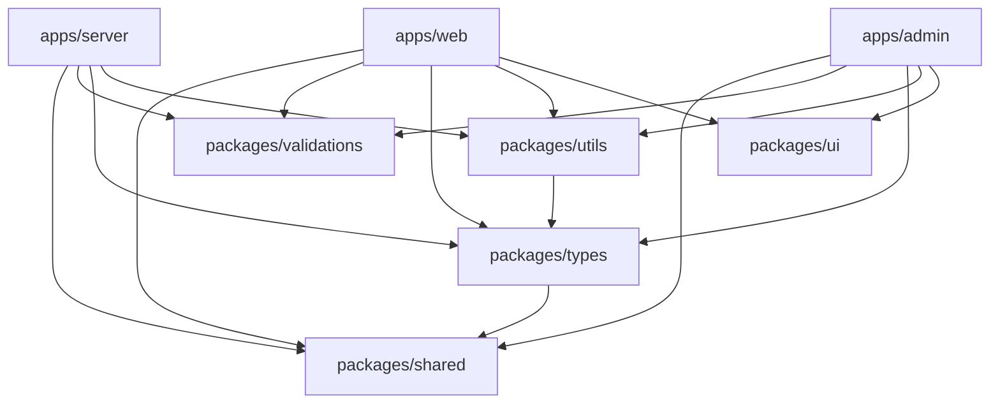
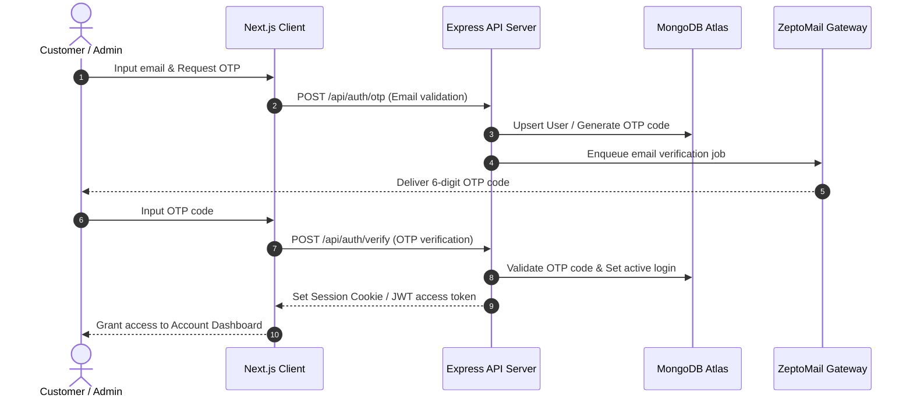
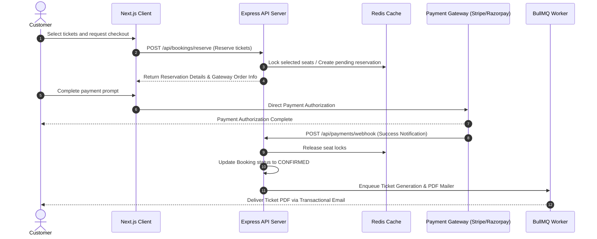

# MAD Entertrainment — Monorepo Architecture & Standards

This document serves as the **Single Source of Truth (SSOT)** for the architecture, package boundaries, data flows, and coding standards of the **MAD Entertrainment** platform. All changes must adhere strictly to these guidelines.

---

## 1. Executive Overview

### System Purpose
MAD Entertrainment is a unified platform for purchasing tickets, managing events, coordinating DJ operators, and processing bookings. It provides customer-facing purchase flows, real-time ticket scanning, and an administrative dashboard for system operations and diagnostic monitoring.

### Monorepo Strategy
The repository is structured as a **pnpm monorepo** managed via **Turborepo**. This approach ensures:
- **Zero Duplication**: Shared business logic, types, UI components, and validations are maintained in separate local packages and referenced by client and server applications.
- **Unified Dependency Management**: Consistent third-party dependencies are controlled from the workspace root.
- **Isolated Build Pipelines**: Build outputs, types, and deployments are compiled independently depending on the target service.

### Architectural Principles
1. **No Side Effects During App Composition**: Application composition must be side-effect-free. Code compilation and routing trees should be introspectable without active database or cache connections.
2. **Strict Layer Decoupling**: Business logic and database state are strictly owned by the backend. The frontend is isolated to rendering presentation, routing views, and holding UI state.
3. **Robust State-Machine Transitions**: All lifecycle state transitions (such as Event Statuses, Booking Statuses, and Payment Statuses) must be processed through verified services that assert current status before executing transitions.

---

## 2. Monorepo Topology

The workspace is organized into two primary categories: application services under `apps/` and reusable library packages under `packages/`.

```
/ (Workspace Root)
├── apps/
│   ├── server (Express API Server)
│   ├── web (Next.js Customer App)
│   └── admin (Next.js Administrative Panel)
└── packages/
    ├── shared (Shared enums, constants, and query keys)
    ├── types (Shared TypeScript type definitions)
    ├── ui (Shared React UI components and layout templates)
    ├── utils (Shared stateless utilities like JWT/date helpers)
    └── validations (Shared runtime Zod validation schemas)
```

### Dependency Flow Graph
To prevent circular dependencies, imports must always flow downward from applications to packages, or between packages following the designated hierarchy:



---

## 3. Package Responsibilities

Each package inside `packages/` has a distinct boundary and responsibility:

### `@mad/shared`
- **Purpose**: Canonical source of domain enums, query keys, and status configuration constants.
- **Responsibilities**: Defines system status constants (e.g. `BookingStatus`, `EventStatus`, `PaymentStatus`) and their visual metadata mapping.
- **Allowed Dependencies**: None.
- **Forbidden Dependencies**: Any workspace package, UI libraries, or stateful client/server code.
- **Consumers**: All packages and apps.

### `@mad/types`
- **Purpose**: Canonical TypeScript declarations representing data models and API response shapes.
- **Responsibilities**: Defines core entity structures (e.g. `Event`, `Seat`, `Booking`, `Payment`, `User`).
- **Allowed Dependencies**: `@mad/shared`.
- **Forbidden Dependencies**: UI libraries, database clients (Mongoose), validation schemas, and server runtimes.
- **Consumers**: `@mad/utils`, `@mad/ui`, apps/server, apps/web, apps/admin.

### `@mad/ui`
- **Purpose**: Shared UI design elements and atomic React layout primitives.
- **Responsibilities**: Exports visual elements (buttons, dialogs, status badges, and loading skeletons).
- **Allowed Dependencies**: `react`, `react-dom`.
- **Forbidden Dependencies**: Stateful API clients, server-only libraries, database schemas.
- **Consumers**: apps/web, apps/admin.

### `@mad/utils`
- **Purpose**: Shared stateless utility functions.
- **Responsibilities**: Exposes standard JWT token generation/validation and timezone-safe date parsing helpers.
- **Allowed Dependencies**: `@mad/types`.
- **Forbidden Dependencies**: Next.js, Express, Mongoose, Zod validations, or React components.
- **Consumers**: apps/server, apps/web, apps/admin.

### `@mad/validations`
- **Purpose**: Shared runtime validation schemas.
- **Responsibilities**: Exports Zod schemas verifying booking checkout parameters, OTP authorization credentials, and user profile inputs.
- **Allowed Dependencies**: `zod`.
- **Forbidden Dependencies**: React components, Next.js page contexts, Express controllers, and database engines.
- **Consumers**: apps/server, apps/web, apps/admin.

---

## 4. Runtime Architecture

The runtime architecture separates presentation concerns from database transactions, using real-time synchronization and asynchronous queues.

```
Customer/Admin Browser
   │
   ├─► Vercel (Next.js Apps)
   │     └─► Next.js Reverse Proxy (/api/* rewrites)
   │           │
   │           ▼
   └────────► Render (Express API Server)
                ├─► MongoDB Atlas (Primary transactional database)
                ├─► Redis (Caching, rate-limiting, and BullMQ store)
                │     └─► BullMQ Workers (Email, PDF, Booking Expirations)
                ├─► Cloudinary (Asset storage: images, banners)
                ├─► SMTP / ZeptoMail (Transactional OTP & ticket emails)
                └─► Payment Gateways (Stripe & Razorpay integrations)
```

### 1. Frontends (Vercel)
- Both `@mad/web` (customer portal) and `@mad/admin` (dashboard panel) run as serverless Next.js applications.
- **Proxy Rewriting**: Next.js is configured via `vercel.json` (or Next.js middleware) to proxy `/api/*` requests back to the Express backend. This prevents CORS configuration issues and consolidates domain routing.

### 2. Backend API Server (Render)
- A stateful Node.js Express server running in a Docker container.
- Serves HTTP REST endpoints and supports real-time socket connections via Socket.IO.

### 3. Database Layer (MongoDB Atlas)
- Stores events, bookings, tickets, payments, notification backlogs, and user profiles.
- Accessed via Mongoose with strict schema definitions matching the `@mad/types` contract.

### 4. Caching & Queue Broker (Redis)
- Backs Express rate-limiting middleware to secure endpoints.
- Acts as the job queue broker for BullMQ, coordinating asynchronous background tasks.

### 5. Background Workers (BullMQ)
- Process email delivery, generate ticket PDFs, monitor booking expiration timers (cleaning up expired holds), and handle webhook retries.
- Workers run concurrently inside the Express application container, isolating intensive operations from the main HTTP thread.

---

## 5. System Data Flows

### Authentication (Passwordless OTP)


### Booking & Payments


---

## 6. Deployment Architecture

```
                       ┌──────────────────────┐
                       │  Vercel Frontend     │
                       │                      │
                       │  web.mad.esparex.in  │
                       │  admin.esparex.in    │
                       └──────────┬───────────┘
                                  │
                       Proxy Rewrites (/api/*)
                                  │
                                  ▼
                       ┌──────────────────────┐
                       │  Render Backend API  │
                       │                      │
                       │  apm.esparex.in      │
                       └────┬───┬───┬───┬───┬─┘
                            │   │   │   │   │
     ┌──────────────────────┘   │   │   │   └──────────────────────┐
     ▼                          ▼   ▼   ▼                          ▼
┌──────────────┐          ┌──────────┐ ┌──────────────┐       ┌──────────────┐
│MongoDB Atlas │          │Redis Cache││Cloudinary CDN│       │Razorpay/Stripe│
└──────────────┘          └──────────┘ └──────────────┘       └──────────────┘
```

- **Render Service Targeting**: Configured via `render.yaml`. Production builds are targeted, running as a Node service using `node apps/server/dist/apps/server/src/server.js`.
- **Staging / Production Separation**: The backend isolates staging and production database clusters. BullMQ queue namespaces are environment-prefixed (`production_`, `staging_`, `local_`) to prevent cross-contamination.

---

## 7. Build Architecture

### Workspace Build Order
Since the application services depend on compilation outputs from the shared libraries, packages must compile in order before applications can build.
1. `@mad/shared`
2. `@mad/types`
3. `@mad/utils`, `@mad/validations`
4. `@mad/ui`
5. `apps/server`, `apps/web`, `apps/admin`

### Clean Compilation Standard
To prevent TypeScript caching from omitting `.d.ts` type-declaration files during incremental builds, every package in `packages/*` must use a cleaning step:
```json
"scripts": {
  "build": "rm -rf dist tsconfig.tsbuildinfo && tsc -p tsconfig.json"
}
```

### Targeted Build Isolations
To optimize deployment times and prevent Next.js UI bundles from compiling in backend hosting environments, developers must compile using target filters:
- **Allowed Backend Build Command**:
  ```bash
  pnpm install --frozen-lockfile && pnpm --filter @mad/server... run clean && pnpm --filter @mad/server... build
  ```
- **Prohibited Command**:
  ```bash
  pnpm -r build  # (Triggers expensive UI compilations on Render API nodes)
  ```

---

## 8. Ownership Matrix

To maintain clean architectural boundaries and prevent business logic leakage, responsibilities are split between the frontend and the backend:

| Subsystem | State Owner (SSOT) | Presentation / Views Owner |
|---|---|---|
| **Authentication** | Server (JWT, OTP Validation, OAuth Verification) | Frontend Client (Login screens, Profile forms, Local tokens) |
| **Payments** | Server (Gateway API calls, Webhook verification, Signatures) | Frontend Client (Stripe Element frames, Payment buttons) |
| **Bookings** | Server (Inventory allocation, Pricing rules, Seat constraints) | Frontend Client (Checkout timers, Seat maps, Ticket selections) |
| **User Data** | Server (Database updates, Role assignments, Sessions) | Frontend Client (Settings form views, Avatar crops) |
| **Notifications** | Server (Job queues, SMTP configuration, Message logs) | Frontend Client (User toast feeds, Success screens) |
| **Event Configurations**| Server (Category mappings, Ticket profiles, Time assertions) | Frontend Client (Event catalogs, Landing displays) |
| **Diagnostics / DLQ** | Server (Redis states, BullMQ queue stats, Log files) | Frontend Client (DLQ Drawer views, Metrics tables) |

---

## 9. Coding Standards

### 1. Pure `createApp()` Bootstrap Isolation
Application initialization must remain decoupled from live infrastructure (databases, caches, rate-limit stores).
- **`createApp()` in `apps/server/src/app.ts`** must configure middleware, body parsers, CORS headers, static paths, and register routing tables. It must **NEVER** instantiate live connections or bind Socket.IO listeners.
- **Boot Sequence in `apps/server/src/server.ts`**:
  1. Establish connections to MongoDB.
  2. Instantiate Redis and wait for readiness.
  3. Initialize Express rate-limiting stores (`initRateLimiters()`).
  4. Instantiate external payment and asset APIs.
  5. Bootstrap Express via `createApp()`.
  6. Bind the HTTP listener and Socket.IO hooks.

### 2. Component Design (Four Render States)
Every dynamic data-driven React page or component in `@mad/web` and `@mad/admin` must handle:
1. **Loading**: Render skeleton outlines or `<LoadingState />`.
2. **Error**: Display action-oriented alerts using `<ErrorState />`.
3. **Empty**: Show contextual illustrations and a Call-To-Action (CTA) using `<EmptyState />`.
4. **Success**: Render the actual data UI list/table.

### 3. Separation of Transport Concerns
- **No Direct HTTP Calls in Components**: React components are strictly banned from direct client-side requests (`axios.get`, `fetch`).
- **Service Layer Delegation**: Transport actions must be isolated inside service files (e.g. `services/venues.ts`) and wrapped in custom React Query hooks.

### 4. Sandbox Webhook Routes
- Stubs returning `501 Not Implemented` are forbidden in production branches. 
- Routes must be fully implemented, verified, or excluded from the Express router setup entirely until ready.

---

## 10. High-Risk Areas

These directories and files contain critical logic and require explicit testing, reviews, and regression checks before changes are merged:

- **Payment Processing**:
  - `apps/server/src/services/public/payment.service.ts`
  - `apps/server/src/services/admin/refund.service.ts`
- **Session and Auth Verification**:
  - `apps/server/src/services/public/auth.service.ts`
  - `apps/web/src/lib/api/client.ts` (Axios token rotation interceptor)
- **Inventory Locking & Bookings**:
  - `apps/server/src/services/reservation.service.ts`
  - `apps/server/src/models/booking.schema.ts`
- **Asynchronous Processing**:
  - `apps/server/src/workers/` (BullMQ queues and notification jobs)

---

## 11. Extension Guidelines

### Adding New Packages
1. Create the package folder in `/packages/<name>`.
2. Define `package.json` specifying output paths (`dist/index.js`, `dist/index.d.ts`) and target typescript settings.
3. Configure the compile scripts to clean prior builds first.
4. Register path mappings inside `/tsconfig.base.json`.
5. Run `pnpm install` at the workspace root.

### Adding New Services
- Backend services must expose pure functions and accept database models as arguments to facilitate testing.
- Write tests matching the service file (e.g., `<name>.service.test.ts`) covering success, network failures, validation rejects, and state rollback paths.

### Preventing Circular Dependencies
- Under no circumstances should a shared package import from an application folder, or a package lower in the dependency hierarchy import from a package higher in the hierarchy (e.g. `@mad/shared` must never import from `@mad/types`).
- Verify import graphs using the compliance script:
  ```bash
  pnpm run audit-data
  ```
