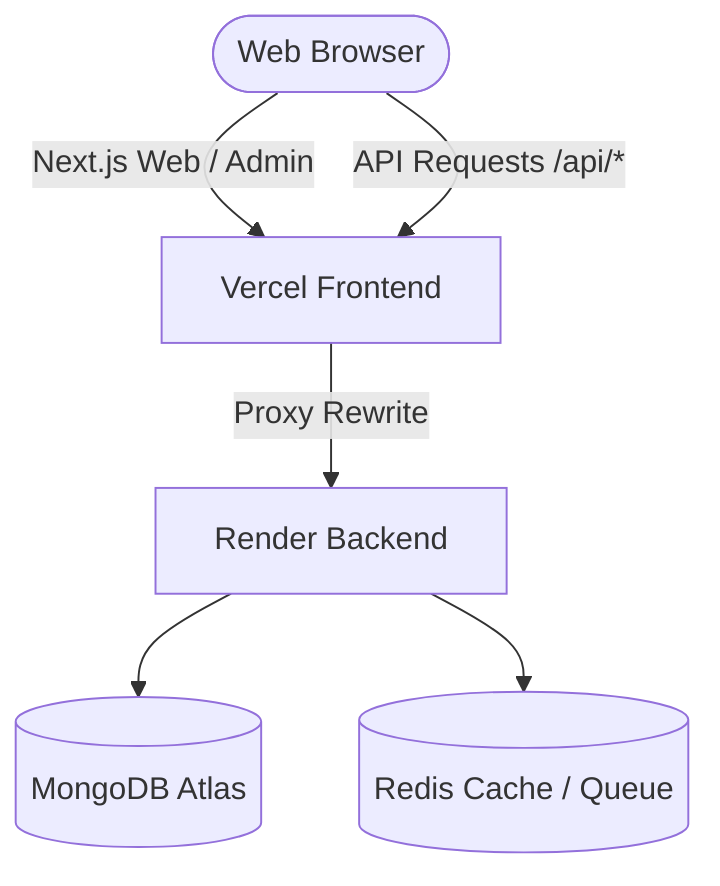
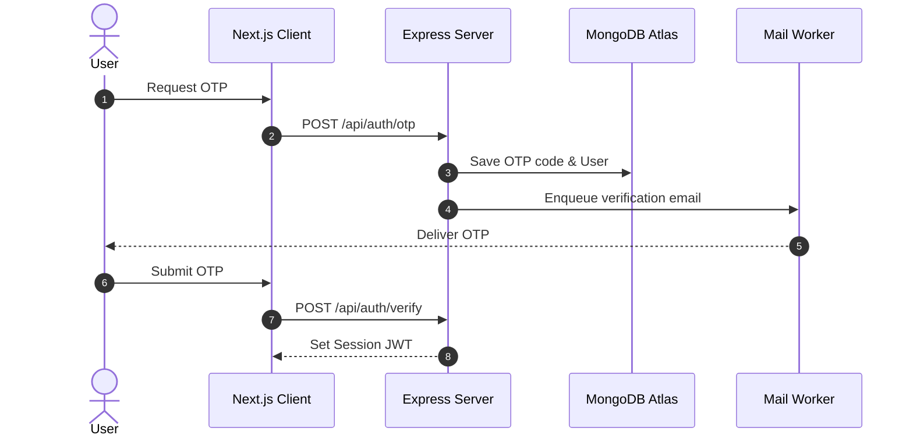

# MAD Entertrainment — Monorepo Architecture & Standards

This document serves as the canonical **Single Source of Truth (SSOT)** for the architecture, package boundaries, data flows, and coding standards of the **MAD Entertrainment** platform.

---

## 1. Executive Overview

### Business Purpose
MAD Entertrainment is a unified event management and ticketing platform. It provides public customer-facing ticket purchasing, real-time ticket scanning, and an administrative dashboard for event operations, bookings, refunds, and diagnostic monitoring.

### Platform Overview
The system is built as a TypeScript monorepo, deploying serverless Next.js frontends to Vercel and a stateful Express API server to Render, backed by MongoDB Atlas (database), Redis (caching and queues), and Cloudinary (assets).

### Architectural Philosophy
We prioritize **deterministic build compilation**, **decoupled side-effects**, and **infrastructure-independent static verification** of the codebase.

---

## 2. Monorepo Topology

### Current Implementation
The repository is managed as a pnpm monorepo using Turborepo for build orchestration. The file system structure contains two primary directories:
- `apps/`: Houses target application services (`server`, `web`, `admin`).
- `packages/`: Houses shared library modules (`shared`, `types`, `ui`, `utils`, `validations`).

*Evidence*:
- Root `pnpm-workspace.yaml` resolves workspace projects within `apps/*` and `packages/*`.
- Root `tsconfig.base.json` configures path mappings (`@mad/shared`, `@mad/types`, etc.) pointing to `./packages/*/src`.

### Repository Standard
All package references must follow a strict top-down dependency direction:
- **Apps** are allowed to import from any **Package**.
- **Packages** are allowed to import from packages lower in the dependency graph (e.g. `@mad/utils` imports from `@mad/types`), but must **never** import from `apps/` or create circular references.
- All workspace package imports must be declared in package manifests using `workspace:*` dependencies.

### Future Recommendations
- See *Appendix A: Future Architecture Considerations* for proposals regarding package modularization (Status: Proposed).

---

## 3. Package Responsibilities

### Current Implementation
The monorepo contains five internal packages under `packages/*`:
1. **`@mad/shared`**: Contains core domain enums (`BookingStatus`, `EventStatus`), query keys, and status metadata.
2. **`@mad/types`**: Declares TypeScript interfaces representing database entities (`Event`, `Seat`, `Booking`).
3. **`@mad/ui`**: Exports reusable React layout elements and primitives.
4. **`@mad/utils`**: Contains stateless utilities (`date.ts`, `jwt.ts`).
5. **`@mad/validations`**: Exports Zod schemas for input payload validation (`checkoutSchema`, `verifyAuthSchema`).

*Evidence*:
- Manifests `packages/*/package.json` define the name and compile scripts.
- Source exports in `packages/*/src/index.ts`.

### Repository Standard
- **`@mad/shared`**: Allowed deps: None. Forbidden deps: Any package.
- **`@mad/types`**: Allowed deps: `@mad/shared`. Forbidden deps: `@mad/utils`, `@mad/ui`, `@mad/validations`.
- **`@mad/ui`**: Allowed deps: `react`, `react-dom`. Forbidden deps: Express, Mongoose, `@mad/utils`.
- **`@mad/utils`**: Allowed deps: `@mad/types`. Forbidden deps: React, Next.js, Express, Mongoose.
- **`@mad/validations`**: Allowed deps: `zod`. Forbidden deps: Next.js, Mongoose, Express.

### Future Recommendations
- See *Appendix A* for proposals regarding `@mad/contracts` validation mappings (Status: Proposed).

---

## 4. Runtime Architecture

### Current Implementation
The runtime stack consists of:
- **Frontend App**: Next.js 15 customer portal (`apps/web`) and dashboard panel (`apps/admin`) running in serverless runtimes.
- **Backend API**: Node.js Express server (`apps/server`) running inside a stateful container, serving JSON APIs and Socket.IO websockets.
- **Primary Datastore**: MongoDB Atlas.
- **Cache & Message Broker**: Redis, backing Express rate-limiters and BullMQ job queues.
- **Background Workers**: BullMQ asynchronous queue processors running on the backend API node for sending email, generating ticket PDFs, and checking reservation timeouts.
- **External CDNs & APIs**: Cloudinary for asset storage, Razorpay/Stripe for payments, ZeptoMail for OTP mailing.

*Evidence*:
- `apps/server/package.json` imports `bullmq`, `mongoose`, `cloudinary`, `socket.io`.
- `apps/server/src/server.ts` connects to Mongoose and Redis before bootstrapping the Express application.

### Repository Standard
- **Connection Isolation**: All connections to external infrastructure (MongoDB, Redis, Stripe) must be established at server startup in `server.ts`. The Express application configuration in `app.ts` must remain side-effect-free to facilitate isolated testing.
- **Queue Separation**: Asynchronous work must be enqueued via `QueueService` rather than executed directly within HTTP request cycles.

### Future Recommendations
- See *Appendix A* for background worker decoupling proposals (Status: Proposed).

---

## 5. Deployment Architecture

### Current Implementation
Services are deployed to separate cloud providers based on type:
- **Client Applications**: `@mad/web` and `@mad/admin` are deployed to **Vercel** serverless runtimes.
- **API Server**: `@mad/server` is deployed to **Render** as a Node.js web service.
- **Reverse Proxy**: Vercel routes `/api/*` requests to the Render API url.

*Evidence*:
- Root `vercel.json` contains rewrites mapping `/api/:path*` to `https://apm.esparex.in/api/:path*`.
- Root `render.yaml` defines the web service deployment for `mad-server` built from the repository root.



### Repository Standard
- **Auto-Deployments**: Deployments are automated. Render compiles and deploys code when changes are pushed to the `live` branch. Vercel deploys public and admin frontend builds on pushes to the `live` branch.
- **Staging Sharing**: Staging/testing frontends deploy on pushes to `develop` but share the production Render API endpoint.

### Future Recommendations
- See *Appendix A* for proposals to isolate staging backends on Render (Status: Proposed).

---

## 6. System Data Flows

### Current Implementation
High-risk transactional flows are managed by dedicated controllers and services:
- **Authentication**: Passwordless logins via 6-digit OTPs sent via BullMQ workers.
- **Booking & Payments**: Reservations allocate seats and capacity. Once Razorpay/Stripe webhooks confirm successful payments, bookings transition to `confirmed` and tickets are generated.

*Evidence*:
- Auth logic in `apps/server/src/services/public/auth.service.ts`.
- Booking logic in `apps/server/src/services/public/booking.service.ts` and `payment.service.ts`.

#### Authentication Sequence:


### Repository Standard
- **Atomic Transactions**: All booking status changes and payment associations must be performed within Mongoose sessions to guarantee data integrity.
- **Idempotency**: Webhook endpoints must assert signature authenticity and verify that the transaction has not already been processed.

### Future Recommendations
- Omitted (No active proposals exist for system data flows).

---

## 7. Build Architecture

### Current Implementation
The project build graph requires shared libraries under `packages/*` to be compiled before application builds can run in `apps/*`.
- **Target Builds**: Production environments use Turborepo filters to compile only the necessary service and its dependency graph.

*Evidence*:
- `turbo.json` defines task pipeline dependencies (`"build": { "dependsOn": ["^build"] }`).
- Root scripts and `render.yaml` use the `--filter` option to restrict build compilation scope.

### Repository Standard
- **Clean Build Rule**: The build script of any shared package under `packages/*` must clean previous outputs and cache files before invoking `tsc`:
  ```json
  "build": "rm -rf dist tsconfig.tsbuildinfo && tsc -p tsconfig.json"
  ```
- **Isolated Compiles**: Never run recursive build scripts (`pnpm -r build`) in backend server environments. Build commands must always filter targeting to prevent Next.js frontend compilation.

### Future Recommendations
- See *Appendix A* for proposals regarding build tool migrations (Status: Proposed).

---

## 8. Ownership Matrix

### Current Implementation
System responsibilities are segregated between frontend (UI Presentation/State) and backend (Business Rules/Datastore):
- **Server Owns (SSOT)**: Authentication credentials, Payment processing, Booking inventory allocations, Pricing rules, Seat constraints, Database access, and background jobs.
- **Client Owns**: Local UI rendering states, React Query cache, local redirection flows, and form validations.

*Evidence*:
- `AGENTS.MD` §SSOT matrix defines the ownership boundaries.
- Database access and Mongoose schemas reside exclusively under `apps/server/src/models/`.

### Repository Standard
- Frontends must never duplicate backend decisions, calculate ticket pricing, or enforce security role controls locally. The client must query the server and reflect returned data.
- Duplicate business validations are strictly prohibited. The frontend uses `@mad/validations` zod schemas for form feedback, but the server remains the final validation authority.

### Future Recommendations
- Omitted (No active proposals exist for the ownership matrix).

---

## 9. Coding Standards

### Current Implementation
The repository enforces code standards at three levels:
- **Architectural**: Stateless controllers, isolated middleware rate-limiters, and decoupled application bootstrap.
- **Component**: React components must handle four render states (Loading, Error, Empty, Success) and delegate HTTP requests to service layers.
- **Governance**: Automated CI checks.

*Evidence*:
- `apps/server/src/app.ts` imports controllers and mounts routes.
- Component render states are verified in `apps/admin/src/components/states/`.
- `scripts/ci_governance_check.ts` blocks code containing direct Axios imports in UI directories or Sentry Node imports in Next.js folders.

### Repository Standard
- **Axios Isolation**: Components and pages must never import Axios directly. All HTTP requests must be made via a dedicated service layer file.
- **Render States**: Silent UI fallbacks are forbidden. Skeletons, error overlays, and empty-state placeholders must be rendered.
- **Middleware rate-limiters**: Eager rate limiters using Redis stores must be declared as lazy wrappers, initialized inside `server.ts` after Redis is ready.

### Future Recommendations
- See *Appendix A* for client-side service generation proposals (Status: Proposed).

---

## 10. High-Risk Systems

### Current Implementation
High-risk systems are located in isolated directories:
- **Authentication**: JWT signing, OTP validation, and session cookies are located in `apps/server/src/services/public/auth.service.ts`.
- **Payments**: Razorpay/Stripe integrations, webhook validations, and database reconciliation are in `apps/server/src/services/public/payment.service.ts` and `admin/refund.service.ts`.
- **Bookings & Locks**: Capacity locking and Mongoose TTL configurations are in `apps/server/src/services/reservation.service.ts` and `apps/server/src/models/booking.schema.ts`.

*Evidence*:
- Code folders match high-risk classifications.
- Strict tests are defined (e.g. `payment.production.test.ts` and `refund.service.test.ts`).

### Repository Standard
- **Testing Requirements**: Any change to high-risk files requires complete test coverage, local verification run, and explicit approval before merge.
- **Mock Disablement**: `MOCK_PAYMENTS` must be set to `false` in staging and production environments to prevent bypass vulnerabilities.

### Future Recommendations
- See *Appendix A* for proposals regarding multi-factor auth integrations (Status: Proposed).

---

## 11. Extension Guidelines

### Current Implementation
Adding new features, modules, or packages is structured around workspaces:
- Packages are defined in `packages/` and mapped in `tsconfig.base.json`.
- Routes are registered in `/apps/server/src/routes/` and linked in `app.ts`.

*Evidence*:
- Workspace folder configurations and tsconfig path aliases.

### Repository Standard
- **Circular Imports**: When adding packages, developers must run the compliance audit to confirm no circular imports are created.
- **Validation Schema Alignment**: Any API payload validation must be defined in `@mad/validations` so that both the server and client share the exact Zod contract.

### Future Recommendations
- Omitted (No active proposals exist for extension guidelines).

---

## 12. Appendix: Future Architecture Considerations

The following enhancements represent potential improvements. They are not approved for implementation and serve as informational reference points only.

### 1. Dedicated Staging Backend API
- **Proposal**: Spin up a separate staging Render Node API instance connecting to a staging MongoDB cluster.
- **Business Motivation**: Prevent staging/testing frontends from contaminating production databases and Redis queues.
- **Technical Benefit**: Complete staging data isolation and risk-free testing.
- **Dependencies**: Setup of new environment parameters and database configurations.
- **Risks**: Increased infrastructure overhead and monthly costs.
- **Approval Status**: Proposed (Possible Future Enhancement - Not Approved).
- **Related ADR**: None.

### 2. Microservice Decoupling of BullMQ Workers
- **Proposal**: Decouple BullMQ queue processors from the primary Express API node and run them as independent container services.
- **Business Motivation**: Isolate CPU-heavy operations (PDF generation, bulk mail runs) from HTTP api threads to maintain performance.
- **Technical Benefit**: Independent scalability of APIs and workers.
- **Dependencies**: Setup of a shared build target and separate Render Docker services.
- **Risks**: Deployment orchestration complexity.
- **Approval Status**: Proposed (Possible Future Enhancement - Not Approved).
- **Related ADR**: None.

### 3. Automated Client API Code Generation
- **Proposal**: Configure `@mad/validations` or `@mad/server` to output Swagger/OpenAPI specifications, and compile client-side fetchers automatically.
- **Business Motivation**: Eliminate manual service layer creation in frontends.
- **Technical Benefit**: Compile-time safety for API endpoints across the monorepo.
- **Dependencies**: Integration of Swagger annotations and code-generation tooling in CI.
- **Risks**: Tooling bloat and build time overhead.
- **Approval Status**: Proposed (Possible Future Enhancement - Not Approved).
- **Related ADR**: None.
