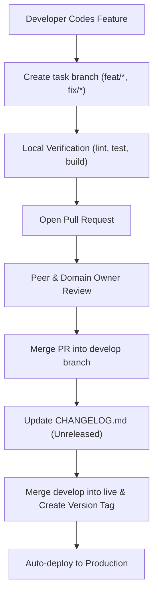

# Repository Changelog

- **Owner**: Repository Governance Owner & Maintainers
- **Status**: Active
- **Version**: 1.0
- **Review Cycle**: Ongoing (Upon each release)
- **Last Updated**: 2026-07-03
- **Changelog Format**: Keep a Changelog v1.0.0
- **Versioning Strategy**: Semantic Versioning (SemVer) v2.0.0
- **Related Documents:**
  - [README.md](README.md)
  - [REPOSITORY_GOVERNANCE.md](REPOSITORY_GOVERNANCE.md)
  - [RUNBOOK.md](RUNBOOK.md)
  - [ARCHITECTURE.md](ARCHITECTURE.md)
  - [DEPLOYMENT_MAP.md](DEPLOYMENT_MAP.md)
  - [API_CONTRACTS.md](API_CONTRACTS.md)

---

## 1. Executive Overview

### Purpose
The `CHANGELOG.md` serves as the canonical history of all releases, architectural shifts, governance updates, and operational revisions in the MAD Entertrainment repository. It provides historical context on what was changed, when it was changed, and why it was changed. The document format is based on the [Keep a Changelog](https://keepachangelog.com/en/1.0.0/) specification, and version numbering adheres to the [Semantic Versioning](https://semver.org/spec/v2.0.0.html) standard.

### Scope & Audience
This log is intended for developers, platform operators, and automated auditing agents. It traces the timeline of repository updates in a structured, human-readable format.

### Relationship with SSOT Documents
While our core SSOT documents (`REPOSITORY_GOVERNANCE.md`, `ARCHITECTURE.md`, `DEPLOYMENT_MAP.md`, `API_CONTRACTS.md`) record the *current state* of our policies and configurations, `CHANGELOG.md` records the *incremental differences* and release milestones over time.

---

## 2. Changelog Policy

### Semantic Versioning (SemVer)
We follow Semantic Versioning (`MAJOR.MINOR.PATCH`) to number repository releases:
- **MAJOR**: Incompatible API contract changes, breaking architectural boundaries, or structural governance updates.
- **MINOR**: Backward-compatible feature additions, new endpoints, package additions, or supplementary SSOT updates.
- **PATCH**: Backward-compatible bug fixes, performance improvements, documentation clarifications, or dependency audits.

### Release Cadence & Process
- Changelog updates must occur in tandem with any release PR.
- Direct commits to protected branches (`develop` or `live`) are prohibited. Release tags are generated strictly from the approved `live` branch.

### Deprecation & Breaking Changes
- Obsolete endpoints, packages, or settings must be marked as `Deprecated` at least one minor release before their eventual code removal (`Removed`).

---

## 3. Release Categories

All changelog entries are grouped into the following standardized sections:
- **Added**: New features, endpoints, packages, or configurations.
- **Changed**: Updates to existing features, boundaries, or workflows.
- **Deprecated**: Impending removal of features, endpoints, or patterns.
- **Removed**: Deletion of features, endpoints, or legacy files.
- **Fixed**: Defect repairs or validation fixes.
- **Security**: Security patches, dependency vulnerability exception updates, or access audits.
- **Documentation**: Non-functional updates to SSOT files or guidelines.
- **Governance**: Updates to review policies, branch guidelines, or CI validation checkers.
- **Performance**: Enhancements to build times, execution speeds, or query efficiency.

---

## 4. Release Workflow

---

## 5. Release Checklist

Every release must satisfy the following checklist before merge:
- [ ] Core verification tests pass (`pnpm lint`, `pnpm test`, `pnpm build`).
- [ ] Governance checks pass (`pnpm run audit-data`).
- [ ] ADR is created (if required by the Repository Governance SSOT).
- [ ] All modified SSOT documentation files are updated.
- [ ] `CHANGELOG.md` is updated with concise, structured entries under `[Unreleased]`.
- [ ] Version tag is updated upon merging into the production branch.

---

## 6. Version History

### [Unreleased]
*Planned or unreleased changes currently residing in the develop branch.*

#### Added
- `CONTRIBUTING.md` outlining the developer workflow, setup instructions, and quality checks.
- Structured issue templates for bugs, feature requests, governance updates, and questions.
- `PULL_REQUEST_TEMPLATE.md` enforcing the 11-question quality gate check.
- `CODEOWNERS` configuration mapping domain owners to repository paths.
- Repository-scoped AI Skills framework under `.agents/skills/` (governance audit, pr review, git workflow, documentation, and architecture review).

#### Changed
- Pinned TruffleHog Action in CI pipeline to a stable release version (`v3.95.7`).
- Renewed the expired vulnerability exception for `serialize-javascript` (valid until 2026-10-01).
- Corrected wrong paths and stale CI statements in `README.md` and `ROADMAP.md`.
- Added standard metadata block to `TODO-AUDIT-FIXES.md`.

### [v1.1.0] - 2026-07-03
*Completed Event Experience — Event Memories feature. PR [#439](https://github.com/adminmadusa/MAD-Entertrainment/pull/439). Release commit `79c15d00`.*

#### Added
- **Event Memories** — post-event content sub-document on the `Event` model, allowing administrators to attach a photo gallery, heading, thank-you message, and highlight copy to completed events.
- **`EventMemoryPublicationState` enum** (`packages/shared`) — four-state publication lifecycle: `DRAFT` → `PREVIEW` → `PUBLISHED` → `HIDDEN`.
- **`EventMemoryConfig` type** (`packages/types`) — shared TypeScript type used by all layers (server schema, admin form, public response).
- **`MAX_MEMORIES_GALLERY_LIMIT` constant** (50 items) and **`DEFAULT_MEMORIES_GALLERY_LIMIT`** (30 items) (`packages/shared`).
- **Admin API — Preview Token endpoint** — `POST /api/admin/events/:id/preview-token` generates a 15-minute short-lived JWT allowing admins to preview memories in `DRAFT` or `PREVIEW` state on the public event page without publishing.
- **Admin UI — EventMemoriesCard** (`apps/admin`) — full-featured admin component for composing and publishing event memories, including gallery management, publication state controls, and previewing.
- **Admin UI — Event Edit page** — integrated `EventMemoriesCard` into the event edit page (`apps/admin/src/app/events/[id]/edit/page.tsx`).
- **Public UI — EventMemoriesRecap** (`apps/web`) — component rendered on the public event detail page when memories are in `PUBLISHED` state.
- **Public UI — EventStickyCTA** updates — completed events suppress the "Buy Tickets" CTA; the sticky bar adapts to the `COMPLETED` event lifecycle status.
- **Database schema** — `eventMemorySchema` embedded sub-document added to the `Event` Mongoose model with fields: `publicationState`, `heading` (max 200 chars), `thankYouMessage` (max 2000 chars), `highlights` (string array), `gallery` (up to 50 Cloudinary assets with `order`), `publishedAt` (stable first-publish timestamp).

#### Changed
- **`PUT /api/admin/events/:id`** — extended request body to accept an optional `memories` sub-document. The `updateEvent` service enforces publication state transition rules, preserves the first `publishedAt` timestamp on subsequent publish operations, and cleans up removed Cloudinary gallery assets.
- **`GET /api/events/:slug`** — now serves both `PUBLISHED` and `COMPLETED` events so that completed event detail pages remain publicly accessible. Suppresses `memories` data unless `publicationState === PUBLISHED` or a valid preview token is provided.
- **`adminEventsQuerySchema` / `updateEventSchema`** — Zod validation extended to include the `eventMemorySchema` validator with `MAX_MEMORIES_GALLERY_LIMIT` enforcement, `order` field, and strict nullable/optional semantics.
- **Backend audit log** — transition-aware audit actions emitted on memory state changes: `event.memories.published`, `event.memories.hidden`, `event.memories.cleared`, `event.memories.updated`, `event.memories.preview.generated`, `event.memories.preview.accessed`.
- **`apps/server/src/services/admin/event.service.test.ts`** — extended with 15 new test cases covering Event Memories state transitions, preview token generation, and gallery cleanup.
- **`apps/server/src/services/public/event.service.test.ts`** — new test file (243 lines) covering public event retrieval including COMPLETED status, preview token validation, and memories suppression logic.

#### Documentation
- `API_CONTRACTS.md` updated with new Event Memories endpoints and preview token flow.
- `ARCHITECTURE.md` updated with Event Memories lifecycle and database schema additions.
- `RUNBOOK.md` updated with operational guidance for publishing Event Memories.
- `CHANGELOG.md` this entry.

---

### [v1.0.0] - 2026-06-25

*Initial repository documentation baseline establishing the monorepo's foundational architecture, APIs, deployment environments, and governance. This represents the post-cleanup documentation state, not the first production software release.*

#### Added
- `REPOSITORY_GOVERNANCE.md` (Governance SSOT defining roles, matrices, and branching/PR policies).
- `ARCHITECTURE.md` (Architecture SSOT defining package boundaries and coding standards).
- `DEPLOYMENT_MAP.md` (Deployment SSOT mapping hosting topology and environments).
- `API_CONTRACTS.md` (API SSOT detailing routes, validation schemas, and rate limits).
- `docs/decisions/` ADR framework with status lifecycles, Templates, and chronological Indices.
- `docs/decisions/ADR-001-booking-ownership.md` (Validating backend booking allocation).

#### Changed
- Documentation hierarchy updated across core files.
- `README.md` simplified to act as an entrypoint.

#### Removed
- Legacy architecture documentation duplicates.

#### Documentation
- Consolidated SSOT references in `RUNBOOK.md` and `AGENTS.MD`.

#### Governance
- Codified domain-owner approval rules.
- Established strict branch lifecycle guidelines.
- Outlined KPIs and governance roadmap milestones.
