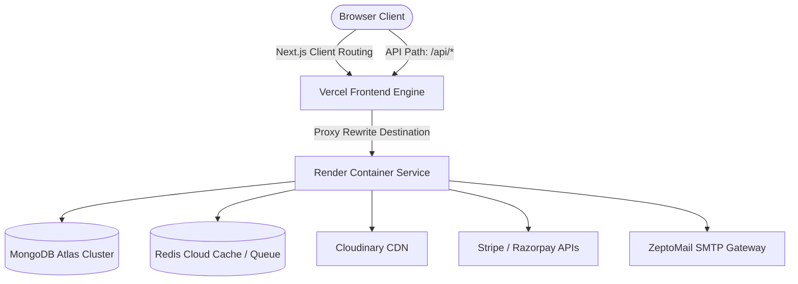
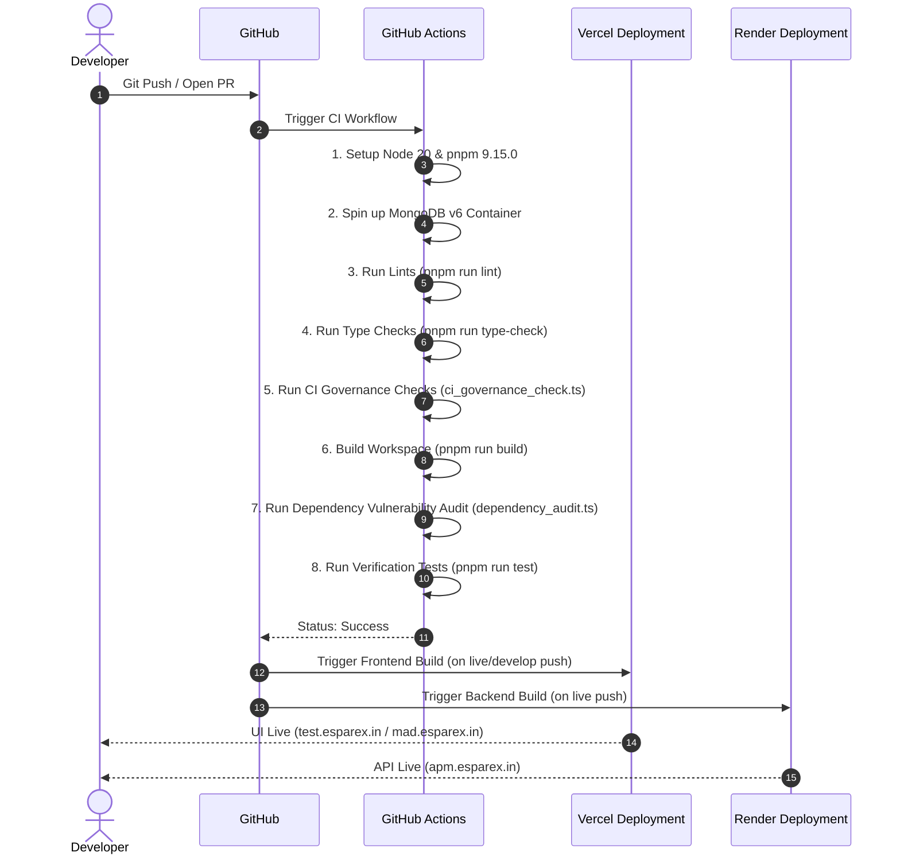

# MAD Entertrainment — Deployment Map

Status: Active  
Version: 1.0  
Owner: DevOps & Platform Engineering  
Review Cycle: Quarterly  
Last Updated: 2026-06-25  

Supersedes:
- None (First version establishing the Deployment SSOT)

Related Documents:
- [README.md](file:///Users/admin/Desktop/MAD%20Entertrainment/README.md)
- [REPOSITORY_GOVERNANCE.md](file:///Users/admin/Desktop/MAD%20Entertrainment/REPOSITORY_GOVERNANCE.md)
- [AGENTS.MD](file:///Users/admin/Desktop/MAD%20Entertrainment/AGENTS.MD)
- [RUNBOOK.md](file:///Users/admin/Desktop/MAD%20Entertrainment/RUNBOOK.md)
- [ARCHITECTURE.md](file:///Users/admin/Desktop/MAD%20Entertrainment/ARCHITECTURE.md)
- [API_CONTRACTS.md](file:///Users/admin/Desktop/MAD%20Entertrainment/API_CONTRACTS.md)
- [decisions/README.md](file:///Users/admin/Desktop/MAD%20Entertrainment/docs/decisions/README.md)

---

## Repository Documentation Hierarchy

Below is the core documentation structure and relationships for MAD Entertrainment:

```text
README.md
│
├── REPOSITORY_GOVERNANCE.md     ← Governance SSOT
├── ARCHITECTURE.md              ← System architecture SSOT
├── DEPLOYMENT_MAP.md            ← Infrastructure & deployment SSOT
├── API_CONTRACTS.md             ← API contract SSOT
├── docs/decisions/README.md     ← Architecture Decision Records (ADRs)
└── RUNBOOK.md                   ← Operational procedures
```

---

## Document Governance

### Deployment Change Policy
This document serves as the canonical Single Source of Truth (SSOT) for the deployment topology, release workflows, CI/CD pipelines, environments, and rollback strategies of the **MAD Entertrainment** platform. 

The document **must** be updated whenever any of the following change:
- Hosting provider
- Deployment topology
- CI/CD pipeline
- Branch strategy
- Environment URLs
- External services
- Secret categories
- Rollback procedure
- Monitoring stack
- Infrastructure ownership

Changes affecting deployment must not be merged without updating this document.

### Deployment Stability Classification
The table below classifies the maturity and stability of the system's deployment workflows:

| Area | Stability |
| :--- | :--- |
| Git Branch Flow | Stable |
| Frontend Hosting | Stable |
| Backend Hosting | Stable |
| Datastores | Stable |
| Background Queues | Stable |
| Secret Management | Stable |
| Staging Isolation | Experimental |

*Definitions*:
- **Stable**: Fully automated, peer-reviewed, and checked by continuous integration.
- **Active Development**: Undergoing configuration updates; subject to pipeline modifications.
- **Experimental**: Manual workflows, shared-environment dependencies, or unapproved proposals.

---

## 1. Executive Overview

### Deployment Philosophy
We enforce **infrastructure-independent builds**, **deterministic compilation graphs**, and **immutable deployment states**. All environmental differences must be declared strictly via external runtime configurations (environment variables), ensuring that the same compiled codebase can be promoted across environments without source changes.

### Infrastructure Goals
- **High Availability**: Decouple client-facing frontends from core API server threads so UI interfaces load even during backend restarts.
- **Zero-Downtime Releases**: Implement rolling updates on stateful API server instances and atomic promotions on serverless frontends.
- **Static Integrity**: Ensure compile-time validation, lints, type-checking, and governance compliance run in a clean sandbox before deployment triggers.

---

## 2. Environment Matrix

### Current Implementation
The platform manages four distinct deployment environments.

| Parameter | Local Development | Preview Deployments | Staging/Testing | Production |
| :--- | :--- | :--- | :--- | :--- |
| **Purpose** | Sandbox coding | PR validation | Integration testing | Live customer traffic |
| **Branch** | Local workspace | Pull Request | `develop` | `live` |
| **Hosting** | Local machine | Vercel Serverless | Vercel Serverless | Vercel Serverless (Web/Admin), Render Node Container (API) |
| **URL** | `http://localhost:3000` (Web)<br>`http://localhost:3002` (Admin) | Vercel Preview URL | `https://test.esparex.in` | `https://mad.esparex.in` (Web)<br>`https://madmin.esparex.in` (Admin)<br>`https://apm.esparex.in/api` (API) |
| **Database** | Local MongoDB | MongoDB Atlas Sandbox | MongoDB Atlas Shared | MongoDB Atlas Prod |
| **Redis** | Local Redis | Mock / None | Redis Cloud Shared | Redis Cloud Prod |
| **Storage** | Local FS / Mock | Cloudinary Sandbox | Cloudinary Sandbox | Cloudinary Production |
| **Payments** | Mock Payments | Sandbox Gateways | Sandbox Gateways | Stripe/Razorpay Live |
| **Email** | Mock SMTP | SMTP Sandbox | SMTP Sandbox | ZeptoMail Gateway |
| **Monitoring** | Console Logging | None | Sentry Alerts | Sentry & Better Uptime |
| **Deployment Trigger** | Manual launch | PR open/synchronize | Git push to `develop` | Git push/merge to `live` |

*Evidence*:
- Environment checklists in `RUNBOOK.md` §2 define variable scopes for local, staging, and production.
- Render config `render.yaml` defines the web service deployment building from root and targeting `live` branch commits.

#### Current Deployment Constraint (Shared Backend Setup)
Our staging/testing environment operates under a shared-backend constraint:
- **Topology**: The Vercel Test frontend (`test.esparex.in`, built from the `develop` branch) routes its requests to the production Render API backend (`apm.esparex.in`, built from the `live` branch).
- **Operational Impact**:
  - Test activity performed on the staging URL (e.g. testing booking flows, database updates) directly modifies the production database cluster and enqueues jobs in the production Redis instance.
  - Environment-specific behavior and data differences must be understood before testing. Testing operators must coordinate actions to prevent contamination of production metrics.

#### Environment Risk Matrix
The table below assesses the operational risk level based on the configuration of each environment:

| Environment | Frontend | Backend | Database | Risk Level | Operational Implications |
| :--- | :--- | :--- | :--- | :--- | :--- |
| **Local** | Local Machine | Local Machine | Local / Dev DB | Low | Isolated sandbox. Changes do not affect other environments or production data. |
| **Test** | Vercel Test | Production Render | Production DB | High | Shared backend constraint. Testing actions interact with live production data. |
| **Preview** | Vercel Preview | Production Render | Production DB | Medium | Ephemeral UI validation. Poses risk of database mutation during PR validation cycles. |
| **Production** | Vercel Production | Production Render | Production DB | Critical | Live client traffic. Requires strict change control and approvals. |

### Repository Standard
- All environment parameters must be validated at runtime startup using Zod environment contracts.
- Database auto-indexing must be disabled in production (`autoIndex: false` Mongoose settings) to prevent locks during releases.
- Deployment configurations must accurately document shared or isolated database cluster boundaries.

### Future Recommendations
- See *Appendix: Future Deployment Considerations* — Proposal 1: "Dedicated Staging Backend API" for proposals to isolate staging backends on Render.  
  *Status*: Possible Future Enhancement (Not Approved) · Untracked

---

## 3. Infrastructure Topology

### Current Implementation
The infrastructure composition is built on split serverless frontends and a containerized stateful Express API server:
- **Client Web Page**: `@mad/web` (customer ticket portal) runs on Vercel.
- **Client Admin Page**: `@mad/admin` (operator dashboard panel) runs on Vercel.
- **API Server backend**: `@mad/server` runs on Render.
- **Object Storage CDN**: Cloudinary for user photo uploads and event banner storage.
- **Primary Datastore**: MongoDB Atlas replica set.
- **Cache & Redis queue broker**: Redis Cloud instance backing BullMQ workers.
- **Background Workers**: BullMQ async workers (PDF, Email, booking-timeout lifecycle) run as concurrent processes on the API Render node.
- **Payment gateways**: Stripe (international card processing) and Razorpay (domestic UPI/netbanking card processing).
- **DNS Route mapping**: Reverse proxy pathing maps `/api/*` requests on Vercel directly to Render.

*Evidence*:
- `vercel.json` rewrites path configurations.
- `render.yaml` web service definition.
- `apps/server/src/server.ts` connection registrations.



### Repository Standard
- Live connections to databases, Redis, and payment clients must be established in `server.ts` after env validation.
- All HTTP calls from Vercel frontends must route through the `/api/*` proxy rewrite to avoid CORS preflight latency.

### Future Recommendations
- See *Appendix: Future Deployment Considerations* — Proposal 2: "Microservice Decoupling of BullMQ Workers" for worker isolation.  
  *Status*: Possible Future Enhancement (Not Approved) · Untracked

---

## 4. Git Branch Strategy & Promotion

### Current Implementation
We follow a strict promotional Git branch strategy:
- **`develop`**: Primary integration branch. Previews and test environments deploy from here.
- **`live`**: Canonical production branch. Render API and Vercel Production frontends build from here.
- **`feature/*` / `fix/*` / `refactor/*` / `chore/*`**: Temporary task branches branched from `develop` and merged via pull requests.
- **`audit/*`**: Read-only branch for discovery, diagnostics, and code audit work. Editing, committing, or pushing production builds from audit branches is strictly forbidden.

*Evidence*:
- `AGENTS.MD` §BRANCH SAFETY rules and §BRANCH LIFECYCLE MANAGEMENT.

```
Task Branch (feature/*, fix/*)
       │
       ▼ (Pull Request Review & CI Checks)
Develop Branch (develop)  ──► Auto-deploys Vercel Test frontend
       │
       ▼ (Production Release Sync)
Live Branch (live)        ──► Auto-deploys Vercel Production & Render API Backend
```

### Repository Standard
- **Direct Commit Prohibition**: Committing directly to `develop` or `live` is blocked. All changes must be promoted via pull requests.
- **Branch Lifecycle Rules**: Task branches must be deleted locally and remotely immediately after merging. Stale branches (> 30 commits behind `develop`) must be rebased or closed.
- **Parity Checking**: Deployment parity checks must verify branches, environment setups, and compilation logs before audit checks or merges are executed.

### Future Recommendations
- Omitted (No active branch promotion proposals exist).

---

## 5. CI/CD Pipeline

### Current Implementation
The deployment pipeline consists of local checks, GitHub Actions continuous integration, and provider build hooks.
- **CI Build**: Triggered on push or pull request to `develop` and `live`.



*Evidence*:
- `.github/workflows/ci.yml` defines the jobs: `build-lint-test`, `secret-scanning`, and `dependency-audit`.

### Repository Standard
- **Zero Failures**: CI checks must pass completely before merging code. Ignored test failures or lint overrides are forbidden.
- **Build Isolation**: Build commands in backend environments must use target filters (`pnpm --filter @mad/server... build`) to prevent compiling Next.js frontends on stateful Render API nodes.

### Future Recommendations
- See *Appendix: Future Deployment Considerations* — Proposal 3: "Automated Client API Code Generation" for build integrations.  
  *Status*: Possible Future Enhancement (Not Approved) · Untracked

---

## 6. Environment Variables

### Current Implementation
Environment configurations are loaded strictly at runtime. Credentials are set via Vercel and Render dashboard consoles, keeping secrets entirely out of source control.
- **Authentication**: JWT secrets (`JWT_SECRET`, `JWT_SESSION_SECRET`), CORS allowed origins (`ALLOWED_ORIGINS`).
- **Payments**: Gateway credentials (`RAZORPAY_KEY_ID`, `RAZORPAY_KEY_SECRET`, `RAZORPAY_WEBHOOK_SECRET`, `STRIPE_SECRET_KEY`).
- **Database**: Atlas connections (`MONGODB_URI`).
- **Redis**: Cloud cache URI (`REDIS_URL`).
- **Email**: Transporter parameters (`SMTP_HOST`, `SMTP_PORT`, `SMTP_USER`, `SMTP_PASS`, `MAIL_FROM`).
- **Cloudinary**: Cloud credentials (`CLOUDINARY_CLOUD_NAME`, `CLOUDINARY_API_KEY`, `CLOUDINARY_API_SECRET`).
- **Monitoring**: Observability keys (`SENTRY_DSN`, `LOG_LEVEL`).
- **Feature Flags**: Gateway behavior overrides (`MOCK_PAYMENTS`).

*Evidence*:
- Environment configuration schema inside `apps/server/src/config/env.ts`.

### Repository Standard
- **Key Hardening**: All cryptographic keys and JWT secret values must require a minimum length of 32 characters (`z.string().min(32)`).
- **Log Masking**: Server logs and audit files must mask variables containing keywords like `SECRET`, `KEY`, `PASSWORD`, or `TOKEN`.
- **Payment Sandbox Safeguard**: `MOCK_PAYMENTS` must be set to `false` in staging/testing and production environments to prevent payment bypass vulnerabilities.

### Future Recommendations
- Omitted (No active variables proposals exist).

---

## 7. External Services

### Current Implementation
The platform integrates with several third-party software and cloud service providers:

| Provider | Purpose | Dependencies | Failure Impact | Owner | Recovery Notes |
| :--- | :--- | :--- | :--- | :--- | :--- |
| **Vercel** | Frontend Next.js hosting | GitHub integration | UI unavailable | DevOps | Re-trigger deployments via Vercel console or Git pushes |
| **Render** | Backend Express hosting | GitHub integration | API unavailable | DevOps | Deploy via Render dashboard; monitor compilation logs |
| **MongoDB Atlas** | Database | Mongoose ORM | Bookings & Auth fail | DBA | Restore snapshot via Atlas console; verify replica set status |
| **Redis Cloud** | Cache & queues broker | ioredis client | Rate-limits block; BullMQ jobs fail | DevOps | Reboot cluster via Redis dashboard; verify workers reconnect |
| **Cloudinary** | Image asset CDN | Cloudinary SDK | Banner uploads fail | Platform | Fallback to default event images; check CDN status page |
| **Stripe / Razorpay**| Payment Processing | Webhook routes | Ticket checkouts fail | Payments | Verify API key parameters; confirm webhook endpoints match |
| **ZeptoMail SMTP** | Mail Delivery | Nodemailer | OTP delivery fails | Auth | Switch to backup SMTP transporter credentials |
| **GitHub** | Code Control | Pull requests | Deployment blocked | Platform | Pull local workspace; merge manually on local release branch |

*Evidence*:
- Third-party packages loaded in `package.json` manifests.
- Connection configurations in `apps/server/src/config/`.

### Repository Standard
- Safe fallback paths and user-friendly error handlers must be implemented for all external service interfaces. Uptime checkers must alert operations when service endpoints fail.

### Future Recommendations
- See *Appendix: Future Deployment Considerations* — Proposal 4: "Message Broker Architecture" for queue brokers.  
  *Status*: Possible Future Enhancement (Not Approved) · Untracked

---

## 8. Operational Responsibilities

### Current Implementation
Operational controls are mapped to functional engineering teams:
- **Frontend App**: Frontend Developers monitor Vercel metrics, console errors, and React Query hydration states.
- **Backend App**: Backend Developers maintain Express endpoints, middleware rate limiters, and logs.
- **Infrastructure**: DevOps maintains Render nodes, Vercel deployments, DNS record mapping, and GitHub Actions settings.
- **Payments**: Payments Team reviews webhook processing, Razorpay/Stripe parameters, and refunds.
- **Authentication**: Auth Team maintains session cookie configurations, JWT keys, and OTP validation.
- **Database**: DBA monitors MongoDB Atlas backups, indexes, and connection pool sizing.
- **Monitoring**: SRE maintains Sentry configurations, Better Uptime checkers, and Slack alerts.
- **Security**: Security reviews TruffleHog scanner logs and conducts access audits.
- **Operations**: Ops coordinates release schedules, rollback executions, and runbook updates.

*Evidence*:
- Governance definitions in `AGENTS.MD`.

### Repository Standard
- Any modifications to environment parameters or external service connections require joint approvals from Security, DevOps, and Backend leads.

### Future Recommendations
- Omitted.

---

## 9. Security Policies

### Current Implementation
The repository enforces security policies at compile, code, and hosting levels:
- **Secret Isolation**: Runtime credentials are set in hosting dashboards, completely isolated from Git commits.
- **Branch Protection**: Master branches (`develop`, `live`) have protection rules requiring pull request reviews.
- **Least Privilege**: Deployment credentials in CI/CD are restricted. Render API keys only have permissions to deploy the `mad-server` service.

*Evidence*:
- `.github/workflows/ci.yml` workflow permissions.
- Gitignore configurations blocking `.env` files.

### Repository Standard
- **Environment Isolation**: BullMQ queue names must be prefixed with their environment namespace (`production_`, `staging_`, `local_`) to prevent staging code from pulling production messages.
- **Continuous Audits**: Pushes and PRs must run TruffleHog secrets scanning. Dependency audits must block critical/high vulnerabilities unless excepted.

### Future Recommendations
- See *Appendix: Future Deployment Considerations* — Proposal 5: "Multi-Factor Authentication (MFA)" for administrative security.  
  *Status*: Possible Future Enhancement (Not Approved) · Untracked

---

## 10. Rollback & Incident Strategy

### Current Implementation
Rollback steps are executed manually from provider consoles:
- **API Server Rollback**: Log in to the Render dashboard → select `mad-server` → click Deploys → select a last-known-good build → click **Redeploy**.
- **Frontend Rollback**: Log in to the Vercel dashboard → select the target project → click Deployments → select the last stable deploy → click **Promote to Production**.
- **Emergency Git Rollback**: Revert commits and push to trigger builds:
  ```bash
  git revert HEAD --no-edit && git push origin develop
  ```
- **Database Rollback**: Log in to the MongoDB Atlas console → select Cluster Backups → select a snapshot → trigger Restore.

*Evidence*:
- Rollback workflows documented in `RUNBOOK.md` §7.

### Repository Standard
- Rollback validation must verify health checks immediately after deployment:
  ```bash
  curl https://apm.esparex.in/api/health
  # Expected response: {"status":"ok","services":{"mongo":"ok","redis":"ok"}}
  ```

### Future Recommendations
- Omitted (No active rollback automation proposals exist).

---

## 11. Monitoring & Health Checks

### Current Implementation
Observability is mapped to three targets:
- **Endpoints**: Express hosts `/api/health` checking MongoDB and Redis connections (documented in [API_CONTRACTS.md](file:///Users/admin/Desktop/MAD%20Entertrainment/API_CONTRACTS.md)).
- **Logging**: Render routes logs to Sentry. BullMQ failures are enqueued for dead-letter processing.
- **Alerting**: Better Uptime monitors `apm.esparex.in/api/health`.

*Evidence*:
- Health routes defined in `apps/server/src/routes/admin/diagnostics.routes.ts`.
- Sentry integrations in `apps/server/src/instrument.ts`.

### Repository Standard
- Silent failures are prohibited. Background workers must report delivery failures to Sentry.
- Uptime checkers must poll endpoints at least once every 60 seconds.

### Future Recommendations
- Omitted.

---

## 12. Appendix: Future Deployment Considerations

The following proposals represent potential future enhancements. They are not approved for implementation and serve as informational reference points only to prevent undocumented roadmaps.

### Proposal 1: Dedicated Staging Backend API
- **Description**: Spin up a staging Render Node API instance connecting to a dedicated staging MongoDB cluster.
- **Business Motivation**: Prevent staging/testing frontends (on Vercel Test) from sharing the production Render API backend.
- **Technical Benefit**: Complete environment and data isolation.
- **Dependencies**: Extra Render service provisioning.
- **Risks**: Monthly hosting overhead increases.
- **Status**: Proposed (Possible Future Enhancement - Not Approved)
- **Related ADR**: None
- **Related GitHub Issue**: None
- **Tracking Status**: Untracked

### Proposal 2: Microservice Decoupling of BullMQ Workers
- **Description**: Decouple BullMQ queue processors from the primary Express API node and run them as independent container services.
- **Business Motivation**: Isolate CPU-heavy operations (PDF generation, bulk mail runs) from HTTP api threads to maintain API performance.
- **Technical Benefit**: Independent scalability of APIs and background workers.
- **Dependencies**: Setup of a shared build target and separate Render Docker services.
- **Risks**: Deployment orchestration and monitoring complexity.
- **Status**: Proposed (Possible Future Enhancement - Not Approved)
- **Related ADR**: None
- **Related GitHub Issue**: None
- **Tracking Status**: Untracked

### Proposal 3: Automated Client API Code Generation
- **Description**: Configure `@mad/validations` or `@mad/server` to output Swagger/OpenAPI specifications, and compile client-side fetchers automatically.
- **Business Motivation**: Eliminate manual service layer creation in frontends.
- **Technical Benefit**: Compile-time safety for API endpoints across the monorepo.
- **Dependencies**: Integration of Swagger annotations and code-generation tooling in CI.
- **Risks**: Tooling bloat and build time overhead.
- **Status**: Proposed (Possible Future Enhancement - Not Approved)
- **Related ADR**: None
- **Related GitHub Issue**: None
- **Tracking Status**: Untracked

### Proposal 4: Message Broker Architecture
- **Description**: Replace Redis-backed BullMQ with a dedicated message broker such as RabbitMQ or Apache Kafka.
- **Business Motivation**: Support persistent, durable event streaming and high-volume message partitioning across decoupled services.
- **Technical Benefit**: Partitioned message delivery, historical event replay, and stronger delivery guarantees.
- **Dependencies**: Provisioning messaging cluster, rewriting QueueService and worker bootstrap logic.
- **Risks**: Operational overhead of managing a Kafka cluster or messaging infrastructure.
- **Status**: Proposed (Possible Future Enhancement - Not Approved)
- **Related ADR**: None
- **Related GitHub Issue**: None
- **Tracking Status**: Untracked

### Proposal 5: Multi-Factor Authentication (MFA)
- **Description**: Add Time-based One-time Password (TOTP) or hardware key verification for administrative accounts.
- **Business Motivation**: Protect high-risk systems and customer data from credential compromise.
- **Technical Benefit**: Multi-layered authentication security.
- **Dependencies**: Integration with authenticator app API, UI development for registration and challenge verification flow.
- **Risks**: Increased friction for administrator workflows, recovery flow management overhead.
- **Status**: Proposed (Possible Future Enhancement - Not Approved)
- **Related ADR**: None
- **Related GitHub Issue**: None
- **Tracking Status**: Untracked
