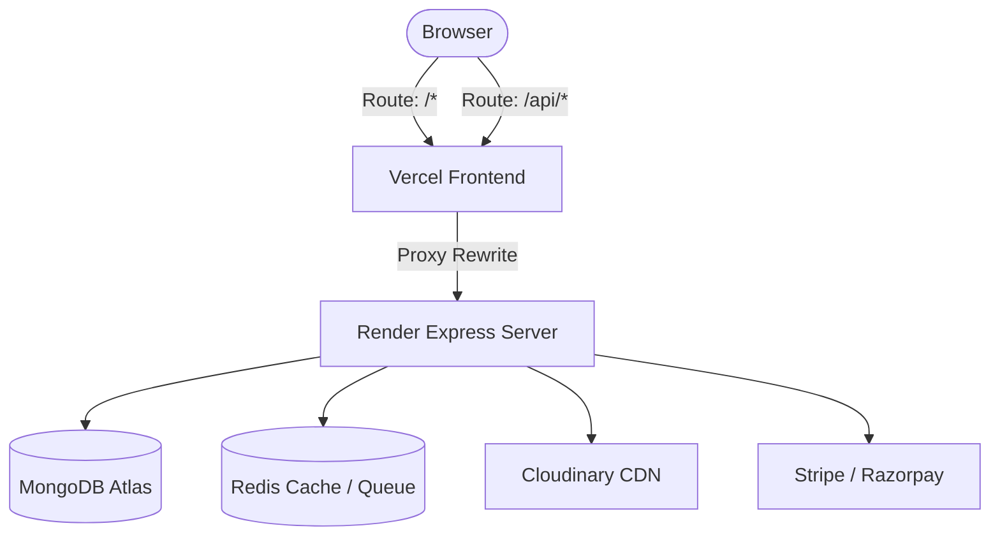
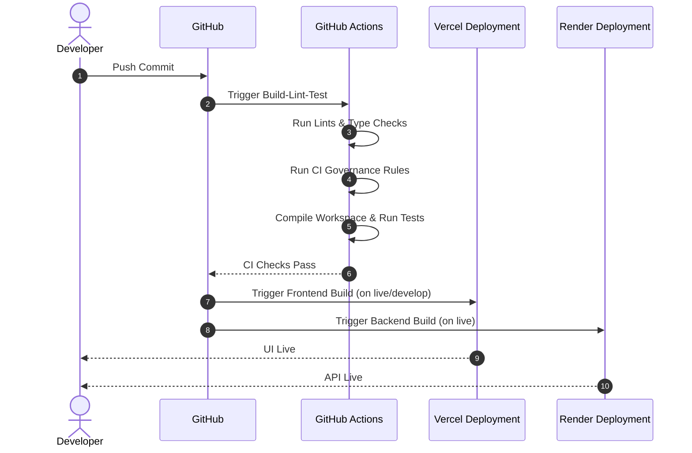

# MAD Entertrainment — Deployment Map

This document serves as the canonical **Single Source of Truth (SSOT)** for the deployment environments, CI/CD pipelines, release procedures, and rollback workflows of the **MAD Entertrainment** platform.

---

## 1. Executive Overview

### Deployment Philosophy
We enforce **infrastructure-independent deployments**, **environment isolation**, and **immutable build artifacts**. Our goal is to maintain absolute alignment between production systems and source control.

### Platform Topology
The application operates on a split hosting architecture: Next.js frontends deploy to Vercel, Express APIs deploy to Render, and Mongoose datastores connect to MongoDB Atlas.

---

## 2. Environment Matrix

### Current Implementation
The platform manages four distinct deployment environments.

| Parameter | Local Development | Preview Deployments | Staging/Testing | Production |
|---|---|---|---|---|
| **Purpose** | Sandbox coding | PR validation | Integration testing | Live customer traffic |
| **URL** | `localhost:3000` | Vercel preview URL | `test.esparex.in` | `mad.esparex.in` |
| **Hosting** | Local machine | Vercel Serverless | Vercel Serverless | Vercel Serverless |
| **Git Branch** | Local workspace | Pull Request | `develop` | `live` |
| **Trigger** | Manual launch | PR open/synchronize | Git push to `develop` | Git push/merge to `live` |
| **Database** | Local MongoDB | MongoDB Atlas Sandbox | MongoDB Atlas Shared | MongoDB Atlas Prod |
| **Redis** | Local Redis | Mock / None | Redis Cloud Shared | Redis Cloud Prod |
| **Storage** | Local FS / Mock | Cloudinary Sandbox | Cloudinary Sandbox | Cloudinary Production |
| **Email** | Mock SMTP | SMTP Sandbox | SMTP Sandbox | ZeptoMail Gateway |
| **Payments** | Mock Payments | Sandbox Gateways | Sandbox Gateways | Stripe/Razorpay Live |
| **Monitoring** | None | Console logs | Sentry Alerts | Sentry & Better Uptime |

*Evidence*:
- Environment checklists in `RUNBOOK.md` define variable scopes for local, staging, and production.
- Render config `render.yaml` points to production Node settings.

### Repository Standard
- Staging and production credentials must be strictly separated.
- Database auto-indexing must be disabled in production (`autoIndex: false` Mongoose settings) to prevent performance locks during migrations.

### Future Recommendations
- See *Appendix A: Future Deployment Considerations* for staging backend isolation proposals (Status: Proposed).

---

## 3. Git Branch Strategy

### Current Implementation
We follow a modified Git Flow strategy to control code promotions:
- **`develop`**: The active integration branch. Previews and test environments pull from here.
- **`live`**: The stable branch representing production. Auto-deploys to Render and Vercel Production are triggered from here.
- **`feature/*` / `bugfix/*` / `chore/*`**: Short-lived task branches branched from `develop` and merged via PR.
- **`audit/*`**: Read-only discovery branches.

```
Feature Branch (feature/*)
      │
      ▼ (Pull Request)
Develop Branch (develop)  ──► Auto-deploys to Vercel Test (Shares Prod API)
      │
      ▼ (Release Approval Merge)
Live Branch (live)        ──► Auto-deploys to Vercel Production & Render API
```

*Evidence*:
- `AGENTS.MD` §BRANCH SAFETY rules define branch names and protection policies.
- `.github/workflows/ci.yml` triggers on pushes/PRs to `develop` and `live`.

### Repository Standard
- Direct commits to `develop` and `live` are strictly blocked.
- One issue = one branch = one PR. Branches must be deleted locally and remotely immediately after merging.

### Future Recommendations
- Omitted.

---

## 4. Hosting Architecture

### Current Implementation
The platform uses Vercel for frontend rendering and Render for backend logic processing:
- **Next.js rewrites**: Vercel acts as the primary ingress point. It proxies API requests matching `/api/*` directly back to the Render URL, eliminating CORS preflight overhead.



*Evidence*:
- Root `vercel.json` rewrites `/api/:path*` to `https://apm.esparex.in/api/:path*`.
- Render service targets in `render.yaml`.

### Repository Standard
- The API server must be hosted as a secure, stateless web service, utilizing external Redis stores for managing session cache and rate limits.

### Future Recommendations
- Omitted.

---

## 5. Deployment Flow

### Current Implementation
The deployment pipeline consists of local checks, GitHub Actions CI, and provider integrations:
- **CI Pipeline**: Triggers on push or PR to `develop` and `live`.
- **Deploy Hook**: Render and Vercel fetch build configurations from the repo root on push.



*Evidence*:
- `.github/workflows/ci.yml` defines the CI compilation and test check pipeline.

### Repository Standard
- CI checks must pass before any branch is merged into `develop` or `live`. The pipeline runs lints, type checks, unit tests, custom governance validators, and dependency audits.

### Future Recommendations
- Omitted.

---

## 6. Environment Variables

### Current Implementation
All runtime variables are loaded through process environment configurations. No raw secrets are stored in code.
- **Server Variables**: Include database URIs (`MONGODB_URI`), payment keys (`RAZORPAY_KEY_ID`, `RAZORPAY_KEY_SECRET`), secret strings (`JWT_SECRET`, `JWT_SESSION_SECRET`), email endpoints, and Cloudinary keys.
- **Client Variables**: Include API targets (`NEXT_PUBLIC_API_URL`, `NEXT_PUBLIC_SOCKET_URL`) and payment IDs.

*Evidence*:
- `apps/server/src/config/env.ts` defines Zod validation schemas for server variables.
- `RUNBOOK.md` §2 defines variables checklists.

### Repository Standard
- **Secret Minimum Lengths**: Secret configurations (JWT keys, session keys) must be at least 32 characters in length (`z.string().min(32)`).
- **Masking**: Under no circumstances should raw secret values be printed to server logs or compliance records.

### Future Recommendations
- Omitted.

---

## 7. External Services

### Current Implementation
The platform integrates with several third-party services:
1. **MongoDB Atlas**: Primary database. Failures block all booking, event management, and authentication flows.
2. **Redis Cloud**: Session store and BullMQ broker. Failures block queue processing and Express rate-limiters.
3. **Cloudinary**: Images and event banner CDN. Failures block image uploads.
4. **Stripe / Razorpay**: Payment processors. Failures prevent booking finalizations.
5. **ZeptoMail**: Transactional SMTP gateway. Failures block OTP delivery.

*Evidence*:
- Connection configurations in `apps/server/src/server.ts` and `apps/server/src/config/`.

### Repository Standard
- Fallback paths and graceful error responses must be implemented for all external service calls. If Razorpay is down, the system should gracefully notify users without crashing.

### Future Recommendations
- Omitted.

---

## 8. Rollback Strategy

### Current Implementation
Rollback procedures are executed manually from provider consoles:
- **API Server Rollback**: Triggered from the Render dashboard under `mad-server` Deploys by selecting a last-known-good build and clicking "Redeploy".
- **Frontend Rollback**: Triggered from the Vercel dashboard under Project Deployments by selecting a stable deployment and clicking "Promote to Production".
- **Emergency Git Rollback**: Reverting commits and pushing to trigger rebuilds:
  ```bash
  git revert HEAD --no-edit && git push origin develop
  ```

*Evidence*:
- Rollback workflows documented in `RUNBOOK.md` §7.

### Repository Standard
- Rollbacks must be monitored immediately via uptime endpoints to verify that the returned state is healthy:
  ```bash
  curl https://apm.esparex.in/api/health
  # Expected: {"status":"ok"}
  ```

### Future Recommendations
- Omitted.

---

## 9. Release Process

### Current Implementation
Releases are coordinated by human operators using staging tests and branch promotions:
1. **Verification**: Compile code locally and run the test suite.
2. **Promotion**: Merge approved `develop` branches into `live`.
3. **Smoke Testing**: Manually trigger payment sandbox scripts and check QR code validations.

*Evidence*:
- Release steps in `RUNBOOK.md` §3 and §10.

### Repository Standard
- Merging `develop` into `live` is forbidden if any unit test or continuous compliance check fails.

### Future Recommendations
- Omitted.

---

## 10. Operational Responsibilities

### Current Implementation
- **Infrastructure**: DevOps maintains Render, Vercel, and GitHub Actions settings.
- **Database**: DBA monitors MongoDB backups, index updates, and connection pools.
- **Security**: Security reviews Sentry logs, TruffleHog secrets leaks, and rate-limit blocks.

### Repository Standard
- Platform status monitoring must be checked continuously. Production alerts must route to high-priority channels.

### Future Recommendations
- Omitted.

---

## 11. Security

### Current Implementation
- **Secrets Management**: Credentials are set directly in Vercel and Render dashboards, completely isolated from git repositories.
- **Branch Protection**: Master branches have protection rules requiring pull request reviews before merge.

*Evidence*:
- Gitignore configurations and environment checks in code.

### Repository Standard
- **Isolation**: Environment namespaces must be strictly isolated. BullMQ namespaces are prefixed (`production_`, `staging_`, `local_`) to prevent staging code from pulling production messages.

### Future Recommendations
- Omitted.

---

## 12. Appendix: Future Deployment Considerations

The following enhancements represent potential improvements. They are not approved for implementation and serve as informational reference points only.

### 1. Separate Staging Backend API Instance
- **Proposal**: Spin up a staging Render Node API instance connecting to a dedicated staging MongoDB cluster.
- **Business Motivation**: Prevent staging/testing frontends (on Vercel Test) from sharing the production Render API backend.
- **Technical Benefit**: Complete environment and data isolation.
- **Dependencies**: Extra Render service provisioning.
- **Risks**: Monthly hosting overhead increases.
- **Approval Status**: Proposed (Possible Future Enhancement - Not Approved).
- **Related ADR**: None.
