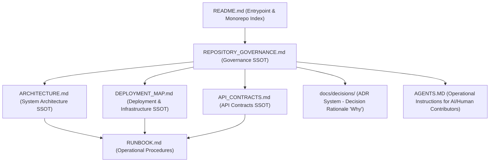
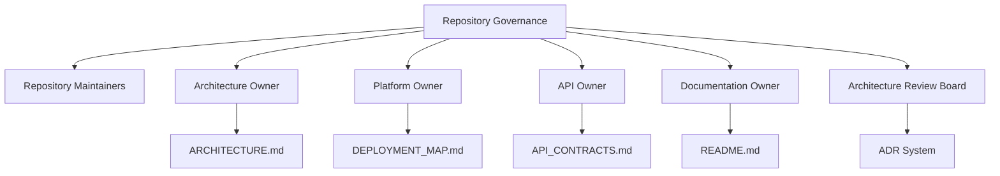
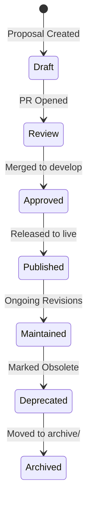

# Repository Governance Single Source of Truth (SSOT)

- **Owner**: Repository Governance Owner & Maintainers
- **Status**: Active
- **Version**: 1.0
- **Repository**: MAD Entertrainment
- **Review Cycle**: Quarterly
- **Last Updated**: 2026-06-25
- **Related Documents:**
  - [README.md](README.md)
  - [ARCHITECTURE.md](ARCHITECTURE.md)
  - [DEPLOYMENT_MAP.md](DEPLOYMENT_MAP.md)
  - [API_CONTRACTS.md](API_CONTRACTS.md)
  - [RUNBOOK.md](RUNBOOK.md)
  - [AGENTS.MD](AGENTS.MD)
  - [TESTING.md](TESTING.md)
  - [Architecture Decisions Index](docs/decisions/README.md)
  - [CHANGELOG.md](CHANGELOG.md)
- **Supersedes**: None (Initial Release)

---

## 1. Executive Summary

### Governance Philosophy
Repository governance at MAD Entertrainment enforces consistency, correctness, security, and traceability. Every decision, schema, deploy topology, and code boundary must have a single source of truth (SSOT) that is documented, reviewed, and audited to prevent legacy code accumulation, duplicate logic, and architectural drift.

### Repository Objectives
1. **Prevent Legacy and Orphan Code**: Ensure all pages, APIs, and components have active consumers and documented purposes.
2. **Ensure System Integrity**: Align frontend assumptions with backend validation contracts through shared workspace schemas.
3. **Decentralized Execution, Centralized Alignment**: Empower engineering teams to develop autonomously while aligning on architectural decisions.

### Engineering & Documentation Principles
- **Documentation-First**: Architectural decisions and API contracts are designed and documented before code changes are merged.
- **Traceability**: Changes trace from user issues to code implementation and PR verification results.
- **Evidence-Based**: Technical state, endpoints, and environment configurations must be backed by automated audits and scans.

---

## 2. Repository Documentation Hierarchy

The repository maintains a strict hierarchy to isolate policies, system definitions, decisions, and procedures:

| Document | Primary Focus | Role in Hierarchy |
| :--- | :--- | :--- |
| [README.md](README.md) | Entry point & Quickstart | Navigational directory for the monorepo workspace. |
| [REPOSITORY_GOVERNANCE.md](REPOSITORY_GOVERNANCE.md) | Governance & Branching policies | Single Source of Truth for documentation, PR rules, and change policy. |
| [ARCHITECTURE.md](ARCHITECTURE.md) | Module boundaries & Code standards | Canonical system design, folder structure, and code design standards. |
| [DEPLOYMENT_MAP.md](DEPLOYMENT_MAP.md) | Topology & Environments | Canonical map of infrastructure, CI/CD, and environment config. |
| [API_CONTRACTS.md](API_CONTRACTS.md) | Endpoint definitions & validation | Authority on request/response schemas, errors, and authentication. |
| [docs/decisions/](docs/decisions/README.md) | Decision records (ADRs) | Rationale behind historical technical decisions (the "Why"). |
| [RUNBOOK.md](RUNBOOK.md) | Operational guidelines & scripts | Incident response, backup, and manual testing procedures. |
| [AGENTS.MD](AGENTS.MD) | Operational developer instructions | Instructions for human and AI agents implementing the governance policies. |

### Document Dependency Matrix

A dependency matrix helps contributors understand which documents should be reviewed together:

| Document | Depends On | Description |
| :--- | :--- | :--- |
| **README.md** | None | Root directory navigation entry point. |
| **REPOSITORY_GOVERNANCE.md**| None | Canonical repository governance policies. |
| **ARCHITECTURE.md** | [REPOSITORY_GOVERNANCE.md](REPOSITORY_GOVERNANCE.md) | Package boundaries and coding standards inherit review matrices. |
| **DEPLOYMENT_MAP.md** | [ARCHITECTURE.md](ARCHITECTURE.md) | Infrastructure mapping is constrained by defined system boundaries. |
| **API_CONTRACTS.md** | [ARCHITECTURE.md](ARCHITECTURE.md) | Service interfaces depend on monorepo design layout. |
| **ADR** | [ARCHITECTURE.md](ARCHITECTURE.md) + [REPOSITORY_GOVERNANCE.md](REPOSITORY_GOVERNANCE.md) | Rationale must map back to active architecture and governance. |
| **RUNBOOK.md** | [ARCHITECTURE.md](ARCHITECTURE.md) + [DEPLOYMENT_MAP.md](DEPLOYMENT_MAP.md) + [API_CONTRACTS.md](API_CONTRACTS.md) | Operations depend on system structure, routes, and hosting topology. |

---

## 3. Governance Principles

1. **Single Source of Truth (SSOT)**: Every rule, boundary, or API must have exactly one owner. Frontend code must never duplicate backend decisions (e.g. calculating price totals or coupon validity).
2. **Evidence-Based Documentation**: Documentation must not rely on assumptions. It is backed by verified route definitions and automation (e.g. `audit_data.json`).
3. **Decision Traceability**: Any architectural deviation or significant decision must be documented in an ADR under `docs/decisions/`.
4. **Documentation-First**: Documentation must be updated in tandem with code changes. PRs with undocumented API or architectural changes are blocked.
5. **Code Ownership**: Specific domain experts review changes affecting their modules.
6. **Verification-First Workflow**: Changes are validated locally (lint, tests, builds) before staging or merging.
7. **Continuous Improvement**: Governance policies and checks are updated as repository capabilities expand.

---

## 4. Governance Roles & Ownership Matrix

### Governance Ownership Diagram

### Roles and Responsibilities
- **Repository Governance Owner**: Maintains `REPOSITORY_GOVERNANCE.md` and reviews repository change policy violations.
- **Repository Maintainers**: Core engineers responsible for branch management, merge reviews, and documentation consistency.
- **Architecture Review Board**: Approves structural changes, package boundaries, and ADRs.
- **Architecture Owner**: Approves changes to ARCHITECTURE.md and monorepo package boundaries.
- **API Owner**: Custodian of public and internal contract schemas (API_CONTRACTS.md).
- **Platform/Deployment Owner**: Controls hosting environments, database clusters, and environment variables (DEPLOYMENT_MAP.md).
- **Documentation Owner**: Manages README.md and documentation layout standards.
- **Security Owner**: Reviews authentication, RBAC boundaries, encryption, and audit logs.

### Document Ownership Matrix
| Document | Owner Role | Review Cycle |
| :--- | :--- | :--- |
| **README.md** | Documentation Owner | Ongoing |
| **REPOSITORY_GOVERNANCE.md**| Repository Governance Owner | Quarterly |
| **ARCHITECTURE.md** | Architecture Owner | Bi-annual |
| **DEPLOYMENT_MAP.md** | Platform/Deployment Owner | Bi-annual |
| **API_CONTRACTS.md** | API Owner | Ongoing |
| **docs/decisions/** | Architecture Review Board | Ongoing |
| **RUNBOOK.md** | Platform/Deployment Owner | Ongoing |
| **AGENTS.MD** | Repository Governance Owner | Quarterly |

---

## 5. Governance Compliance Matrix

Use this matrix to determine the SSOT location, whether an ADR is required, and verification requirements:

| Area | SSOT Document | ADR Required | Verification Requirements |
| :--- | :--- | :--- | :--- |
| **Architecture** | [ARCHITECTURE.md](ARCHITECTURE.md) | Yes | Workspace build + structural review |
| **Deployment** | [DEPLOYMENT_MAP.md](DEPLOYMENT_MAP.md) | Sometimes | Configuration validation + smoke test |
| **API Contracts** | [API_CONTRACTS.md](API_CONTRACTS.md) | Breaking changes only | Integration tests + validation checks |
| **Security** | [AGENTS.MD](AGENTS.MD) / ADR | Yes | Security review + secret scanning |
| **Governance** | [REPOSITORY_GOVERNANCE.md](REPOSITORY_GOVERNANCE.md) | Yes | Document review + link audits |

---

## 6. Documentation Lifecycle

- **Draft**: A document modification is proposed in a workspace branch.
- **Review**: The documentation PR is opened and audited.
- **Approved**: Reviewers approve the documentation change, and it is merged into the `develop` branch.
- **Published**: The branch is merged into `live`. All merged changes must be documented in [CHANGELOG.md](CHANGELOG.md) under the appropriate version section before tag creation.
- **Maintained**: The document remains the active reference and is updated with patch modifications.
- **Deprecated**: The document or record is marked as obsolete (e.g. a superseded ADR or deprecated API).
- **Archived**: Obsolete records are cataloged in an archive folder (e.g. `docs/archive/`) for historical reference.

---

## 7. Subsystem Governance Rules

### Architecture Governance
- Modifying package boundaries, folder structures, or introducing dependencies requires updating [ARCHITECTURE.md](ARCHITECTURE.md).
- Speculative designs are prohibited; only current systems are described. Future recommendations must reside under a clearly marked Appendix.

### Deployment Governance
- Any change in environment variables, hosting providers, or database setup requires modifying [DEPLOYMENT_MAP.md](DEPLOYMENT_MAP.md).
- Staging and production configurations must be isolated to prevent testing modifications to production data.

### API Governance
- Request/Response payload mutations, authorization changes, or endpoint additions require updating [API_CONTRACTS.md](API_CONTRACTS.md).
- Frontends must consume validation schemas from `@mad/validations` rather than creating independent checks.

### ADR Governance
- Significant deviations from standard boundaries must be recorded in `docs/decisions/`.
- ADRs must respect the numbering and lifecycle policies defined in [docs/decisions/README.md](docs/decisions/README.md).

---

## 8. Branch & PR Governance

### Branch Management
- **Allowed Branches**:
  - `feat/<name>`: New capabilities.
  - `fix/<name>`: Defect repairs.
  - `refactor/<name>`: Code restructuring.
  - `audit/<name>`: Discovery and diagnostics. **No code modifications allowed on audit branches.**
  - `docs/<name>`: Documentation modifications.
  - `test/<name>`: Test modifications.
  - `chore/<name>`: Maintenance tasks.
- **Lifecycle Boundaries**:
  - Strict mapping: **1 Issue = 1 Branch = 1 PR**. Reusing merged branches or combining issues is prohibited.
  - Stale branches (behind `develop` by more than 30 commits) must be rebased or deleted.
  - Immediately delete branches upon merge.

### Pull Request & Review Requirements
No Pull Request may be merged without satisfying the following:
- **Required Reviewers**:
  - *Architecture Changes*: Approved by Architecture Owner.
  - *API Modifications*: Approved by Backend/API Owner.
  - *Deployment Changes*: Approved by Platform Owner.
  - *Security Changes*: Approved by Security Owner.
  - *Documentation Updates*: Approved by Repository Maintainer.
  - *UI Spacing/Layout*: Approved by Frontend Owner.
- **Evidence Requirements**: PRs must provide test logs, build results, or audit reports confirming compliance.
- **Rollback Requirements**: Every PR introducing operational changes must document a rollback strategy.
- **Changelog Requirement**: All merged PRs that modify features, APIs, architecture, or deployments must include a corresponding entry in [CHANGELOG.md](CHANGELOG.md).

---

## 9. Documentation & Verification Standards

### Documentation Standards
- **Markdown**: GFM compliant, short concise lists.
- **Links**: Clickable repository-relative paths, immutable commit permalinks, or repository URLs. Absolute local workstation paths are forbidden.
- **Diagrams**: Mermaid diagrams with standard state or flow layouts.
- **No Placeholders**: Real images and working code scripts only.

### Verification Standards
- **Build Checks**: Turbo workspace builds must compile cleanly (`pnpm build`).
- **Test Integrity**: Every test suite must pass (`pnpm test`).
- **Governance Audit**: Run `pnpm run audit-data` to check route structure and dependencies.
- **Automation Verification**: CI checks (`scripts/ci-governance-check.ts` and `scripts/dependency-audit.ts`) must pass before merging.

---

## 10. Repository Change & Deprecation Policy

### Change Triggers
`REPOSITORY_GOVERNANCE.md` must be updated if there are changes to:
- Code review rules or PR review matrices.
- Allowed branch names or branch promotion lifecycles.
- CI/CD workflow requirements or verification gates.
- Documentation structure or naming policies.
- Release version increments or deprecation schedules (must update [CHANGELOG.md](CHANGELOG.md)).

### Deprecation & Archiving Rules
- When a document is deprecated, a prominent `> [!WARNING] Deprecated` notice must be added at the top, referencing the replacing document.
- Historical ADRs are kept in the index for traceability; their status is updated to `Superseded` or `Deprecated`.

---

## 11. Governance Automation Roadmap

The following validation checks are scheduled for automated implementation in the CI pipeline:

> [!NOTE]
> **Status**: Possible Future Enhancement (Not Approved) · Untracked
- **Markdown Linting**: Automatic syntax and style linting of all repository documentation.
- **Broken Link Validation**: Scan documents for invalid absolute or relative paths.
- **Cross-Reference Validation**: Verify structural references are fully resolved across documents.
- **SSOT Consistency Checks**: Automate checking route definitions in Express code against `API_CONTRACTS.md`.
- **ADR Validation**: Enforce ADR format consistency, status tags, and reviewer metadata verification.
- **Documentation Freshness Reporting**: Automatically flags files that exceed their designated review cycle limits.
- **Dead Document Detection**: Scan for obsolete document files or orphan configuration maps.

### Governance KPIs

> [!NOTE]
> The Repository Health Score is a weighted governance indicator derived from ownership compliance, documentation freshness, and document linkage. It is intended for reporting and trend analysis rather than acting as a pass/fail CI gate.

Measurable governance metrics are established to support future automation checks:

| KPI | Target | Verification Method |
| :--- | :--- | :--- |
| **Broken documentation links** | 0 | Automated markdown link check scan |
| **Missing SSOT references** | 0 | Static parsing of cross-document links |
| **ADR numbering inconsistencies** | 0 | Static analysis of ADR index and file names |
| **Governance CI failures** | 0 | Automatic block on GitHub Actions build checks |
| **Outdated governance documents** | 0 | Repository metadata freshness reviews |
| **Documentation review SLA** | 3 business days | Defined by peer review cycle SLA policies |

---

## 12. Current Implementation & Standards

### Current Verification Rules
- Linting runs via `pnpm lint` calling `turbo lint`.
- Vulnerability scanning runs via `scripts/dependency-audit.ts` utilizing `.audit-exceptions.json`.
- Structural checks run via `scripts/ci-governance-check.ts` to detect sentry/opentelemetry frontend leakage and validation drift.
- Route verification collects active Express configurations into `reports/audit/audit-data.json`.

### Repository Standard
- Pre-commit or pre-push hooks must execute `pnpm lint` and `pnpm test`.
- All PR submissions must attach terminal evidence of clean builds.
