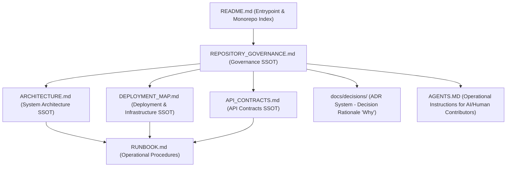
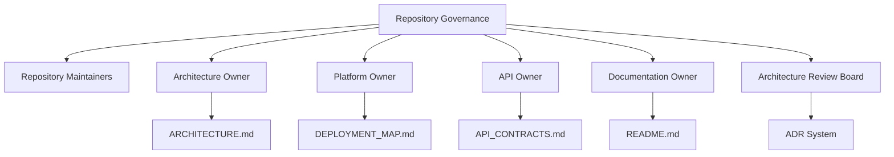
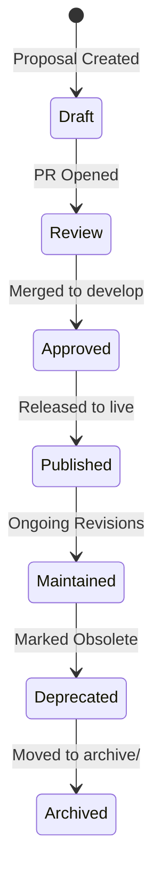

# Repository Governance Single Source of Truth (SSOT)

- **Owner**: Repository Governance Owner & Maintainers
- **Status**: Active
- **Version**: 1.0
- **Repository**: MAD Entertrainment
- **Review Cycle**: Quarterly
- **Last Updated**: 2026-06-25
- **Related Documents:**
  - [README.md](README.md)
  - [ARCHITECTURE.md](ARCHITECTURE.md)
  - [DEPLOYMENT_MAP.md](DEPLOYMENT_MAP.md)
  - [API_CONTRACTS.md](API_CONTRACTS.md)
  - [RUNBOOK.md](RUNBOOK.md)
  - [AGENTS.MD](AGENTS.MD)
  - [TESTING.md](TESTING.md)
  - [Architecture Decisions Index](docs/decisions/README.md)
  - [CHANGELOG.md](CHANGELOG.md)
- **Supersedes**: None (Initial Release)

---

## 1. Executive Summary

### Governance Philosophy
Repository governance at MAD Entertrainment enforces consistency, correctness, security, and traceability. Every decision, schema, deploy topology, and code boundary must have a single source of truth (SSOT) that is documented, reviewed, and audited to prevent legacy code accumulation, duplicate logic, and architectural drift.

### Repository Objectives
1. **Prevent Legacy and Orphan Code**: Ensure all pages, APIs, and components have active consumers and documented purposes.
2. **Ensure System Integrity**: Align frontend assumptions with backend validation contracts through shared workspace schemas.
3. **Decentralized Execution, Centralized Alignment**: Empower engineering teams to develop autonomously while aligning on architectural decisions.

### Engineering & Documentation Principles
- **Documentation-First**: Architectural decisions and API contracts are designed and documented before code changes are merged.
- **Traceability**: Changes trace from user issues to code implementation and PR verification results.
- **Evidence-Based**: Technical state, endpoints, and environment configurations must be backed by automated audits and scans.

---

## 2. Repository Documentation Hierarchy

The repository maintains a strict hierarchy to isolate policies, system definitions, decisions, and procedures:



| Document | Primary Focus | Role in Hierarchy |
| :--- | :--- | :--- |
| [README.md](README.md) | Entry point & Quickstart | Navigational directory for the monorepo workspace. |
| [REPOSITORY_GOVERNANCE.md](REPOSITORY_GOVERNANCE.md) | Governance & Branching policies | Single Source of Truth for documentation, PR rules, and change policy. |
| [ARCHITECTURE.md](ARCHITECTURE.md) | Module boundaries & Code standards | Canonical system design, folder structure, and code design standards. |
| [DEPLOYMENT_MAP.md](DEPLOYMENT_MAP.md) | Topology & Environments | Canonical map of infrastructure, CI/CD, and environment config. |
| [API_CONTRACTS.md](API_CONTRACTS.md) | Endpoint definitions & validation | Authority on request/response schemas, errors, and authentication. |
| [docs/decisions/](docs/decisions/README.md) | Decision records (ADRs) | Rationale behind historical technical decisions (the "Why"). |
| [RUNBOOK.md](RUNBOOK.md) | Operational guidelines & scripts | Incident response, backup, and manual testing procedures. |
| [AGENTS.MD](AGENTS.MD) | Operational developer instructions | Instructions for human and AI agents implementing the governance policies. |

### Document Dependency Matrix

A dependency matrix helps contributors understand which documents should be reviewed together:

| Document | Depends On | Description |
| :--- | :--- | :--- |
| **README.md** | None | Root directory navigation entry point. |
| **REPOSITORY_GOVERNANCE.md**| None | Canonical repository governance policies. |
| **ARCHITECTURE.md** | [REPOSITORY_GOVERNANCE.md](REPOSITORY_GOVERNANCE.md) | Package boundaries and coding standards inherit review matrices. |
| **DEPLOYMENT_MAP.md** | [ARCHITECTURE.md](ARCHITECTURE.md) | Infrastructure mapping is constrained by defined system boundaries. |
| **API_CONTRACTS.md** | [ARCHITECTURE.md](ARCHITECTURE.md) | Service interfaces depend on monorepo design layout. |
| **ADR** | [ARCHITECTURE.md](ARCHITECTURE.md) + [REPOSITORY_GOVERNANCE.md](REPOSITORY_GOVERNANCE.md) | Rationale must map back to active architecture and governance. |
| **RUNBOOK.md** | [ARCHITECTURE.md](ARCHITECTURE.md) + [DEPLOYMENT_MAP.md](DEPLOYMENT_MAP.md) + [API_CONTRACTS.md](API_CONTRACTS.md) | Operations depend on system structure, routes, and hosting topology. |

---

## 3. Governance Principles

1. **Single Source of Truth (SSOT)**: Every rule, boundary, or API must have exactly one owner. Frontend code must never duplicate backend decisions (e.g. calculating price totals or coupon validity).
2. **Evidence-Based Documentation**: Documentation must not rely on assumptions. It is backed by verified route definitions and automation (e.g. `audit_data.json`).
3. **Decision Traceability**: Any architectural deviation or significant decision must be documented in an ADR under `docs/decisions/`.
4. **Documentation-First & Search Before Create**: Documentation must be updated in tandem with code changes. No new `.md` file may be created until the repository has been searched for an existing canonical document covering the same subject (`RULE-DOC-001`).
5. **One Topic → One Canonical SSOT**: Every active subject must have exactly one authoritative `.md` document (`RULE-DOC-002`). Historical records and completed plans belong in `docs/archive/`.
6. **Code Ownership**: Specific domain experts review changes affecting their modules.
7. **Verification-First Workflow**: Changes are validated locally (lint, tests, builds) before staging or merging.
8. **Continuous Improvement**: Governance policies and checks are updated as repository capabilities expand.

---

## 4. Governance Roles & Ownership Matrix

### Governance Ownership Diagram


### Roles and Responsibilities
- **Repository Governance Owner**: Maintains `REPOSITORY_GOVERNANCE.md` and reviews repository change policy violations.
- **Repository Maintainers**: Core engineers responsible for branch management, merge reviews, and documentation consistency.
- **Architecture Review Board**: Approves structural changes, package boundaries, and ADRs.
- **Architecture Owner**: Approves changes to ARCHITECTURE.md and monorepo package boundaries.
- **API Owner**: Custodian of public and internal contract schemas (API_CONTRACTS.md).
- **Platform/Deployment Owner**: Controls hosting environments, database clusters, and environment variables (DEPLOYMENT_MAP.md).
- **Documentation Owner**: Manages README.md and documentation layout standards.
- **Security Owner**: Reviews authentication, RBAC boundaries, encryption, and audit logs.

### Document Ownership Matrix
| Document | Owner Role | Review Cycle |
| :--- | :--- | :--- |
| **README.md** | Documentation Owner | Ongoing |
| **REPOSITORY_GOVERNANCE.md**| Repository Governance Owner | Quarterly |
| **ARCHITECTURE.md** | Architecture Owner | Bi-annual |
| **DEPLOYMENT_MAP.md** | Platform/Deployment Owner | Bi-annual |
| **API_CONTRACTS.md** | API Owner | Ongoing |
| **docs/decisions/** | Architecture Review Board | Ongoing |
| **RUNBOOK.md** | Platform/Deployment Owner | Ongoing |
| **AGENTS.MD** | Repository Governance Owner | Quarterly |

---

## 5. Governance Compliance Matrix

Use this matrix to determine the SSOT location, whether an ADR is required, and verification requirements:

| Area | SSOT Document | ADR Required | Verification Requirements |
| :--- | :--- | :--- | :--- |
| **Architecture** | [ARCHITECTURE.md](ARCHITECTURE.md) | Yes | Workspace build + structural review |
| **Deployment** | [DEPLOYMENT_MAP.md](DEPLOYMENT_MAP.md) | Sometimes | Configuration validation + smoke test |
| **API Contracts** | [API_CONTRACTS.md](API_CONTRACTS.md) | Breaking changes only | Integration tests + validation checks |
| **Security** | [AGENTS.MD](AGENTS.MD) / ADR | Yes | Security review + secret scanning |
| **Governance** | [REPOSITORY_GOVERNANCE.md](REPOSITORY_GOVERNANCE.md) | Yes | Document review + link audits |

---

## 6. Documentation Lifecycle



- **Draft**: A document modification is proposed in a workspace branch.
- **Review**: The documentation PR is opened and audited.
- **Approved**: Reviewers approve the documentation change, and it is merged into the `develop` branch.
- **Published**: The branch is merged into `live`. All merged changes must be documented in [CHANGELOG.md](CHANGELOG.md) under the appropriate version section before tag creation.
- **Maintained**: The document remains the active reference and is updated with patch modifications.
- **Deprecated**: The document or record is marked as obsolete (e.g. a superseded ADR or deprecated API).
- **Archived**: Obsolete records are cataloged in an archive folder (e.g. `docs/archive/`) for historical reference.

---

## 7. Subsystem Governance Rules

### Architecture Governance
- Modifying package boundaries, folder structures, or introducing dependencies requires updating [ARCHITECTURE.md](ARCHITECTURE.md).
- Speculative designs are prohibited; only current systems are described. Future recommendations must reside under a clearly marked Appendix.

### Deployment Governance
- Any change in environment variables, hosting providers, or database setup requires modifying [DEPLOYMENT_MAP.md](DEPLOYMENT_MAP.md).
- Staging and production configurations must be isolated to prevent testing modifications to production data.

### API Governance
- Request/Response payload mutations, authorization changes, or endpoint additions require updating [API_CONTRACTS.md](API_CONTRACTS.md).
- Frontends must consume validation schemas from `@mad/validations` rather than creating independent checks.

### ADR Governance
- Significant deviations from standard boundaries must be recorded in `docs/decisions/`.
- ADRs must respect the numbering and lifecycle policies defined in [docs/decisions/README.md](docs/decisions/README.md).

---

## 8. Branch & PR Governance

### Branch Management
- **Allowed Branches**:
  - `feat/<name>`: New capabilities.
  - `fix/<name>`: Defect repairs.
  - `refactor/<name>`: Code restructuring.
  - `audit/<name>`: Discovery and diagnostics. **No code modifications allowed on audit branches.**
  - `docs/<name>`: Documentation modifications.
  - `test/<name>`: Test modifications.
  - `chore/<name>`: Maintenance tasks.
- **Lifecycle Boundaries**:
  - Strict mapping: **1 Issue = 1 Branch = 1 PR**. Reusing merged branches or combining issues is prohibited.
  - Stale branches (behind `develop` by more than 30 commits) must be rebased or deleted.
  - Immediately delete branches upon merge in accordance with **RULE-GIT-001** and **RULE-GIT-002**.

### Git Branch Cleanup Standard (RULE-GIT-001)

#### Preconditions
Before deleting a feature branch:
- The associated Pull Request is merged.
- The working tree is clean (no uncommitted or unstaged changes).
- All CI/CD checks have passed.

#### Cleanup Protocol Steps
1. **Verify Working Tree**:
   Run `git status` and confirm there is `nothing to commit, working tree clean`.
2. **Synchronize Target**:
   Switch to `develop` and pull the latest changes:
   ```bash
   git checkout develop
   git pull origin develop
   ```
3. **Verify PR Merge Status**:
   Confirm the Pull Request has been merged on GitHub.
4. **Verify Integration (Merge-Strategy-Agnostic)**:
   Apply both checks — they handle all three merge strategies (merge commit, squash, rebase):

   **Step 4a — Ancestor Reachability** (works for standard merge commits):
   ```bash
   git merge-base --is-ancestor feature-branch develop
   ```
   - Exit code `0` (true): The branch tip is a direct ancestor of `develop`. Proceed to step 5.
   - Exit code `1` (false): The commit is not reachable by ancestry. This is expected for squash or rebase merges. Continue to Step 4b.

   **Step 4b — Tree Equivalence** (works for squash and rebase merges):
   ```bash
   git diff develop feature-branch
   ```
   - Empty output: The working trees are identical. All code is integrated. Proceed to step 5.
   - Non-empty output: STOP. The branch contains unique changes not yet in `develop`.

   **Step 4c — Patch Equivalence (Optional Confirmation)**:
   ```bash
   git cherry develop feature-branch
   ```
   - All lines prefixed with `-`: Patch-equivalent commits exist on `develop`. Safe to delete.
   - Any line prefixed with `+`: STOP. The branch contains at least one unique patch not yet integrated.

5. **Delete Local Branch**:
   Run safe delete:
   ```bash
   git branch -d feature-branch
   ```
   Only if the PR is merged and both Step 4a/4b confirm integration, you may force-delete:
   ```bash
   git branch -D feature-branch
   ```
6. **Delete Remote Branch** (if not already deleted on GitHub):
   ```bash
   git push origin --delete feature-branch
   ```
7. **Prune References**:
   ```bash
   git fetch --prune
   ```
8. **Final Verification**:
   Confirm all three checks pass:
   ```bash
   git status      # must show: nothing to commit, working tree clean
   git branch      # feature branch must NOT appear
   git branch -r   # remote tracking ref must NOT appear
   ```

### Working Tree State Rule (RULE-GIT-002)
A feature branch **must not** be deleted while the local repository contains uncommitted or unstaged changes.

If the working tree is not clean, you must do one of the following before starting the cleanup protocol:
- **Commit** the changes.
- **Stash** the changes.
- **Discard** the changes.

### Pull Request & Review Requirements
No Pull Request may be merged without satisfying the following:
- **Required Reviewers**:
  - *Architecture Changes*: Approved by Architecture Owner.
  - *API Modifications*: Approved by Backend/API Owner.
  - *Deployment Changes*: Approved by Platform Owner.
  - *Security Changes*: Approved by Security Owner.
  - *Documentation Updates*: Approved by Repository Maintainer.
  - *UI Spacing/Layout*: Approved by Frontend Owner.
- **Evidence Requirements**: PRs must provide test logs, build results, or audit reports confirming compliance.
- **Rollback Requirements**: Every PR introducing operational changes must document a rollback strategy.
- **Changelog Requirement**: All merged PRs that modify features, APIs, architecture, or deployments must include a corresponding entry in [CHANGELOG.md](CHANGELOG.md).

---

## 9. Documentation & Verification Standards

### Documentation Standards
- **Markdown**: GFM compliant, short concise lists.
- **Links**: Clickable repository-relative paths, immutable commit permalinks, or repository URLs. Absolute local workstation paths are forbidden.
- **Diagrams**: Mermaid diagrams with standard state or flow layouts.
- **No Placeholders**: Real images and working code scripts only.

### Verification Standards
- **Build Checks**: Turbo workspace builds must compile cleanly (`pnpm build`).
- **Test Integrity**: Every test suite must pass (`pnpm test`).
- **Governance Audit**: Run `pnpm run audit-data` to check route structure and dependencies.
- **Automation Verification**: CI checks (`scripts/ci-governance-check.ts` and `scripts/dependency-audit.ts`) must pass before merging.

---

## 10. Repository Change & Deprecation Policy

### Change Triggers
`REPOSITORY_GOVERNANCE.md` must be updated if there are changes to:
- Code review rules or PR review matrices.
- Allowed branch names or branch promotion lifecycles.
- CI/CD workflow requirements or verification gates.
- Documentation structure or naming policies.
- Release version increments or deprecation schedules (must update [CHANGELOG.md](CHANGELOG.md)).

### Deprecation & Archiving Rules
- When a document is deprecated, a prominent `> [!WARNING] Deprecated` notice must be added at the top, referencing the replacing document.
- Historical ADRs are kept in the index for traceability; their status is updated to `Superseded` or `Deprecated`.

---

## 11. Governance Automation Roadmap

The following validation checks are scheduled for automated implementation in the CI pipeline:

> [!NOTE]
> **Status**: Possible Future Enhancement (Not Approved) · Untracked
- **Markdown Linting**: Automatic syntax and style linting of all repository documentation.
- **Broken Link Validation**: Scan documents for invalid absolute or relative paths.
- **Cross-Reference Validation**: Verify structural references are fully resolved across documents.
- **SSOT Consistency Checks**: Automate checking route definitions in Express code against `API_CONTRACTS.md`.
- **ADR Validation**: Enforce ADR format consistency, status tags, and reviewer metadata verification.
- **Documentation Freshness Reporting**: Automatically flags files that exceed their designated review cycle limits.
- **Dead Document Detection**: Scan for obsolete document files or orphan configuration maps.

### Governance KPIs

> [!NOTE]
> The Repository Health Score is a weighted governance indicator derived from ownership compliance, documentation freshness, and document linkage. It is intended for reporting and trend analysis rather than acting as a pass/fail CI gate.

Measurable governance metrics are established to support future automation checks:

| KPI | Target | Verification Method |
| :--- | :--- | :--- |
| **Broken documentation links** | 0 | Automated markdown link check scan |
| **Missing SSOT references** | 0 | Static parsing of cross-document links |
| **ADR numbering inconsistencies** | 0 | Static analysis of ADR index and file names |
| **Governance CI failures** | 0 | Automatic block on GitHub Actions build checks |
| **Outdated governance documents** | 0 | Repository metadata freshness reviews |
| **Documentation review SLA** | 3 business days | Defined by peer review cycle SLA policies |

---

## 12. Current Implementation & Standards

### Current Verification Rules
- Linting runs via `pnpm lint` calling `turbo lint`.
- Vulnerability scanning runs via `scripts/dependency-audit.ts` utilizing `.audit-exceptions.json`.
- Structural checks run via `scripts/ci-governance-check.ts` to detect sentry/opentelemetry frontend leakage and validation drift.
- Route verification collects active Express configurations into `reports/audit/audit-data.json`.

### Repository Standard
- Pre-commit or pre-push hooks must execute `pnpm lint` and `pnpm test`.
- All PR submissions must attach terminal evidence of clean builds.


---

## 13. Naming Conventions

#### Purpose

This document defines standard naming conventions across the monorepo for directories, files, components, classes, variables, constants, hooks, scripts, configurations, and documentation. Adhering to these conventions maintains consistency, readability, and compatibility with automated linting rules.

---

### Scope

This policy applies to all files and directories written, generated, or renamed inside the repository.

---

### Naming Standards

#### 1. Directories
* **Convention**: `kebab-case` (lowercase words separated by hyphens).
* **Allowed Characters**: `a-z`, `0-9`, `-`
* **Examples**:
  - `apps/admin`
  - `packages/shared`
  - `scripts/governance`
  - `src/components/button`
* **Exceptions**: Directory names representing Next.js route groups (e.g. `(auth)`) or dynamic segments (e.g. `[id]`) follow Next.js framework conventions.

#### 2. Source Files (React / UI Components)
* **Convention**: `PascalCase` (words capitalised, no separators).
* **Extension**: `.tsx`
* **Examples**:
  - `CoolButton.tsx`
  - `dj-operators/DJFormActions.tsx`
  - `InviteAdminModal.tsx`

#### 3. Source Files (Logic / Functions / Services / Utilities)
* **Convention**: `snake_case` or `kebab-case` based on context.
  - Server-side logic and utility files: `snake_case` (words separated by underscores).
  - Scripts and CLI entry points: `kebab-case` (words separated by hyphens).
* **Extensions**: `.ts`, `.js`
* **Examples**:
  - `scripts/governance/core/finding_manager.ts` (snake_case for engine core)
  - `scripts/cleanup-ports.js` (kebab-case for script run directly)
  - `packages/shared/src/utils/date_formatter.ts`

#### 4. React Components (Classes / Functions)
* **Convention**: `PascalCase` for component declarations.
* **Examples**:
  ```tsx
  export function InviteAdminModal() { ... }
  ```

#### 5. Custom React Hooks
* **Convention**: CamelCase starting with `use`.
* **Examples**:
  - `useAuth`
  - `useActiveBookings`
  - `useDebouncedState`

#### 6. Variables and Functions
* **Convention**: `camelCase` (first letter lowercase, subsequent words capitalised).
* **Examples**:
  - `const activeFindingIds = new Set<string>();`
  - `function matchOrCreateFinding(violation: StatelessViolation): Finding`

#### 7. Constants
* **Convention**: `UPPER_SNAKE_CASE` (all uppercase words separated by underscores).
* **Examples**:
  - `const MAX_RETRY_ATTEMPTS = 3;`
  - `export const SHARED_BUTTON_STYLES = "bg-blue-600 text-white";`

#### 8. Types and Interfaces
* **Convention**: `PascalCase` for declaration names. Avoid prefixing interfaces with `I` (e.g. `IFinding` is forbidden; use `Finding` instead).
* **Examples**:
  - `export interface FindingOccurrence { ... }`
  - `export type FindingStatus = 'NEW' | 'CLOSED';`

#### 9. Configuration Files
* **Convention**: Framework standard conventions (usually `kebab-case` or `camelCase`).
* **Examples**:
  - `turbo.json`
  - `tsconfig.base.json`
  - `eslint.config.mjs`
  - `postcss.config.js`
  - `vercel.json`

#### 10. Documentation files
* **Convention**: `UPPER_SNAKE_CASE` or `kebab-case` based on hierarchy.
  - Root policies / manuals: `UPPER_SNAKE_CASE`
  - ADRs: `ADR-###-description-kebab-case`
* **Extension**: `.md`
* **Examples**:
  - `README.md`
  - `REPOSITORY_GOVERNANCE.md`
  - `docs/decisions/ADR-002-governance-persistence-v2.md`

---

### Allowed Practices

- Using standard camelCase for in-memory temporary variables.
- Grouping related components under a subdirectory named in `kebab-case`.

---

### Forbidden Practices

- Creating files with spaces in their names (e.g. `My Component.tsx`).
- Mixing PascalCase and snake_case in the same directory (e.g., having `date_formatter.ts` and `StringHelper.ts` side by side).
- Using names with trailing numbers indicating copies (e.g. `Button2.tsx`, `ButtonCopy.tsx`).

---

### Exceptions

- Dynamic route folders in Next.js applications (e.g. `[id]/page.tsx`).

---

---

## 14. File Lifecycle

#### Purpose

This document classifies all file and directory lifecycles within the repository. It defines which files are permanently required, which are generated automatically, which are ignored by version control, and who owns each file type. It also specifies cleanup expectations and rules regarding manual modifications of generated artifacts.

---

### Scope

This policy applies to all files existing or generated during build, test, and development phases inside this repository.

---

### File Classification Registry

All files in this repository fall into one of four classifications:

#### 1. Required Files
These files must always exist, be tracked under git, and never be deleted.

| File Name | Purpose | Ownership |
|---|---|---|
| `README.md` | General landing page and developer orientation | Platform Team |
| `LICENSE` | Intellectual property and licensing terms | Legal / Owners |
| `CHANGELOG.md` | Historical record of all version releases | Release Manager |
| `pnpm-workspace.yaml` | Declaration of monorepo workspace directories | DevOps |
| `turbo.json` | Configuration for Turborepo task pipeline | DevOps |
| `package.json` (Root) | Root project dependencies and task scripts | DevOps |
| `REPOSITORY_GOVERNANCE.md` | Core repository workflow governance policies | Architecture Board |
| `AGENTS.MD` | Operations policy manual for human/AI developers | Governance Owner |

#### 2. Generated Artifacts
Files or directories created by build processes, testing runs, or code generators.

| Directory / File | Generated By | Manual Edits Allowed? | Cleanup Expectation |
|---|---|---|---|
| `dist/` | Production compile (`pnpm build`) | **NO** | Recreated on clean build |
| `.next/` | Next.js build compilation | **NO** | Recreated on build run |
| `coverage/` | Test runner coverage reporting | **NO** | Safe to delete locally |
| `reports/` | Governance audit checks | **NO** | Automated update in CI |
| `node_modules/` | Package installer (`pnpm install`) | **NO** | Cleaned via `pnpm clean` |

#### 3. Optional Files
Files that may be present to customize local environments or IDE behavior, but do not block compilation if missing.

- `.env.local` / `.env` (Excluded from git tracking)
- `.vscode/` or `.idea/` configs

#### 4. Ignored Files
Temporary files, cache folders, and operating system artifacts that must never be committed to git.

- `.DS_Store`
- `npm-debug.log` / `pnpm-debug.log`
- `tmp/` / `temp/`
- `/scratch/` (Used for temporary developer scratch scripts)

---

### Allowed Practices

- Deleting `dist/` or `.next/` directories locally to troubleshoot build cache issues.
- Modifying required files (such as adding a package dependency inside `package.json`) and committing them.
- Creating temporary files under `/scratch/` for isolated testing.

---

### Forbidden Practices

- Manually editing files within `dist/` or `.next/` directories.
- Force-committing files listed in `.gitignore` (such as local `.env` files or node_modules).
- Creating un-ignored scratch folders outside of designated ignore paths (such as `apps/web/temp_testing/`).

---

---

## 15. Workspace Policy

#### Purpose

This document defines the rules and boundaries for workspaces in the pnpm monorepo. It ensures separation of concerns, maintains clean build boundaries, and protects shared libraries from application-specific logic leakage.

---

### Scope

This policy applies to all subdirectories under `apps/*` and `packages/*` declared as workspace packages in `pnpm-workspace.yaml`.

---

### Workspace Categories

Workspaces are classified into exactly two categories:

#### 1. Application Workspaces (`apps/*`)
Deployable targets that represent the final runtime bundles.
- `@mad/web`: User-facing web application (Next.js/React).
- `@mad/admin`: Administrative dashboard (Next.js/React).
- `@mad/server`: Backend API and service layer (Express.js/Node.js).

#### 2. Package Workspaces (`packages/*`)
Reusable, shared library targets consumed by applications or other packages.
- `@mad/ui`: Shared design system components (React/CSS).
- `@mad/shared`: Cross-cutting utilities and shared domain configuration.
- `@mad/types`: Global TypeScript typings and contract declarations.
- `@mad/utils`: Reusable helper functions and formatting routines.
- `@mad/validations`: Validation schemas (Zod).

---

### Boundary Rules

#### W-001 — Application Isolation
No workspace under `apps/` may import code, types, or configurations from another workspace under `apps/`. Cross-application integration must occur strictly via public APIs, WebSockets, or shared data stores.

#### W-002 — Dependency Direction Limit
Package workspaces (`packages/*`) must never import from or depend on application workspaces (`apps/*`). All code in `packages/` must be entirely self-contained and application-agnostic.

#### W-003 — UI Package Constraints
The `@mad/ui` package must remain framework-agnostic (beyond React) and must never contain business logic, database queries, Sentry reporting, environment variable configurations, or API-client invocations. It is purely presentational.

#### W-004 — Validation Package Constraints
The `@mad/validations` package contains parsing and validation rules. It must never depend on the `@mad/ui` component library.

---

### Allowed Practices

- Consuming shared components from `@mad/ui` inside both `@mad/web` and `@mad/admin`.
- Importing schemas from `@mad/validations` in both `@mad/server` (for request validation) and `@mad/web` / `@mad/admin` (for form validation).
- Adding workspace-specific dev dependencies for testing or local building.

---

### Forbidden Practices

- Importing `@mad/server` logic inside `@mad/web` or `@mad/admin`.
- Copy-pasting TypeScript interface definitions between `@mad/web` and `@mad/admin` instead of publishing them in `@mad/types`.
- Adding React-based styling components to non-UI packages like `@mad/utils` or `@mad/validations`.

---

### Exceptions

- The server app `@mad/server` may consume `@mad/types` and `@mad/validations` but must not import `@mad/ui` as it is a headless Node.js environment.

---

---

## 16. Dependency Policy

#### Purpose

This document establishes rules for dependencies within the MAD Entertrainment monorepo. It details permitted and prohibited dependency paths to support automated dependency validators and to ensure build caching can run optimally without cycle-induced cache busting.

---

### Scope

This policy governs:
- Direct imports in source files (`import ... from '...'` or `require('...')`).
- Workspace-level dependencies declared in `package.json` configurations.
- Third-party packages installed via `pnpm`.

---

### Allowed Dependency Flow

The permitted direction of dependency flows between monorepo workspaces is strictly defined as follows:

```
[ Application Workspaces ]
       │            │
       ▼            ▼
  [ @mad/ui ]   [ @mad/validations ]
       │            │
       ▼            ▼
   [ @mad/utils / @mad/types ]
       │
       ▼
   [ @mad/shared ]
```

#### Table of Allowed Direct Dependencies

| Workspace | Allowed Internal Dependencies |
|---|---|
| `@mad/web` | `@mad/ui`, `@mad/validations`, `@mad/utils`, `@mad/types`, `@mad/shared` |
| `@mad/admin` | `@mad/ui`, `@mad/validations`, `@mad/utils`, `@mad/types`, `@mad/shared` |
| `@mad/server` | `@mad/validations`, `@mad/utils`, `@mad/types`, `@mad/shared` |
| `@mad/ui` | `@mad/types`, `@mad/shared` |
| `@mad/validations` | `@mad/types`, `@mad/shared` |
| `@mad/utils` | `@mad/types`, `@mad/shared` |
| `@mad/types` | `@mad/shared` |
| `@mad/shared` | None |

---

### Dependency Rules

#### D-001 — Circular Dependency Prohibition
Circular dependency loops of any length are strictly forbidden (e.g., A → B → A, or A → B → C → A). This applies to file-level imports and workspace-level dependencies.

#### D-002 — Third-Party Dependency Version Synchronization
To ensure single-version consistency inside the monorepo:
- Shared third-party packages (e.g., `zod`, `react`, `typescript`) must use identical version ranges in all `package.json` files where they are declared.
- Root `package.json` overrides must be used to enforce specific sub-dependency resolutions across the workspace.

#### D-003 — Framework Lock-in Prevention
Shared libraries (`@mad/shared`, `@mad/utils`, `@mad/types`, `@mad/validations`) must remain framework-agnostic. They must not depend on or import Next.js, Express.js, React, or browser-specific objects unless scoped to UI-specific packages.

#### D-004 — Peer Dependency Enforcement
If a shared package requires a specific runtime host (e.g., `@mad/ui` requiring `react`), it must declare that host as a `peerDependency` in its `package.json` to ensure the consuming application supplies the singleton instance.

---

### Allowed Practices

- Utilizing `@mad/validations` in frontend forms and backend controllers.
- Updating dependencies collectively via Turborepo commands.
- Declaring common TypeScript configuration rules in `tsconfig.base.json` at the root and extending them in workspace-specific `tsconfig.json` configurations.

---

### Forbidden Practices

- Importing components from `@mad/ui` inside backend-focused modules (such as database migrations or background queue workers).
- Using relative paths (`../../`) to import modules outside of the current workspace directory; all external references must resolve via workspace package names (e.g. `@mad/shared`).

---

### Exceptions

- Scripts under `scripts/` (e.g., governance engine tools) may import dev-specific helper libraries that are not packaged for production distribution.

---

---
