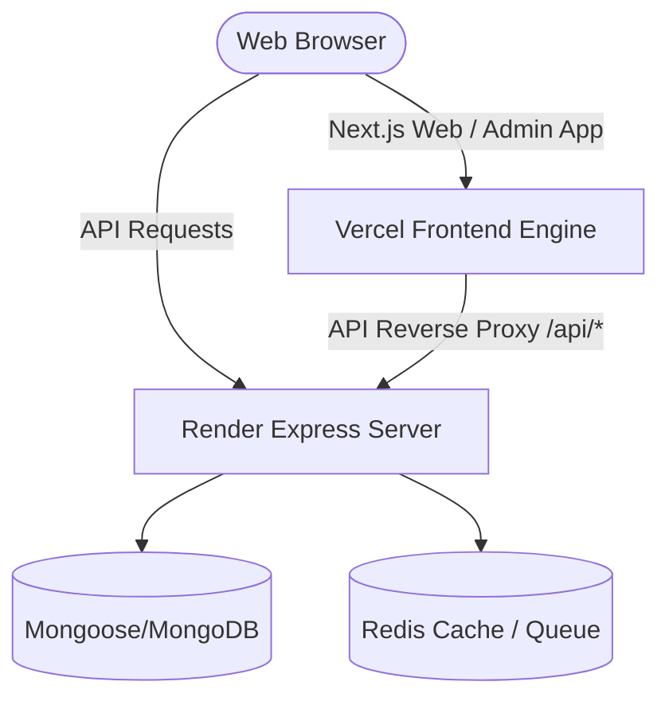

# Monorepo Architecture Governance & Standards

This document establishes the official architectural principles, packaging standards, and runtime composition rules for the **MAD Entertrainment** platform. All changes must adhere strictly to these rules to maintain monorepo operational integrity and prevent deployment drift.

---

## 1. Core Architectural Philosophy

We prioritize **deterministic build systems**, **predictable runtime composition**, and **infrastructure-independent static verification**.
- **No Side Effects During App Composition**: Express routing and middleware instantiation must be decoupled from live infrastructure (databases, caches, rate-limit stores).
- **Targeted Build Isolation**: Backend and frontend environments compile only their specific dependency trees to minimize deployment duration and overhead.
- **Automated Verification**: Build outputs, exports, types, environment configurations, and routing trees must be audited continuously.

---

## 2. Package Management & Build Orchestration

The workspace operates as a pnpm monorepo with strict package references.

### Clean Compilation Rule
To prevent TypeScript from silently omitting `.d.ts` type-declaration files during incremental cached compilation, the `"build"` script of any shared package under `packages/*` **MUST** clean previous outputs and cache files before invoking `tsc`:
```json
"scripts": {
  "build": "rm -rf dist tsconfig.tsbuildinfo && tsc -p tsconfig.json"
}
```

### Deployment Build Targeting
Never run recursive build scripts across the entire workspace in resource-constrained hosting environments (such as Render). Build scripts **MUST** filter compilation to only target the service and its immediate dependency graph:
- **Correct Target Command**: 
  ```bash
  pnpm install --frozen-lockfile && pnpm --filter @mad/server... run clean && pnpm --filter @mad/server... build
  ```
- **Prohibited Command**: 
  ```bash
  pnpm -r build  # (Unnecessarily compiles Next.js frontends in backend environments)
  ```

---

## 3. Runtime Composition & Express Instantiation

To ensure that the application is fully introspectable, testable, and sandboxed, application setup is separated from server bootstrap.

### The Pure `createApp()` Standard
- `createApp()` in `apps/server/src/app.ts` **MUST** remain side-effect-free. It should only configure middleware, parse bodies, register static paths, and mount routing stacks.
- It must **NEVER** initiate live connections to MongoDB, Redis, Stripe, Razorpay, or bind Socket.IO listeners.
- **Middleware Rate Limiters**: Eager rate limiters (e.g., `express-rate-limit` using `rate-limit-redis`) must be declared as lazy middleware wrappers. The actual store instances are initialized separately in `initRateLimiters()`.

### Server Bootstrap Sequence
Live connection pools and rate limiters are initialized during the main startup lifecycle in `apps/server/src/server.ts`:
1. Connect to MongoDB.
2. Initialize Redis and wait for readiness.
3. Call `initRateLimiters()` (after Redis is ready).
4. Initialize external payment, logging, and asset services (Stripe, Razorpay, Cloudinary).
5. Call `createApp()` to construct the Express stack.
6. Bind the HTTP server and Socket.IO hooks, then begin listening.

---

## 4. Environment Configuration Contracts

All environment variables **MUST** be defined in `apps/server/src/config/env.ts` using strict Zod schemas.

- **Required Variables**: All variables critical for runtime operations (such as database URIs, payment credentials, and session handlers) must be declared without defaults.
- **Secret Minimum Lengths**: JWT secret parameters and hashing keys **MUST** require a minimum length of 32 characters (`z.string().min(32)`) to block weak staging or development credentials.
- **Secret Value Masking**: The audit system and debug log formatters must filter out values containing keywords like `SECRET`, `KEY`, `PASSWORD`, or `TOKEN`. Under no circumstances should raw secret values be logged, serialized, or written to compliance reports.

---

## 5. Deployment Topology

The platform deploys split services to separate providers for speed, cost efficiency, and horizontal scalability.



### 1. Backend Service (Render)
- Configured via `render.yaml`.
- Targeted building is enforced, running as a Node service targeting `node apps/server/dist/apps/server/src/server.js`.

### 2. Frontend Services (Vercel)
- Configured via root/app-specific `vercel.json` configurations.
- Directs UI routes to Next.js serverless runtimes.
- Proxies `/api/*` endpoints directly back to Render using path rewrites to prevent CORS issues.

---

## 6. Continuous Compliance Verification

Operational drift is programmatically verified. The audit script can be triggered at any time:
```bash
pnpm run audit-data
```

### Verification Scope:
1. Checks if all shared packages compile to target files (`dist/index.js` and `dist/index.d.ts`).
2. Confirms that packages resolve at runtime (`require("@mad/...")` executes cleanly).
3. Boots `createApp()` in sandbox mode and recursive routes traversal lists all endpoints.
4. Audits Zod schemas for missing environment contract keys.
5. Inspects `render.yaml` and `vercel.json` configurations.

### Future CI/CD Integration:
When integrating tests into CI/CD pipelines (e.g. GitHub Actions), `pnpm run audit-data` should run as a blocking task. If `audit_data.json` contains any validation failures or an empty routing stack, the CI pipeline must fail, preventing invalid configurations from reaching staging or production.

---

## 7. Frontend Component Governance

These rules apply to all components under `apps/admin/src/` and `apps/web/src/`. Violations are treated as build-blocking defects.

### Rule 1 — No Direct HTTP Calls in Components

**Components must never call `axios`, `fetch`, or any HTTP client directly.**

All data fetching must be delegated to a service layer function (e.g. `services/venues.ts`) or a React Query hook. This enforces a clean separation between UI rendering and data transport.

```tsx
// ❌ FORBIDDEN — direct fetch in component
const res = await axios.get('/api/venues');

// ✅ CORRECT — delegate to service layer
import { venueService } from '@/services/venues';
const venues = await venueService.getAll();
```

### Rule 2 — All Pages Must Handle Four Render States

Every page and data-driven component **must** explicitly handle:

| State | Requirement |
|---|---|
| `loading` | Render `<LoadingState />` or equivalent skeleton |
| `error` | Render `<ErrorState />` with actionable message |
| `empty` | Render `<EmptyState />` with contextual CTA |
| `success` | Render the actual data UI |

Silently rendering `null`, an empty `<div>`, or falling through to a broken layout is forbidden. Use the primitives in `apps/admin/src/components/states/`.

```tsx
// ✅ CORRECT pattern
if (isLoading) return <LoadingState />;
if (error)     return <ErrorState message={error.message} />;
if (!data?.length) return <EmptyState title="No venues found" />;
return <VenueList venues={data} />;
```

### Rule 3 — No Placeholder 501 API Routes in Production

**Backend routes that return `501 Not Implemented` are forbidden in the production branch.**

Every route registered in Express must either:
- Have a complete, tested controller implementation, **or**
- Be removed from the router until it is ready

Stub routes that silently return `501` disguise missing backend functionality, cause frontend pages to crash, and create false confidence in audit tooling. If a feature is not ready, do not register its route.

```ts
// ❌ FORBIDDEN — placeholder stub
router.get('/analytics', (req, res) => res.status(501).json({ message: 'Not implemented' }));

// ✅ CORRECT — real implementation or route omitted until ready
router.get('/analytics', analyticsController.getSummary);
```
