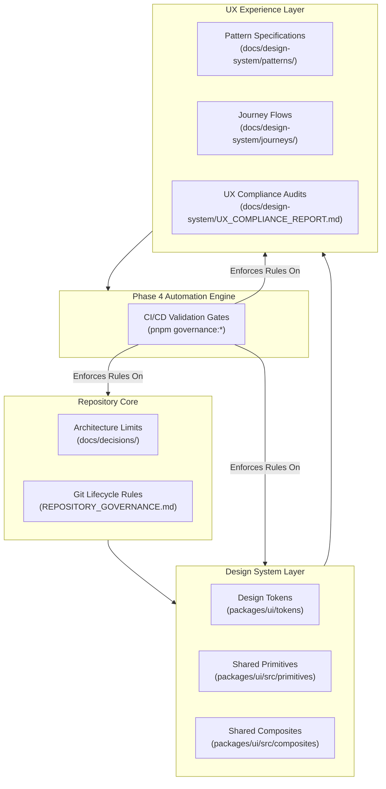

# Governance Execution Engine

This document describes the technical architecture of the automated governance engine located in `scripts/governance/` and `tests/ui-governance/`.

---

## Architecture Overview

## 1. Purpose

This document defines the structural relationship between code quality, architectural constraints, Git branch lifecycles, and design tokens/UX patterns in the MAD Entertrainment repository. 

As a repository scales into a multi-product platform, manual peer reviews become insufficient. This architecture acts as the blueprint for **automated enforcement (Phase 4)**, mapping human-readable specifications to static analysis rules.

---

## 2. Core Governance Layers

The governance engine evaluates repository health across five distinct layers:



### Layer Details

1. **Architecture & Structure Governance:**
   - Enforces file size limits (e.g. Components < 300 lines).
   - Prevents dependency cycle loops between internal packages and apps.
   - Restricts package boundaries (e.g. apps can only import from `@mad/ui`, never from internal package structures).

2. **Git Lifecycle Governance:**
   - Enforces `RULE-GIT-001` (automated squash/rebase branch cleanup validation).
   - Validates branch naming formats (`feat/*`, `fix/*`, `refactor/*`, `docs/*`).
   - Ensures PR compliance before merge.

3. **Design System Governance (Tokens & Primitives):**
   - Validates that semantic design tokens (typography, layout heights, spacing, theme constants) map to CSS variables.
   - Prevents hardcoded color values (hex/rgb) or ad-hoc custom styles in layout views.
   - Verifies compliance with the Theme Contract across products.

4. **UX & Pattern Governance (Composites & Journeys):**
   - Compares implemented pages against the 19 canonical pattern documents (e.g., verifying `UX-AUTH-001` forms use `FormField`).
   - Enforces keyboard focus trapping and ARIA standards (WCAG AA accessibility target).

5. **Compliance & Backlog Tracking:**
   - Indexes and validates all backlog references (`BL-XXX`) in `BACKLOG.md`.
   - Logs and measures layout compliance via the manual and automated compliance matrix.

---

## 3. Phase 4 Automation Strategy

Phase 4 moves the governance engine from descriptive documentation to automated gates that fail the CI pipeline upon violations.

```
                               ┌────────────────────────┐
                               │  Code Commit / Pull Request │
                               └───────────┬────────────┘
                                           │
                                           ▼
                            ┌──────────────────────────────┐
                            │   pnpm governance:validate   │
                            └──────────────┬───────────────┘
                                           │
                    ┌──────────────────────┼──────────────────────┐
                    │                      │                      │
                    ▼                      ▼                      ▼
         [Documentation Lint]      [Public API Lint]      [Static Token Audit]
         Checks YAML schema,       Verifies imports from  Detects raw hex/rgb,
         Pattern IDs & links.      stable barrel only.    non-token values.
                    │                      │                      │
                    └──────────────────────┼──────────────────────┘
                                           │
                                           ▼
                                ┌─────────────────────┐
                                │ All Checks Passed?  │
                                └──────────┬──────────┘
                                           │
                             ┌─────────────┴─────────────┐
                             ▼                           ▼
                        [YES: Merge]               [NO: Fail CI]
```

### Automation Workstreams

* **Phase 4A — Documentation Enforcement:**
  - Lints pattern markdown files for valid YAML frontmatter templates.
  - Verifies that all components listed in `related-components` exist in the `@mad/ui` barrel export.
  - Validates pattern and journey link references.

* **Phase 4B — Component Import Validation:**
  - Employs AST parser rules (ESLint plugin) to ensure that apps import components exclusively from the stable public boundary (`@mad/ui`).
  - Restricts imports of internal directories (e.g. `@mad/ui/src/primitives/...` is prohibited).

* **Phase 4C — Design Token Scanner:**
  - Audits CSS/Tailwind source files for raw color values (e.g. `#8b5cf6`).
  - Restricts style overrides unless explicitly annotated with `governance-ignore` comments for external SDK requirements (like Razorpay).

* **Phase 4D — Accessibility Auditor:**
  - Validates that modal overlays incorporate Escape close behaviors.
  - Ensures inputs contain associated `<Label>` references.

---

## 4. Contributor Workflow

Every developer making changes in the repository must adhere to the following sequence:

1. **Consult Patterns:** Refer to `docs/design-system/patterns/` to align new features with approved UX layouts.
2. **Reuse Components:** Utilize stable composites from `@mad/ui` (such as `FormField` or `ErrorState`). If a primitive is missing, log a gap in `BACKLOG.md` rather than building an ad-hoc local component.
3. **Execute Local Audits:** Prior to staging commits, run lint commands:
   ```bash
   pnpm governance:docs
   pnpm build
   ```
4. **Follow Branch Cleanup:** When a PR is merged, run the branch cleanup protocol (`RULE-GIT-001`) immediately to keep local/remote tracking references clean.

## 5. Governance Execution Engine

The Governance Execution Engine is the centralized orchestration coordinator that executes governance scans on the codebase. It replaces the old hardcoded loader loops and isolates validator execution, handling filter dispatching, dependency ordering, timing diagnostics, and memory footprint tracking.

---

## 1. Engine Core Flow

```
Governance CLI ──> ExecutionEngine ──> ExecutionPlanner ──> ExecutionScheduler ──> Validators
```

The execution flow consists of three distinct pipeline stages:
1. **Registry Initialization**: Validator metadata (supported file types, execution priority, and prerequisites) is registered.
2. **Planner Assembly**: The planner resolves dependencies, runs cycle detection, applies filters (by rule, category, owner, etc.), and generates a topological execution schedule.
3. **Deterministic Scheduling**: The scheduler executes validators sequentially in topological order, isolating validator crashes and gathering granular timing and memory usage metrics.

---

## 2. Timing and Performance Instrumentation

Granular metrics are collected during execution:
- **Planning Duration**: Time elapsed during filter parsing and topological sort.
- **Execution Duration**: Milliseconds spent by each validator running analysis.
- **Memory Footprint**: Heap usage delta (`heapUsed`) recorded before and after execution of each validator block.

---

## 3. Failure Isolation

If a validator encounters an unhandled exception or crash, the scheduler intercepts it and logs a `Validator Crash` error under `ValidationResult.errors` instead of aborting the entire governance check, ensuring other validators still complete and report metrics.

---

## Execution Pipeline

# Governance Execution Pipeline

The execution pipeline processes target workspace files through a topological validator graph, executing them in a stable and reproducible order.

---

## 1. Topological Sorting & Dependency Ordering

To execute validators containing inter-dependencies correctly, the engine uses a depth-first search (DFS) topological sort algorithm.

### Execution Scheduler Ordering Algorithm
- Stable sorting by **priority** is applied first.
- Pre-sorted items are traversed; if a validator declares dependencies, its dependency validators are traversed and scheduled before it.
- If a dependency node is already visiting, a cycle is detected, and execution is halted immediately.

---

## 2. CLI Execution Filtering

Filters specified in the CLI (such as `--rule`, `--category`, `--validator`, `--owner`, `--severity`) are evaluated during the planning phase:
- Active validators are filtered down to only those claiming the targeted rules or categories.
- Topological sort is then run on the subset of matched validators to construct a safe, minimal execution plan.
- The scheduler runs only the planned validators.

---

## Registry Pattern

## Purpose

This document defines the schema, rules, and APIs for the centralised Governance Rule Registry. The registry serves as the Single Source of Truth (SSOT) for all rule metadata, severities, owners, and policies in the MAD Entertrainment repository.

---

## Scope

This policy applies to all validation rules implemented in the governance engine, all metadata files under `scripts/governance/rules/metadata/`, and the rule resolution APIs.

---

## Registry Schema Definition

Every rule definition must comply with the following TypeScript interface structure:

```ts
export interface RuleDefinition {
  id: string;              // Unique rule ID (e.g. VAL-UI-010)
  name: string;            // Human-readable rule name
  description: string;     // Purpose and description of the rule
  category: RuleCategory;  // UI, UX, ACCESSIBILITY, SECURITY, PERFORMANCE, ARCHITECTURE, DOCUMENTATION, HYGIENE, REPOSITORY, INFRASTRUCTURE
  severity: RuleSeverity;  // INFO, WARNING, ERROR, CRITICAL
  confidence: number;      // Confidence index between 0.0 and 1.0
  owner: RuleOwner;        // Team/Guild responsible for this rule
  defaultStatus: string;   // Default lifecycle status (e.g. "NEW")
  ciPolicy: RuleCiPolicy;  // FAIL_BUILD, WARN, INFO_ONLY
  documentation: string;   // Absolute repository path to rule markdown (docs/governance/rules/...)
  remediation: string;     // Concise instruction to resolve findings
  supportsAutofix: boolean;// Whether automated fixes are supported
  version: string;         // Semantic version of this rule
  introducedVersion: string;// Version where this rule was added
  deprecatedVersion?: string;// Optional version where this rule was deprecated
  status: RuleStatus;      // ACTIVE, DEPRECATED, EXPERIMENTAL, DISABLED
  tags: string[];          // Arbitrary tags for metrics grouping
}
```

---

## Registry Rules

### RREG-001 — Central Registry SSOT
Rule metadata (such as severities, default statuses, or owners) must be declared exclusively in the registry files under `scripts/governance/rules/metadata/`. Defining or hardcoding rule metadata in validators or reporting components is strictly prohibited.

### RREG-002 — Failure on Duplicate
The registry loader API (`RuleRegistry.initialize()`) must fail fast and halt the process if a duplicate rule ID or duplicate rule name is registered.

### RREG-003 — Schema Constraints
All registered rules must pass strict schema validation at startup, including:
- Categories must belong to the approved set.
- Severities must belong to the approved set.
- Owners must belong to the approved set.
- Confidence must be a number between 0 and 1 inclusive.
- Documentation paths must reside under `docs/governance/rules/`.

---

## Allowed Practices

- Adding new metadata categories or owners by updating the validation sets in `scripts/governance/rules/registry.ts`.
- Fetching rules selectively via helper APIs: `getRule(id)`, `getAllRules()`, `getRulesByCategory(cat)`, `getRulesByOwner(owner)`, `getRulesBySeverity(sev)`, `getRulesByPolicy(policy)`.

---

## Forbidden Practices

- Initializing rule metadata inline inside validators.
- Defining a rule ID that is not unique across categories.
- Reference documentation paths outside the `docs/governance/rules/` workspace directory.

---

---

## Validator Registry

# Validator Registry API Reference

The Validator Registry is the single source of truth for validator metadata registration, capabilities querying, and startup checks.

---

## 1. Registry API Definitions

The registry exposes the following core static functions:
- `registerValidator(validator, metadata)`: Adds a validator to the registry with capability settings.
- `registerValidators(validators)`: Registers an array of validator definitions.
- `unregisterValidator(id)`: Removes a validator from the registry.
- `getValidator(id)`: Retrieves a specific validator definition.
- `getAllValidators()`: Returns all registered validator definitions.
- `getValidatorsByCategory(category)`: Returns validators that claim rules in a specific category.
- `getValidatorsByRule(ruleId)`: Returns validators associated with a specific rule ID.
- `validatorExists(id)`: Checks if a validator ID is registered.
- `initialize()`: Sets up registry state.
- `validateRegistry()`: Runs fast-fail startup integrity checks.

---

## 2. Validator Definition Schema

Validators register with execution metadata defining their operational capabilities:
```ts
interface ValidatorDefinition {
  id: string;
  name: string;
  supportedRules: string[];
  supportedFileTypes: string[];
  priority: number;
  dependencies: string[];
  enabled: boolean;
  validator: GovernanceValidator;
}
```
No rule metadata (like severity, owners, or documentation links) is defined here; those properties reside exclusively in the centralized `RuleRegistry`.

---

